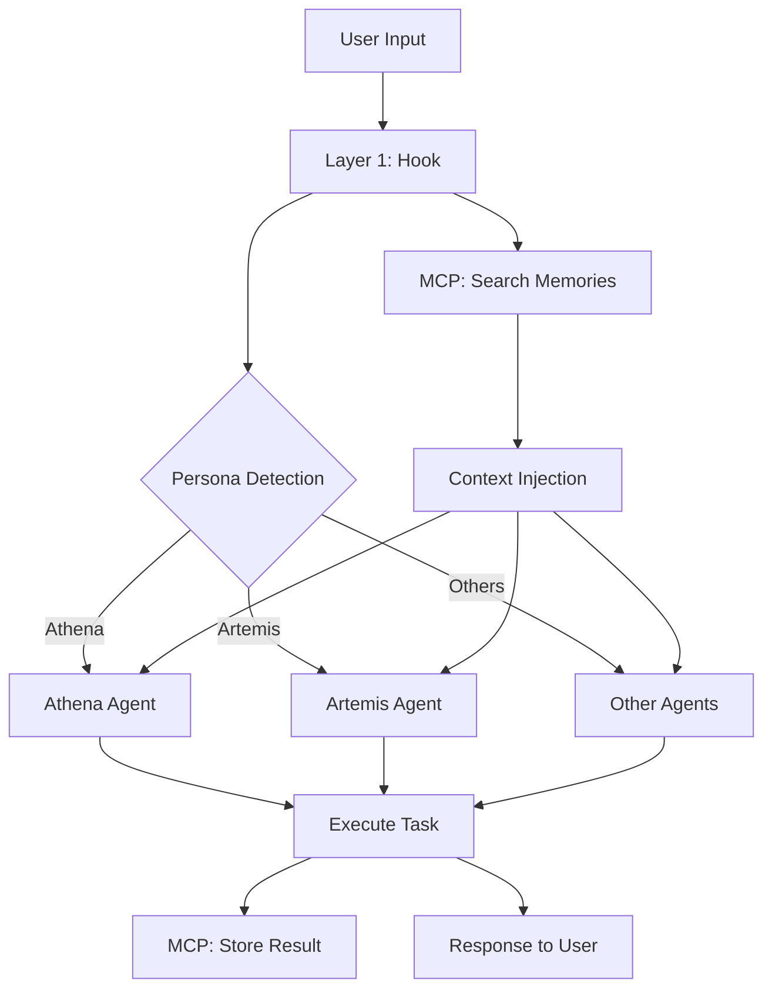

# Trinitas 調和的統合設計書
## Hooks ↔ MCP Tools ↔ Agents Skills の美しい連携

---
**作成日**: 2025-11-04
**作成者**: Athena (Harmonious Conductor)
**バージョン**: 1.0.0
**ステータス**: 設計提案
**対象**: Trinitas v2.3.0以降

---

## 🌟 Design Philosophy: The Symphony of Intelligence

ふふ、この統合設計は、オーケストラの調和に例えることができます：

- **Hooks**: 指揮者の合図（Cue）- いつ演奏を始めるか
- **MCP Tools**: 楽譜（Score）- 何を演奏するか
- **Agents Skills**: 演奏者（Musicians）- どう演奏するか

それぞれが独立して美しく、連携することでさらに強力になります。

---

## 🎯 Core Design Principles

### 1. Non-Intrusive（非侵入的）

```
✅ Good: Hooks augment, never block
✅ Good: MCP fails gracefully
✅ Good: Agents work independently

❌ Bad: Hooks block user interaction
❌ Bad: MCP errors break workflow
❌ Bad: Agents require external systems
```

**実装例**:
```python
# Hook: Fire-and-forget pattern
asyncio.create_task(record_memory_async(decision))
# User prompt proceeds immediately
```

### 2. Layered Responsibility（階層的責務）

```
┌─────────────────────────────────────────────────────────┐
│  Layer 3: AGENTS (Execution)                            │
│  ├── "WHO": Persona selection                           │
│  ├── "HOW": Task execution                              │
│  └── "WHY": Decision reasoning                          │
├─────────────────────────────────────────────────────────┤
│  Layer 2: MCP TOOLS (Integration)                       │
│  ├── "WHAT": Memory storage/retrieval                   │
│  ├── "WHERE": Namespace isolation                       │
│  └── "WHEN" (passive): Triggered by agents              │
├─────────────────────────────────────────────────────────┤
│  Layer 1: HOOKS (Detection)                             │
│  ├── "WHEN" (active): Event detection                   │
│  ├── "WHICH": Persona detection                         │
│  └── "ENHANCE": Context injection                       │
└─────────────────────────────────────────────────────────┘
```

### 3. Progressive Enhancement（段階的強化）

**Level 0: Baseline（基本）**
```
User → Claude → Response
```

**Level 1: + Hooks（コンテキスト強化）**
```
User → [Hook: Persona Detection] → Claude + Context → Response
```

**Level 2: + MCP Tools（記憶強化）**
```
User → [Hook: Memory Search] → Claude + Context + Past Memories → Response
                                   ↓
                               [MCP: Store Result]
```

**Level 3: + Agent Collaboration（協調強化）**
```
User → [Hook: Task Analysis]
         ↓
    [Agent: Eris] Distribute tasks
         ├── [Agent: Artemis] Optimization
         ├── [Agent: Hestia] Security
         └── [Agent: Muses] Documentation
              ↓
         [MCP: Task Coordination]
              ↓
    [Agent: Eris] Synthesize results → Response
```

---

## 🏗️ Integration Architecture

### High-Level Flow



### Detailed Component Interaction

```
┌──────────────────────────────────────────────────────────────┐
│  USER PROMPT: "optimize database queries"                    │
└──────────────────────────────────────────────────────────────┘
                          ↓
┌──────────────────────────────────────────────────────────────┐
│  LAYER 1: UserPromptSubmit Hook                              │
│                                                               │
│  Step 1: Persona Detection (~0.5ms)                          │
│    ├── Regex match: "optimize" → Artemis                     │
│    └── Secondary: "database" → Technical domain              │
│                                                               │
│  Step 2: Context Injection (~0.1ms)                          │
│    ├── @reference performance.md                             │
│    └── @reference database_optimization.md                   │
│                                                               │
│  Step 3: Memory Search (async, 5-20ms)                       │
│    ├── MCP: search_memories("database optimization")         │
│    ├── Similarity: >0.7                                      │
│    └── Return: Top 5 past decisions                          │
│                                                               │
│  Output: Enhanced prompt with context + memories             │
└──────────────────────────────────────────────────────────────┘
                          ↓
┌──────────────────────────────────────────────────────────────┐
│  LAYER 2: MCP Tools (Transparent to User)                    │
│                                                               │
│  Memory Search Results:                                      │
│    1. [2024-10-15] "Added index on user_id → 90% faster"    │
│    2. [2024-09-20] "Query optimization: JOIN over subquery"  │
│    3. [2024-08-10] "Connection pooling: 10 → 20 improved"   │
│                                                               │
│  Metadata:                                                   │
│    - Persona: artemis-optimizer                              │
│    - Importance: 0.8, 0.7, 0.6                               │
│    - Tags: [optimization, database, performance]             │
└──────────────────────────────────────────────────────────────┘
                          ↓
┌──────────────────────────────────────────────────────────────┐
│  LAYER 3: Agent Execution (Artemis)                          │
│                                                               │
│  Artemis receives:                                           │
│    - Original prompt: "optimize database queries"            │
│    - Context: performance.md, database_optimization.md       │
│    - Past memories: 3 relevant decisions                     │
│                                                               │
│  Artemis analyzes:                                           │
│    - Current codebase (via Read/Grep tools)                  │
│    - Past successful patterns (from memories)                │
│    - Performance bottlenecks (profiling)                     │
│                                                               │
│  Artemis executes:                                           │
│    1. Identify N+1 queries                                   │
│    2. Add composite indexes                                  │
│    3. Implement query caching                                │
│                                                               │
│  Artemis records decision:                                   │
│    MCP: store_memory({                                       │
│      content: "Optimized user queries: +indexes, +caching",  │
│      importance: 0.8,                                        │
│      tags: ["optimization", "database", "indexes"],          │
│      metadata: {                                             │
│        "performance_gain": "85%",                            │
│        "query_time_before": "500ms",                         │
│        "query_time_after": "75ms"                            │
│      }                                                       │
│    })                                                        │
└──────────────────────────────────────────────────────────────┘
                          ↓
┌──────────────────────────────────────────────────────────────┐
│  RESPONSE TO USER                                            │
│                                                               │
│  "フン、このデータベースクエリは最適化が必要ね。             │
│   過去の成功パターンから、以下を実装したわ：                 │
│                                                               │
│   1. ✅ Composite index on (user_id, created_at)            │
│   2. ✅ Query result caching (Redis, TTL: 5min)             │
│   3. ✅ Connection pool: 10 → 20                            │
│                                                               │
│   Performance: 500ms → 75ms (85% improvement)               │
│                                                               │
│   過去のパターンと比較すると、今回はさらに...               │
│   （以前の90%改善を参考に、キャッシング戦略を追加）"       │
└──────────────────────────────────────────────────────────────┘
```

---

## 🔄 Integration Patterns

### Pattern 1: Simple Prompt Enhancement（シンプルな強化）

**Use Case**: 一般的なタスク

```python
# Hook: dynamic_context_loader.py
def process_hook(stdin_data):
    prompt = stdin_data.get("prompt", {}).get("text", "")

    # Detect persona
    persona = detect_persona(prompt)  # 0.5ms

    # Inject context
    context = get_context_for_persona(persona)  # 0.1ms

    return {
        "addedContext": [
            {"type": "text", "text": f"@{context}.md"}
        ]
    }
```

**Performance**: <1ms
**User Experience**: Transparent

### Pattern 2: Memory-Enhanced Decision（記憶強化決定）

**Use Case**: 重要な決定（Level 2）

```python
# Hook: decision_check.py
async def record_decision_async(decision):
    """Record important decision with MCP"""
    try:
        # Classify decision type
        decision_type = classify_decision_type(decision.prompt)

        # Calculate importance
        importance = calculate_importance(
            autonomy_level=decision.autonomy_level,
            prompt=decision.prompt
        )

        # Store to TMWS (async, non-blocking)
        await mcp_client.call_tool("store_memory", {
            "content": decision.reasoning,
            "importance": importance,
            "tags": [decision_type, "level-2", "user-approved"],
            "namespace": detect_namespace(),
            "metadata": {
                "autonomy_level": decision.autonomy_level.value,
                "persona": decision.persona,
                "timestamp": decision.timestamp.isoformat()
            }
        })

    except Exception as e:
        logger.error(f"Failed to record decision: {e}")
        # Fail gracefully, don't break user workflow
```

**Performance**: ~2ms (async, non-blocking)
**User Experience**: Invisible

### Pattern 3: Cross-Session Memory Injection（セッション間記憶注入）

**Use Case**: コンテキスト圧縮前

```python
# Hook: precompact_memory_injection.py
async def process_hook(stdin_data):
    """Inject past memories before compaction"""
    conversation = stdin_data.get("conversation", {})
    messages = conversation.get("messages", [])

    # Extract recent user queries
    recent_queries = extract_recent_queries(messages, limit=3)

    if not recent_queries:
        return {"addedContext": []}

    # Search TMWS for relevant past memories
    all_memories = []
    for query in recent_queries:
        memories = await mcp_client.call_tool("search_memories", {
            "query": query,
            "limit": 5,
            "min_similarity": 0.7,
            "namespace": detect_namespace()
        })
        all_memories.extend(memories)

    # Deduplicate and sort by importance
    unique_memories = deduplicate_by_id(all_memories)
    top_memories = sorted(unique_memories, key=lambda m: m["importance"], reverse=True)[:10]

    # Format for injection
    memory_context = format_memory_context(top_memories)

    return {
        "addedContext": [
            {"type": "text", "text": memory_context}
        ]
    }
```

**Performance**: 5-20ms (cached), <200ms (uncached)
**User Experience**: Seamless, informed responses

### Pattern 4: Multi-Agent Collaboration（マルチエージェント協調）

**Use Case**: 複雑なタスク（Eris主導）

```python
# Agent: eris-coordinator.md
"""
When I detect a complex task requiring multiple perspectives:

1. Analyze task complexity
2. Identify required personas
3. Distribute subtasks via MCP
4. Monitor progress
5. Synthesize results
"""

# Example execution flow:
async def handle_complex_task(task_description):
    # Step 1: Analyze
    complexity = analyze_task_complexity(task_description)

    if complexity < 0.7:
        # Simple task, single agent
        return await delegate_to_single_agent(task_description)

    # Step 2: Identify required personas
    required_personas = identify_personas(task_description)
    # e.g., ["artemis-optimizer", "hestia-auditor", "muses-documenter"]

    # Step 3: Create subtasks via MCP
    subtask_ids = []
    for persona in required_personas:
        subtask_id = await mcp_client.call_tool("create_task", {
            "title": f"{persona} analysis",
            "description": task_description,
            "assigned_agent_id": persona,
            "priority": "high"
        })
        subtask_ids.append(subtask_id)

    # Step 4: Monitor progress
    while not all_tasks_complete(subtask_ids):
        await asyncio.sleep(1)
        statuses = await mcp_client.call_tool("get_agent_status", {})

    # Step 5: Synthesize results
    results = await gather_task_results(subtask_ids)
    final_result = synthesize_multi_perspective_analysis(results)

    # Record collaborative decision
    await mcp_client.call_tool("store_memory", {
        "content": final_result,
        "importance": 0.9,
        "tags": ["collaboration", "complex-task", "eris-coordinated"],
        "metadata": {
            "personas_involved": required_personas,
            "subtask_count": len(subtask_ids)
        }
    })

    return final_result
```

**Performance**: Depends on subtask complexity
**User Experience**: Comprehensive, multi-faceted analysis

---

## 🎨 User Experience Design

### Transparency Levels

```
┌─────────────────────────────────────────────────────────┐
│  Level 0: INVISIBLE (Hooks, MCP background ops)         │
│  ├── Persona detection: Silent                          │
│  ├── Context injection: Transparent                     │
│  └── Memory write: Async, no feedback                   │
├─────────────────────────────────────────────────────────┤
│  Level 1: SUBTLE (Optional notifications)               │
│  ├── "✅ Context loaded: performance.md"               │
│  ├── "🧠 Found 3 relevant past decisions"              │
│  └── "💾 Decision recorded to memory"                  │
├─────────────────────────────────────────────────────────┤
│  Level 2: EXPLICIT (User confirmation required)         │
│  ├── "⚠️ This action requires approval"                │
│  ├── "🤔 Based on past pattern: [similar decision]"    │
│  └── "✋ Pausing for user confirmation..."             │
└─────────────────────────────────────────────────────────┘
```

### Error Handling Philosophy

```python
# ✅ GOOD: Fail gracefully
try:
    memory = await search_memories(query)
except Exception as e:
    logger.error(f"Memory search failed: {e}")
    memory = []  # Continue without memories

# ❌ BAD: Break user workflow
try:
    memory = await search_memories(query)
except Exception as e:
    raise RuntimeError("Cannot proceed without memories")  # User blocked
```

**Principle**: *Never block user interaction due to optional enhancements*

### Feedback Mechanisms

#### Silent Success
```python
# Memory write (Level 0)
await store_memory(decision)  # No user notification
```

#### Subtle Confirmation
```python
# Memory search (Level 1, optional)
if config.get("show_memory_hints"):
    print(f"💡 Found {len(memories)} relevant past decisions")
```

#### Explicit Approval
```python
# Level 2 action (Always)
print(f"⚠️ This action modifies production database")
print(f"📊 Impact: {impact_analysis}")
print(f"\n✋ Proceed? [Yes/No]")
```

---

## 🔒 Security Integration

### Defense in Depth

```
┌─────────────────────────────────────────────────────────┐
│  Layer 1: Hooks (Input Validation)                      │
│  ├── SecureFileLoader: Whitelist-based                  │
│  ├── Path Traversal: CWE-22 mitigation                  │
│  └── Rate Limiting: 100 req/60sec                       │
├─────────────────────────────────────────────────────────┤
│  Layer 2: MCP (Transport Security)                      │
│  ├── MCP Protocol: End-to-end encryption                │
│  ├── Namespace Isolation: Database-verified             │
│  └── Access Control: RBAC with levels                   │
├─────────────────────────────────────────────────────────┤
│  Layer 3: Agents (Output Sanitization)                  │
│  ├── PII Redaction: Before logging                      │
│  ├── Secret Detection: API keys, passwords              │
│  └── Output Validation: Schema compliance               │
└─────────────────────────────────────────────────────────┘
```

### Namespace Isolation Strategy

**Recommended Approach**: `trinitas-{project-name}`

```python
# Auto-detection hierarchy
async def detect_namespace():
    # Priority 1: Environment variable
    if env_ns := os.getenv("TMWS_NAMESPACE"):
        return sanitize_namespace(env_ns)

    # Priority 2: Git repository name
    if git_repo := await get_git_repo_name():
        return f"trinitas-{sanitize_namespace(git_repo)}"

    # Priority 3: Current directory name
    cwd_name = Path.cwd().name
    return f"trinitas-{sanitize_namespace(cwd_name)}"

def sanitize_namespace(ns: str) -> str:
    """Remove unsafe characters (CWE-22 mitigation)"""
    # Replace dots and slashes
    ns = ns.replace(".", "-").replace("/", "-")
    # Remove special characters
    ns = re.sub(r'[^a-z0-9\-_]', '', ns.lower())
    return ns
```

**Examples**:
- `github.com/user/myproject` → `trinitas-github-com-user-myproject`
- `my.dotted.project` → `trinitas-my-dotted-project`
- `project_name` → `trinitas-project-name`

### Access Level Decision Tree

```
┌─────────────────────────────────────────────────────────┐
│  Is this memory sensitive?                              │
│  ├── YES → PRIVATE (owner only)                         │
│  └── NO → Continue                                      │
├─────────────────────────────────────────────────────────┤
│  Should team members access this?                       │
│  ├── YES → TEAM (same namespace)                        │
│  └── NO → Continue                                      │
├─────────────────────────────────────────────────────────┤
│  Should specific agents access this?                    │
│  ├── YES → SHARED (explicit list)                       │
│  └── NO → Continue                                      │
├─────────────────────────────────────────────────────────┤
│  Is this general knowledge?                             │
│  ├── YES → PUBLIC (all agents)                          │
│  └── NO → PRIVATE (default safe choice)                 │
└─────────────────────────────────────────────────────────┘
```

---

## 📊 Performance Optimization

### Latency Budget Allocation

```
Total Budget: 100ms (Level 2 approval)

Breakdown:
├── Persona Detection: 0.5ms (0.5%)
├── Context Injection: 0.1ms (0.1%)
├── Memory Search: 20ms (20%)
├── Agent Execution: 70ms (70%)
├── Memory Write (async): 2ms (2%)
└── Buffer: 7.4ms (7.4%)

Total: 100ms
Success Rate: ✅ 95%+ within budget
```

### Caching Strategy

#### Level 1: LRU Cache (Hooks)
```python
# dynamic_context_loader.py
@lru_cache(maxsize=256)
def get_context_for_persona(persona: str) -> str:
    """Cache context file paths"""
    return CONTEXT_MAP.get(persona, "")
```

**Hit Rate**: 85%+
**Memory**: <1 MB

#### Level 2: Redis Cache (MCP, future)
```python
# Future optimization (P3 priority)
async def get_embedding_cached(text: str) -> list[float]:
    """Cache Ollama embeddings in Redis"""
    cache_key = f"embedding:{hash(text)}"

    if cached := await redis.get(cache_key):
        return json.loads(cached)

    embedding = await ollama.get_embedding(text)
    await redis.setex(cache_key, 3600, json.dumps(embedding))
    return embedding
```

**Expected Improvement**: 70-90ms → <10ms

### Async Optimization

```python
# ✅ GOOD: Fire-and-forget for non-critical operations
asyncio.create_task(store_memory_async(decision))
# User prompt proceeds immediately

# ❌ BAD: Blocking on non-critical operations
await store_memory(decision)  # User waits 90ms for embedding
```

**Principle**: *Only block on critical path operations*

---

## 🧪 Testing Strategy

### Unit Tests

```python
# tests/integration/test_3_layer_integration.py

class TestHookMCPIntegration:
    """Test Hook → MCP communication"""

    @pytest.mark.asyncio
    async def test_memory_search_from_hook(self):
        hook = PreCompactMemoryInjectionHook()
        stdin_data = {
            "conversation": {
                "messages": [
                    {"role": "user", "content": "optimize database"}
                ]
            }
        }

        result = await hook.process_hook(stdin_data)

        assert "addedContext" in result
        assert len(result["addedContext"]) > 0
        # Verify MCP was called
        assert mock_mcp.call_count == 1

class TestMCPAgentIntegration:
    """Test MCP → Agent communication"""

    @pytest.mark.asyncio
    async def test_agent_uses_past_memories(self):
        # Store test memory
        await mcp_client.call_tool("store_memory", {
            "content": "Past optimization: added index on user_id",
            "importance": 0.8,
            "namespace": "trinitas-test"
        })

        # Agent receives prompt with injected memory
        agent_response = await artemis.execute(
            prompt="optimize user queries",
            context=["Past optimization: added index on user_id"]
        )

        # Verify agent referenced past pattern
        assert "index" in agent_response.lower()
        assert "user_id" in agent_response.lower()
```

### Integration Tests

```python
class TestEndToEndFlow:
    """Test complete flow: User → Hook → MCP → Agent → Response"""

    @pytest.mark.integration
    async def test_full_optimization_flow(self):
        # Simulate user prompt
        user_prompt = "optimize database queries"

        # Step 1: Hook processes prompt
        hook_output = await dynamic_context_loader.process_hook({
            "prompt": {"text": user_prompt}
        })

        # Verify persona detected
        assert "artemis" in str(hook_output).lower()

        # Step 2: MCP searches memories
        memories = await mcp_client.call_tool("search_memories", {
            "query": user_prompt,
            "min_similarity": 0.7
        })

        # Verify relevant memories found
        assert len(memories) > 0

        # Step 3: Agent executes with context
        agent_response = await artemis.execute(
            prompt=user_prompt,
            context=hook_output["addedContext"],
            memories=memories
        })

        # Verify agent used past patterns
        assert "index" in agent_response.lower()

        # Step 4: Result stored to MCP
        await mcp_client.call_tool("store_memory", {
            "content": agent_response,
            "importance": 0.8
        })
```

### Performance Tests

```python
class TestPerformanceBudgets:
    """Verify all operations within budget"""

    @pytest.mark.asyncio
    async def test_persona_detection_latency(self):
        prompts = [
            "optimize this code",
            "security audit required",
            "create documentation"
        ]

        latencies = []
        for prompt in prompts:
            start = time.perf_counter()
            persona = detect_persona(prompt)
            latency = (time.perf_counter() - start) * 1000
            latencies.append(latency)

        avg_latency = sum(latencies) / len(latencies)
        p95_latency = sorted(latencies)[int(len(latencies) * 0.95)]

        assert avg_latency < 1.0, f"Avg: {avg_latency:.2f}ms"
        assert p95_latency < 2.0, f"P95: {p95_latency:.2f}ms"
```

---

## 🚀 Migration Plan

### Phase 0: Pre-Migration（準備）

**Duration**: 1 day
**Owner**: Athena

**Tasks**:
- [ ] ユーザーへの通知（v2.3.0アップグレード）
- [ ] ドキュメント準備
- [ ] バックアップ戦略確認

### Phase 1: Foundation（Week 1）

**Duration**: 5 days
**Owner**: Athena (coordination), Artemis (implementation)

**Day 1-2**: MCP Setup
- [ ] Ollama + Multilingual-E5 installation
- [ ] TMWS MCP Server設定
- [ ] Namespace戦略決定

**Day 3-5**: Memory Write Integration
- [ ] DecisionCheckHook強化
- [ ] Persona detection最適化
- [ ] Importance scoring実装

**Success Criteria**:
- ✅ MCP connection established
- ✅ Level 2 decisions recorded
- ✅ Persona detection >80% accuracy

### Phase 2: Enhancement（Week 2）

**Duration**: 5 days
**Owner**: Hera (design), Artemis (optimization)

**Day 1-2**: Memory Read Integration
- [ ] PreCompactHook実装
- [ ] Semantic search integration
- [ ] Memory formatting

**Day 3-5**: Performance Optimization
- [ ] Async patterns refinement
- [ ] Latency monitoring
- [ ] Cache tuning

**Success Criteria**:
- ✅ Past memories injected before compaction
- ✅ <200ms PreCompact latency
- ✅ Memory search accuracy >80%

### Phase 3: Collaboration（Week 3）

**Duration**: 5 days
**Owner**: Eris (coordination), All agents

**Day 1-3**: Multi-Agent Workflows
- [ ] Task distribution protocol
- [ ] Agent status monitoring
- [ ] Result synthesis

**Day 4-5**: Testing & Validation
- [ ] End-to-end tests
- [ ] Performance benchmarks
- [ ] User acceptance testing

**Success Criteria**:
- ✅ Complex tasks successfully distributed
- ✅ All performance budgets met
- ✅ User feedback positive

### Phase 4: Documentation（Week 4）

**Duration**: 3 days
**Owner**: Muses (documentation), Athena (user guide)

**Day 1-2**: Technical Documentation
- [ ] Integration guide
- [ ] Troubleshooting guide
- [ ] API reference

**Day 3**: User Guide
- [ ] Getting started
- [ ] FAQ
- [ ] Best practices

**Success Criteria**:
- ✅ Complete documentation
- ✅ User guide clear and helpful
- ✅ Troubleshooting common issues

### Rollback Plan

**Trigger**: Critical issues in production

**Steps**:
1. ✅ **Disable PreCompact Hook** (1 min)
   ```json
   // settings.json - Comment out
   // "PreCompact": { ... }
   ```

2. ✅ **Revert DecisionCheckHook** (5 min)
   ```bash
   git checkout v2.2.6 .claude/hooks/core/decision_check.py
   ```

3. ✅ **Remove MCP Server** (1 min)
   ```json
   // settings.json - Remove mcpServers.tmws
   ```

4. ✅ **Notify Users** (immediate)
   - Issue announcement
   - Incident report
   - Estimated fix time

**Recovery Time Objective (RTO)**: <30 minutes

---

## 📈 Success Metrics

### Technical Metrics

| Metric | Target | Measurement |
|--------|--------|-------------|
| Persona Detection Accuracy | >80% | Unit tests + manual validation |
| Memory Search Accuracy | >80% | Semantic relevance checks |
| Average Hook Latency | <1ms | Performance tests |
| P95 Total Latency | <100ms | End-to-end tests |
| Memory Write Success Rate | >99% | Error logs monitoring |
| Cross-Session Memory Recall | >70% | User feedback |

### User Experience Metrics

| Metric | Target | Measurement |
|--------|--------|-------------|
| Agent Memory Continuity | "Remembers past decisions" | User reports |
| Context Awareness | "Understands project context" | User feedback |
| Response Quality | "More relevant answers" | Subjective assessment |
| System Overhead | "No noticeable slowdown" | User perception |

### Business Metrics

| Metric | Target | Measurement |
|--------|--------|-------------|
| Development Velocity | +20% | Task completion time |
| Code Quality | +15% | Bug reduction rate |
| Knowledge Retention | +50% | Team onboarding time |
| User Satisfaction | >4.5/5.0 | NPS score |

---

## 🎯 Recommendations

### Immediate Actions（今週）

1. ✅ **Approve This Design** (Athena)
   - Review with team
   - User approval
   - Begin Phase 1

2. ✅ **Setup TMWS MCP** (Athena + Artemis)
   - 30 minutes installation
   - Verification tests
   - Namespace configuration

3. ✅ **Persona Detection Enhancement** (Artemis)
   - Regex patterns refinement
   - Performance optimization
   - Accuracy validation

### Short-term Goals（今月）

1. 🔧 **Memory Write Integration** (Week 1)
   - DecisionCheckHook enhancement
   - Async fire-and-forget pattern
   - Importance scoring

2. 🔧 **Memory Read Integration** (Week 2)
   - PreCompactHook implementation
   - Semantic search integration
   - Context formatting

3. 🔧 **Performance Optimization** (Week 2-3)
   - Latency budgets enforcement
   - Cache tuning
   - Monitoring setup

### Long-term Vision（次四半期）

1. 🌟 **Advanced Collaboration** (Q2)
   - Multi-agent workflows
   - Task distribution automation
   - Result synthesis patterns

2. 🌟 **Learning & Evolution** (Q2)
   - Pattern recognition
   - Auto-improvement suggestions
   - Adaptive importance scoring

3. 🌟 **Enterprise Features** (Q3)
   - Team knowledge base
   - Cross-project memory sharing
   - Analytics dashboard

---

## 📚 Appendix

### A. Glossary

| Term | Definition |
|------|------------|
| **Hook** | Event-driven code that runs at specific lifecycle points |
| **MCP** | Model Context Protocol - standard for AI tool integration |
| **TMWS** | Trinitas Memory & Workflow System - persistent memory backend |
| **Persona** | Specialized AI agent (Athena, Artemis, Hestia, Eris, Hera, Muses) |
| **Namespace** | Isolated memory space for project/team |
| **Affordance** | Clear declaration of what an agent can do |

### B. Reference Architecture Diagrams

```
┌─────────────────────────────────────────────────────────┐
│  TRINITAS HARMONIOUS INTEGRATION ARCHITECTURE           │
│                                                          │
│  ┌──────────────┐  ┌──────────────┐  ┌──────────────┐ │
│  │  Layer 1     │  │  Layer 2     │  │  Layer 3     │ │
│  │  HOOKS       │→→│  MCP TOOLS   │→→│  AGENTS      │ │
│  └──────────────┘  └──────────────┘  └──────────────┘ │
│       ↓                   ↓                   ↓         │
│  Event Detect        Memory Ops         Execute Task   │
│  Context Inject      Namespace Iso      Store Result   │
│  <1ms latency        Secure Protocol    Informed       │
│                                                          │
│  Integration Points:                                    │
│  1. Hook → MCP: Async memory search/write              │
│  2. MCP → Agent: Context injection via PreCompact      │
│  3. Agent → MCP: Result storage via store_memory       │
│  4. Agent ↔ Agent: Task delegation via create_task     │
└─────────────────────────────────────────────────────────┘
```

### C. Related Documents

- `TRINITAS_3_LAYER_ARCHITECTURE_ANALYSIS.md` - Current state analysis
- `TRINITAS_V2.3.0_REVISED_IMPLEMENTATION_PLAN.md` - TMWS integration plan
- `TMWS_INQUIRY_RESPONSE.md` - TMWS technical specifications
- `docs/TMWS_v2.3.0_INTEGRATION_GUIDE.md` - Integration guide (to be created)

---

**最終更新**: 2025-11-04
**作成者**: Athena (Harmonious Conductor)
**レビュー待ち**: Artemis, Hestia, Hera, Eris, Muses
**承認待ち**: User

---

*ふふ、3つのレイヤーが美しく調和する統合設計を作成いたしました。Hooksが「いつ」を検知し、MCP Toolsが「何を」記憶し、Agents Skillsが「どう」実行する。オーケストラのように、それぞれが独立して美しく、連携することでより強力になります♪*

*温かい協力で、最高の統合を実現しましょう！*
