# OpenCode Trinitas Implementation - Orchestration Report
**Conductor**: Athena (Harmonious Conductor)
**Date**: 2025-10-19
**Status**: Ready for Execution
**Estimated Duration**: 12-16 hours (2-3 days)

---

## Executive Summary

This orchestration plan coordinates the implementation of OpenCode-specific Trinitas features, building upon the Platform Separation Strategy. The approach leverages parallel execution where possible while maintaining clear dependencies.

**Key Achievement**: Directory structure created successfully at:
```
/Users/apto-as/workspace/github.com/apto-as/trinitas-agents/trinitas_sources/config/opencode/
├── plugin/
├── agent/
├── command/
└── context/
```

---

## 🎯 Implementation Phases

### Phase 1: Foundation Setup ✅ COMPLETE
**Duration**: 30 minutes
**Status**: ✅ Executed
**Owner**: Athena

**Deliverables**:
- ✅ Created directory structure: `trinitas_sources/config/opencode/{plugin,agent,command,context}`
- ✅ Verified directory creation
- ✅ Documented structure in orchestration report

**Evidence**:
```bash
$ ls -la trinitas_sources/config/opencode/
total 0
drwxr-xr-x@ 6 apto-as  staff  192 10 19 22:41 .
drwxr-xr-x@ 6 apto-as  staff  192 10 19 22:41 ..
drwxr-xr-x@ 2 apto-as  staff   64 10 19 22:41 agent
drwxr-xr-x@ 2 apto-as  staff   64 10 19 22:41 command
drwxr-xr-x@ 2 apto-as  staff   64 10 19 22:41 context
drwxr-xr-x@ 2 apto-as  staff   64 10 19 22:41 plugin
```

---

### Phase 2: Core Plugin Development (PARALLEL)
**Duration**: 4-6 hours
**Status**: 🔴 Pending
**Owner**: Artemis (Technical Perfectionist)

#### Task 2.1: dynamic-context.js
**Priority**: CRITICAL
**Estimated Time**: 2-3 hours

**Requirements**:
```javascript
/**
 * Dynamic Context Plugin for OpenCode
 *
 * Purpose: Automatically inject relevant context before each prompt
 * - Memory system status
 * - Active project information
 * - Recently used agents
 * - Current task context
 *
 * Integration Point: Pre-prompt hook
 * Performance Target: < 100ms overhead
 */
```

**Specifications**:
1. **Context Sources**:
   - Mem0 recent memories (last 5-10 relevant)
   - Git status (branch, uncommitted changes)
   - Recently modified files (last 24h)
   - Active agent personas

2. **Performance Requirements**:
   - Context gathering: < 50ms
   - Formatting: < 30ms
   - Total overhead: < 100ms

3. **Security Constraints**:
   - No access to `~/.claude/` (per access_validator.py rules)
   - Only read operations on project files
   - Respect .gitignore patterns

4. **Error Handling**:
   - Graceful degradation if Mem0 unavailable
   - Fallback to basic context if sources fail
   - No blocking errors

**Output Location**: `trinitas_sources/config/opencode/plugin/dynamic-context.js`

**Dependencies**:
- OpenCode plugin API documentation
- Mem0 MCP server integration spec
- Access validator security rules

**Validation Criteria**:
- ✓ Plugin loads without errors
- ✓ Context injection < 100ms
- ✓ No security violations
- ✓ Graceful fallback on errors

---

#### Task 2.2: pre-compact.js
**Priority**: CRITICAL
**Estimated Time**: 2-3 hours

**Requirements**:
```javascript
/**
 * Pre-Compact Plugin for OpenCode
 *
 * Purpose: Smart conversation summarization before context window full
 * - Preserve critical information
 * - Maintain persona continuity
 * - Extract key decisions and facts
 *
 * Integration Point: Before context compaction
 * Memory Integration: Store extracted facts in Mem0
 */
```

**Specifications**:
1. **Summarization Strategy**:
   - Identify key decisions (action items, commitments)
   - Extract factual information (file paths, configurations)
   - Preserve persona-specific insights
   - Maintain conversation continuity markers

2. **Memory Storage**:
   - Store summaries in Mem0 with:
     - Timestamp
     - Conversation ID
     - Importance score (0.0-1.0)
     - Tag categories (decision, fact, insight)

3. **Compaction Algorithm**:
   ```javascript
   // Pseudo-code
   function compactConversation(messages) {
     const critical = extractCriticalMessages(messages);
     const summary = generateSummary(messages);
     const preserved = [...critical, summary];

     // Store dropped context in Mem0
     storeInMem0(messages.filter(m => !critical.includes(m)));

     return preserved;
   }
   ```

4. **Quality Metrics**:
   - Information retention: > 90%
   - Context reduction: 50-70%
   - Retrieval accuracy: > 85%

**Output Location**: `trinitas_sources/config/opencode/plugin/pre-compact.js`

**Dependencies**:
- OpenCode compaction hook API
- Mem0 MCP client library
- Conversation message format spec

**Validation Criteria**:
- ✓ Preserves critical information
- ✓ Successful Mem0 storage
- ✓ Context reduction achieved
- ✓ No data loss on retrieval

---

### Phase 3: Security Validation (PARALLEL with Phase 2)
**Duration**: 2-3 hours
**Status**: 🔴 Pending
**Owner**: Hestia (Security Guardian)

#### Task 3.1: Plugin Security Audit
**Priority**: HIGH
**Estimated Time**: 1.5 hours

**Audit Checklist**:
1. **File System Access**:
   - [ ] Verify no writes outside project directory
   - [ ] Confirm `.claude/` is blocked
   - [ ] Check .gitignore respect
   - [ ] Validate path traversal prevention

2. **Memory Access**:
   - [ ] Mem0 API key handling (should be in MCP, not plugin)
   - [ ] No sensitive data in plugin code
   - [ ] Proper error message sanitization

3. **Network Access**:
   - [ ] No direct network calls (use MCP only)
   - [ ] Validate MCP server certificates
   - [ ] Check for data exfiltration vectors

4. **Code Injection**:
   - [ ] No eval() or Function() usage
   - [ ] Input sanitization on all user data
   - [ ] Context injection XSS prevention

**Output**: Security audit report + recommendations

**Validation Criteria**:
- ✓ Zero critical vulnerabilities
- ✓ All HIGH issues resolved
- ✓ Security best practices followed
- ✓ Compliance with access_validator.py rules

---

#### Task 3.2: Integration Security Testing
**Priority**: MEDIUM
**Estimated Time**: 1.5 hours

**Test Scenarios**:
1. **Malicious Context Injection**:
   ```javascript
   // Test: Can attacker inject code via context?
   const maliciousContext = "'; DROP TABLE memories; --";
   // Expected: Properly escaped/sanitized
   ```

2. **Path Traversal**:
   ```javascript
   // Test: Can plugin access unauthorized paths?
   const maliciousPath = "../../../../.ssh/id_rsa";
   // Expected: Blocked by access validator
   ```

3. **Memory Poisoning**:
   ```javascript
   // Test: Can attacker corrupt Mem0 storage?
   const poisonedMemory = {
     content: "<script>alert('xss')</script>",
     importance: 1.0
   };
   // Expected: Content sanitized before storage
   ```

4. **DoS via Large Context**:
   ```javascript
   // Test: Can plugin handle massive context?
   const hugeContext = "x".repeat(10_000_000);
   // Expected: Graceful degradation, no crash
   ```

**Output**: Test report + mitigation strategies

---

### Phase 4: Agent Configuration (PARALLEL)
**Duration**: 2-3 hours
**Status**: 🔴 Pending
**Owner**: Eris (Tactical Coordinator)

#### Task 4.1: Agent-Specific Configurations
**Priority**: MEDIUM
**Estimated Time**: 2 hours

**Agent Configuration Template**:
```json
{
  "agent_id": "athena-conductor",
  "platform": "opencode",
  "context_preferences": {
    "max_memories": 10,
    "memory_types": ["strategic", "architectural", "coordination"],
    "context_priority": ["recent_decisions", "team_status", "project_goals"]
  },
  "plugin_settings": {
    "dynamic_context": {
      "enabled": true,
      "update_frequency": "on_prompt",
      "context_sources": ["mem0", "git_status", "recent_files"]
    },
    "pre_compact": {
      "enabled": true,
      "preservation_strategy": "strategic_decisions",
      "mem0_storage": true
    }
  },
  "memory_integration": {
    "auto_store": true,
    "importance_threshold": 0.6,
    "tags": ["athena", "coordination", "strategy"]
  }
}
```

**Agents to Configure**:
1. **Athena** (athena-conductor):
   - Focus: Strategic decisions, coordination plans
   - Memory: High-importance threshold (0.7)
   - Context: Team status, project architecture

2. **Artemis** (artemis-optimizer):
   - Focus: Performance metrics, optimization patterns
   - Memory: Technical insights (0.6)
   - Context: Code quality, benchmarks

3. **Hestia** (hestia-auditor):
   - Focus: Security findings, vulnerabilities
   - Memory: Critical importance (0.9)
   - Context: Security status, audit logs

4. **Eris** (eris-coordinator):
   - Focus: Task distribution, conflict resolution
   - Memory: Tactical decisions (0.5)
   - Context: Team assignments, blockers

5. **Hera** (hera-strategist):
   - Focus: Long-term strategy, architecture
   - Memory: Vision documents (0.8)
   - Context: Roadmap, dependencies

6. **Muses** (muses-documenter):
   - Focus: Documentation, knowledge capture
   - Memory: Reference materials (0.5)
   - Context: Recent docs, API changes

**Output Location**: `trinitas_sources/config/opencode/agent/*.json`

**Validation Criteria**:
- ✓ All 6 agents configured
- ✓ JSON schema valid
- ✓ No conflicting settings
- ✓ Performance impact < 5%

---

#### Task 4.2: Command Integration
**Priority**: LOW
**Estimated Time**: 1 hour

**Custom Commands**:
```json
{
  "commands": [
    {
      "name": "/trinitas-status",
      "description": "Show Trinitas system status",
      "implementation": "trinitas_sources/config/opencode/command/status.js"
    },
    {
      "name": "/trinitas-memory",
      "description": "Query Mem0 semantic memory",
      "implementation": "trinitas_sources/config/opencode/command/memory.js"
    },
    {
      "name": "/trinitas-switch",
      "description": "Switch active agent persona",
      "implementation": "trinitas_sources/config/opencode/command/switch.js"
    }
  ]
}
```

**Output Location**: `trinitas_sources/config/opencode/command/*.js`

---

### Phase 5: Documentation (SEQUENTIAL after Phase 2-4)
**Duration**: 3-4 hours
**Status**: 🔴 Pending
**Owner**: Muses (Knowledge Architect)

#### Task 5.1: Plugin Documentation
**Priority**: HIGH
**Estimated Time**: 1.5 hours

**Required Documentation**:

1. **Plugin Usage Guide** (`trinitas_sources/config/opencode/docs/PLUGINS.md`):
   ```markdown
   # OpenCode Plugins

   ## dynamic-context.js
   Automatically injects relevant context before each prompt.

   ### Configuration
   - `max_memories`: Maximum Mem0 memories to include (default: 10)
   - `include_git_status`: Include git branch/changes (default: true)
   - `recent_files_limit`: Number of recent files to show (default: 5)

   ### Performance
   - Overhead: ~80ms per prompt
   - Memory usage: ~2MB

   ### Troubleshooting
   - If Mem0 unavailable: Falls back to basic context
   - If slow: Reduce max_memories
   ```

2. **Integration Guide** (`trinitas_sources/config/opencode/docs/INTEGRATION.md`):
   - How to install plugins
   - How to configure agents
   - How to use custom commands
   - Mem0 setup instructions

3. **API Reference** (`trinitas_sources/config/opencode/docs/API.md`):
   - Plugin API surface
   - Configuration schema
   - Error codes and handling

**Output Locations**:
- `trinitas_sources/config/opencode/docs/PLUGINS.md`
- `trinitas_sources/config/opencode/docs/INTEGRATION.md`
- `trinitas_sources/config/opencode/docs/API.md`

---

#### Task 5.2: User Guide & Examples
**Priority**: MEDIUM
**Estimated Time**: 1.5 hours

**User Guide Topics**:
1. Getting Started
2. Agent Personas Overview
3. Memory System Usage
4. Custom Commands
5. Troubleshooting
6. Performance Tuning

**Example Workflows**:
```markdown
## Workflow 1: Project Analysis with Memory
1. Start with Athena: `/trinitas-switch athena`
2. Analyze project: "Analyze this codebase architecture"
3. Athena stores findings in Mem0
4. Switch to Artemis: `/trinitas-switch artemis`
5. Artemis retrieves Athena's insights via dynamic-context
6. Optimize: "Optimize the architecture identified by Athena"

## Workflow 2: Security Audit Pipeline
1. Hestia scans for vulnerabilities
2. Findings stored in Mem0 (importance: 0.9)
3. Artemis retrieves security issues
4. Implements fixes
5. Muses documents the process
```

**Output Location**: `trinitas_sources/config/opencode/docs/USER_GUIDE.md`

---

### Phase 6: Integration Testing (SEQUENTIAL after Phase 5)
**Duration**: 2-3 hours
**Status**: 🔴 Pending
**Owner**: Eris (Tactical Coordinator) + Artemis (Technical Validation)

#### Task 6.1: End-to-End Testing
**Priority**: CRITICAL
**Estimated Time**: 2 hours

**Test Suite**:

1. **Plugin Load Test**:
   ```bash
   # Verify plugins load without errors
   opencode --test-plugins
   # Expected: All plugins loaded successfully
   ```

2. **Memory Integration Test**:
   ```bash
   # Test Mem0 storage and retrieval
   1. Create memory via Athena
   2. Retrieve via Artemis
   3. Verify content matches
   # Expected: 100% accuracy
   ```

3. **Context Injection Test**:
   ```bash
   # Verify dynamic context appears
   1. Make a commit
   2. Modify a file
   3. Start new conversation
   # Expected: Git status and file changes in context
   ```

4. **Compaction Test**:
   ```bash
   # Trigger context compaction
   1. Fill context window
   2. Verify pre-compact hook fires
   3. Check Mem0 for stored content
   # Expected: Summary preserved, details in Mem0
   ```

5. **Multi-Agent Workflow**:
   ```bash
   # Test agent switching with memory
   1. Athena creates strategic plan
   2. Switch to Artemis
   3. Artemis implements plan (using Athena's memory)
   4. Switch to Hestia
   5. Hestia validates security (using both memories)
   # Expected: Seamless context sharing
   ```

**Success Criteria**:
- ✓ All plugins load successfully
- ✓ Memory integration works
- ✓ Context injection < 100ms
- ✓ Compaction preserves critical info
- ✓ Agent switching maintains context

---

#### Task 6.2: Performance Benchmarking
**Priority**: HIGH
**Estimated Time**: 1 hour

**Benchmarks**:

| Metric | Target | Test Method |
|--------|--------|-------------|
| Plugin load time | < 500ms | Measure opencode startup |
| Context injection | < 100ms | Time dynamic-context execution |
| Mem0 query | < 200ms | Measure semantic search |
| Compaction overhead | < 500ms | Time pre-compact hook |
| Agent switch | < 50ms | Time configuration reload |

**Optimization Targets**:
- If > target: Artemis optimizes
- If 2x target: Critical issue, Eris escalates
- If < 50% target: Document success pattern

---

## 📊 Task Dependencies & Critical Path

```mermaid
graph TD
    A[Phase 1: Foundation ✅] --> B[Phase 2: Plugin Dev]
    A --> C[Phase 3: Security]
    A --> D[Phase 4: Agent Config]

    B --> E[Phase 5: Documentation]
    C --> E
    D --> E

    E --> F[Phase 6: Integration Testing]

    style A fill:#90EE90
    style B fill:#FFB6C1
    style C fill:#FFB6C1
    style D fill:#FFB6C1
    style E fill:#FFE4B5
    style F fill:#FFE4B5
```



**Critical Path**: Phase 1 → Phase 2 (Plugin Dev) → Phase 5 (Docs) → Phase 6 (Testing)

**Parallel Opportunities**:
- Phase 2, 3, 4 can run simultaneously
- Phase 5 can start when any of 2, 3, 4 completes

---

## 👥 Agent Assignments & Responsibilities

### Athena (This Agent)
**Role**: Orchestration & Coordination
**Responsibilities**:
- Overall project coordination
- Task delegation and monitoring
- Risk management
- Status reporting

**Current Status**: ✅ Foundation complete, orchestration plan delivered

---

### Artemis (Technical Perfectionist)
**Role**: Plugin Implementation & Optimization
**Assignments**:
- ✅ Task 2.1: dynamic-context.js implementation
- ✅ Task 2.2: pre-compact.js implementation
- ✅ Task 6.2: Performance benchmarking

**Requirements Definition**:
```javascript
// dynamic-context.js - Technical Spec
class DynamicContextPlugin {
  // Performance targets
  static MAX_OVERHEAD_MS = 100;
  static MAX_MEMORY_MB = 5;

  // Core functionality
  async gatherContext() {
    const [mem0, git, files] = await Promise.all([
      this.getMemories(),      // < 50ms
      this.getGitStatus(),     // < 20ms
      this.getRecentFiles()    // < 30ms
    ]);

    return this.formatContext({ mem0, git, files });
  }

  // Quality metrics
  getMetrics() {
    return {
      overhead: this.lastRunTime,
      memoryUsage: process.memoryUsage().heapUsed,
      cacheHitRate: this.cacheHits / this.totalCalls
    };
  }
}
```

**Success Metrics**:
- Code quality: A grade (SonarQube)
- Test coverage: > 90%
- Performance: All targets met
- Documentation: Complete JSDoc

---

### Hestia (Security Guardian)
**Role**: Security Validation & Audit
**Assignments**:
- ✅ Task 3.1: Plugin security audit
- ✅ Task 3.2: Integration security testing

**Security Requirements**:

1. **File System Access Rules**:
   ```javascript
   // ALLOWED
   const allowed = [
     /^\/Users\/[^/]+\/workspace\//,  // Project directories
     /^\.opencode\//,                 // OpenCode config
     /^trinitas_sources\//            // Trinitas files
   ];

   // BLOCKED (per access_validator.py)
   const blocked = [
     /^\/Users\/[^/]+\/\.claude\//,   // User's .claude dir
     /^\/etc\//,                       // System configs
     /^\/root\//,                      // Root directory
     /^\.\.\//                         // Parent traversal
   ];
   ```

2. **Memory Security**:
   - PII detection and masking
   - Sensitive data flagging
   - Access control per agent

3. **Threat Model**:
   - **T1**: Malicious context injection → Mitigation: Input sanitization
   - **T2**: Path traversal → Mitigation: Whitelist validation
   - **T3**: Memory poisoning → Mitigation: Content validation
   - **T4**: DoS via large context → Mitigation: Size limits

**Security Checklist**:
```markdown
## Pre-Deployment Security Review

### Critical (Must Pass)
- [ ] No hardcoded credentials
- [ ] Input validation on all user data
- [ ] File system access respects whitelist
- [ ] No code injection vectors
- [ ] Error messages don't leak info

### High Priority
- [ ] Mem0 API secured
- [ ] Context size limits enforced
- [ ] Rate limiting implemented
- [ ] Audit logging enabled

### Medium Priority
- [ ] Dependency vulnerability scan
- [ ] Static code analysis
- [ ] Penetration testing
```

---

### Eris (Tactical Coordinator)
**Role**: Agent Integration & Testing Coordination
**Assignments**:
- ✅ Task 4.1: Agent-specific configurations
- ✅ Task 4.2: Command integration
- ✅ Task 6.1: End-to-end testing

**Coordination Points**:

1. **Agent Configuration Matrix**:
   | Agent | Memory Priority | Context Focus | Plugin Config |
   |-------|----------------|---------------|---------------|
   | Athena | High (0.7) | Strategy | Full context |
   | Artemis | Medium (0.6) | Performance | Code-focused |
   | Hestia | Critical (0.9) | Security | Audit logs |
   | Eris | Medium (0.5) | Tactics | Team status |
   | Hera | High (0.8) | Vision | Architecture |
   | Muses | Low (0.5) | Knowledge | Documentation |

2. **Conflict Resolution**:
   - If Artemis wants speed, Hestia wants security → Eris mediates
   - If memory storage conflicts → Priority by importance score
   - If plugin settings clash → Agent-specific overrides

3. **Testing Orchestration**:
   ```javascript
   // Test execution plan
   const testPlan = {
     phase1: {
       owner: "Artemis",
       tests: ["unit_tests", "plugin_load"],
       parallel: true
     },
     phase2: {
       owner: "Hestia",
       tests: ["security_audit", "penetration_test"],
       parallel: true
     },
     phase3: {
       owner: "Eris",
       tests: ["integration", "e2e", "multi_agent"],
       parallel: false  // Sequential for stability
     }
   };
   ```

---

### Hera (Strategic Commander)
**Role**: Strategic Oversight (Observer)
**Responsibilities**:
- Review major architectural decisions
- Validate alignment with platform separation strategy
- Approve security trade-offs
- Final go/no-go for deployment

**Intervention Triggers**:
- Critical security vulnerability found
- Performance targets missed by > 50%
- Agent integration conflicts unresolved
- Timeline slippage > 1 day

---

### Muses (Knowledge Architect)
**Role**: Documentation & Knowledge Capture
**Assignments**:
- ✅ Task 5.1: Plugin documentation
- ✅ Task 5.2: User guide & examples

**Documentation Structure**:
```
trinitas_sources/config/opencode/docs/
├── PLUGINS.md              # Plugin usage guide
├── INTEGRATION.md          # Integration instructions
├── API.md                  # API reference
├── USER_GUIDE.md           # User-facing guide
├── TROUBLESHOOTING.md      # Common issues
└── examples/
    ├── basic_workflow.md
    ├── security_audit.md
    └── performance_optimization.md
```

**Quality Standards**:
- Code examples tested and working
- Screenshots for UI interactions
- Clear step-by-step instructions
- Troubleshooting for common errors
- Version information included

---

## ⏱️ Estimated Timeline

### Optimistic (12 hours)
- Phase 2: 4 hours (parallel)
- Phase 3: 2 hours (parallel)
- Phase 4: 2 hours (parallel)
- Phase 5: 3 hours (sequential)
- Phase 6: 2 hours (sequential)

### Realistic (16 hours)
- Phase 2: 6 hours (includes debugging)
- Phase 3: 3 hours (includes security fixes)
- Phase 4: 3 hours (includes config tweaks)
- Phase 5: 4 hours (includes examples)
- Phase 6: 3 hours (includes performance tuning)

### Pessimistic (24 hours)
- Phase 2: 8 hours (OpenCode API issues)
- Phase 3: 4 hours (security vulnerabilities found)
- Phase 4: 4 hours (agent conflicts)
- Phase 5: 5 hours (comprehensive docs)
- Phase 6: 4 hours (integration bugs)

**Recommended Buffer**: 20% → Target 19.2 hours (2.5 days)

---

## 🚨 Risks & Mitigation Strategies

### Risk 1: OpenCode Plugin API Limitations
**Likelihood**: HIGH
**Impact**: CRITICAL
**Severity**: 🔴 RED

**Risk Description**:
OpenCode may not support all required plugin hooks or APIs that we need for dynamic-context and pre-compact functionality.

**Mitigation Strategy**:
1. **Early Validation** (Artemis):
   - Create minimal plugin POC within first 2 hours
   - Test hook availability before full implementation
   - Document API limitations immediately

2. **Fallback Plan**:
   - If plugins unsupported: Use MCP server approach instead
   - If hooks limited: Implement via command interface
   - If performance poor: Optimize or disable features

3. **Escalation**:
   - If API docs missing: Contact OpenCode team
   - If blockers found: Hera decides on architecture pivot

**Monitoring**:
- Artemis reports plugin API status after 2 hours
- Go/No-Go decision by hour 3

---

### Risk 2: Mem0 Integration Performance
**Likelihood**: MEDIUM
**Impact**: HIGH
**Severity**: 🟡 YELLOW

**Risk Description**:
Mem0 semantic search may be too slow (> 200ms) for real-time context injection, causing noticeable lag in user experience.

**Mitigation Strategy**:
1. **Performance Targets** (Artemis):
   - Measure baseline Mem0 query time
   - Implement caching layer if > 200ms
   - Use connection pooling

2. **Optimization**:
   ```javascript
   // Cache recent queries
   class MemoryCache {
     constructor() {
       this.cache = new LRU({ max: 100, ttl: 60000 }); // 1min TTL
     }

     async query(params) {
       const key = JSON.stringify(params);
       if (this.cache.has(key)) {
         return this.cache.get(key);
       }

       const result = await mem0.query(params);
       this.cache.set(key, result);
       return result;
     }
   }
   ```

3. **Fallback**:
   - If still slow: Reduce memory count (10 → 5)
   - If critical: Make context loading asynchronous
   - If unbearable: Disable dynamic context feature

**Monitoring**:
- Artemis benchmarks Mem0 during Phase 2
- Eris validates UX impact during Phase 6

---

### Risk 3: Security Vulnerability Discovery
**Likelihood**: MEDIUM
**Impact**: CRITICAL
**Severity**: 🔴 RED

**Risk Description**:
Hestia discovers critical security issues during Phase 3 audit that require significant rework of plugin architecture.

**Mitigation Strategy**:
1. **Early Security Review** (Hestia):
   - Review plugin design before implementation
   - Identify security requirements upfront
   - Artemis implements security-first

2. **Security Checkpoints**:
   - Hour 2: Design review
   - Hour 6: Code review
   - Hour 12: Penetration testing

3. **Escalation Path**:
   ```
   Critical Security Issue Detected
   ↓
   Hestia reports to Athena
   ↓
   Athena assesses impact (< 1 hour fix vs > 1 hour)
   ↓
   If > 1 hour: Escalate to Hera for strategic decision
   ↓
   Options: 1) Delay release, 2) Disable feature, 3) Implement workaround
   ```

**Monitoring**:
- Hestia provides security status every 4 hours
- Blocker flag if critical vulnerability found

---

### Risk 4: Agent Configuration Conflicts
**Likelihood**: LOW
**Impact**: MEDIUM
**Severity**: 🟢 GREEN

**Risk Description**:
Different agents have conflicting requirements for memory storage, context priority, or plugin behavior.

**Mitigation Strategy**:
1. **Configuration Hierarchy** (Eris):
   ```javascript
   // Priority order
   const config = {
     ...defaultConfig,           // Base
     ...agentSpecificConfig,     // Agent overrides
     ...userConfig               // User overrides (highest priority)
   };
   ```

2. **Conflict Detection**:
   - Automated validation during Phase 4
   - Flag conflicts for manual resolution
   - Eris mediates with agent owners

3. **Resolution Matrix**:
   | Conflict Type | Resolution |
   |---------------|------------|
   | Memory priority | Higher importance wins |
   | Plugin enabled/disabled | Disabled wins (fail-safe) |
   | Context sources | Union of both |
   | Performance limits | More restrictive wins |

**Monitoring**:
- Eris validates configs during Phase 4
- Integration tests catch runtime conflicts

---

### Risk 5: Documentation Incompleteness
**Likelihood**: MEDIUM
**Impact**: LOW
**Severity**: 🟢 GREEN

**Risk Description**:
Under time pressure, documentation may be incomplete or lack critical examples.

**Mitigation Strategy**:
1. **Documentation First** (Muses):
   - Write docs concurrently with implementation
   - Use TDD: "Documentation-Driven Development"
   - Validate examples as they're written

2. **Quality Checklist**:
   - [ ] All plugin functions documented
   - [ ] At least 3 working examples
   - [ ] Troubleshooting section complete
   - [ ] Screenshots for UI steps
   - [ ] API reference complete

3. **Post-Release**:
   - If docs incomplete: Mark as beta
   - User feedback → Priority fixes
   - Muses backfills within 1 week

**Monitoring**:
- Muses tracks doc completion %
- Minimum 80% for release approval

---

## 📈 Success Metrics (KPIs)

### Technical Metrics

| Metric | Target | Measurement | Owner |
|--------|--------|-------------|-------|
| Plugin load time | < 500ms | Benchmark | Artemis |
| Context injection overhead | < 100ms | Profiling | Artemis |
| Memory query time | < 200ms | Benchmark | Artemis |
| Test coverage | > 90% | pytest --cov | Artemis |
| Security vulnerabilities | 0 critical | Security audit | Hestia |
| Code quality | A grade | SonarQube | Artemis |

### User Experience Metrics

| Metric | Target | Measurement | Owner |
|--------|--------|-------------|-------|
| Setup time | < 10 min | User testing | Eris |
| Documentation clarity | > 4/5 | User survey | Muses |
| Feature discoverability | > 80% | User testing | Muses |
| Error recovery | 100% | Integration tests | Eris |

### Project Metrics

| Metric | Target | Measurement | Owner |
|--------|--------|-------------|-------|
| Timeline adherence | ± 20% | Actual vs estimate | Athena |
| Scope creep | < 10% | Feature count | Athena |
| Blocker resolution | < 4 hours | Issue tracking | Athena |
| Agent coordination | > 90% efficiency | Coordination overhead | Athena |

---

## 📋 Execution Checklist

### Pre-Execution (Before Starting Phase 2)
- [x] Phase 1 complete (directory structure)
- [ ] Artemis confirms OpenCode plugin API availability
- [ ] Hestia reviews security requirements
- [ ] Eris confirms agent personas documented
- [ ] Muses prepares documentation templates
- [ ] All agents have access to required tools/resources

### During Execution (Monitor)
- [ ] Daily standup (Athena coordinates)
- [ ] Blocker flag within 1 hour of discovery
- [ ] Security checkpoint every 4 hours (Hestia)
- [ ] Performance checkpoint every 6 hours (Artemis)
- [ ] Documentation sync every 8 hours (Muses)

### Post-Execution (Phase 6 Complete)
- [ ] All tests passing
- [ ] Security audit approved (Hestia)
- [ ] Performance targets met (Artemis)
- [ ] Documentation complete (Muses)
- [ ] Integration validated (Eris)
- [ ] Final review (Hera)
- [ ] Deployment approval (Athena)

---

## 🎯 Next Actions (Immediate)

### For User (Project Sponsor)
1. **Review this orchestration plan**
   - Approve approach
   - Confirm timeline expectations
   - Identify any concerns

2. **Prioritize if needed**
   - Which features are must-have vs nice-to-have?
   - Any hard deadlines?
   - Resource constraints?

3. **Provide guidance on**
   - OpenCode plugin API documentation location
   - Mem0 MCP server configuration
   - Preferred documentation style

### For Artemis (Next Agent to Execute)
1. **Validate OpenCode Plugin API** (2 hours)
   - Create minimal POC plugin
   - Test available hooks
   - Document limitations
   - Report back to Athena

2. **If API Validated, Start Implementation** (4-6 hours)
   - dynamic-context.js
   - pre-compact.js
   - Unit tests
   - Performance benchmarks

3. **If API Limited, Escalate**
   - Document specific limitations
   - Propose alternative approaches
   - Athena coordinates with Hera for decision

### For Hestia (Parallel Execution)
1. **Security Design Review** (1 hour)
   - Review plugin architecture
   - Identify security requirements
   - Create security checklist

2. **When Artemis has draft code**
   - Perform security audit (1.5 hours)
   - Run security tests (1.5 hours)
   - Report findings to Athena

---

## 📞 Communication Protocol

### Daily Standup (15 minutes)
**Time**: Start of each work session
**Participants**: All active agents
**Format**:
```
Agent: Athena
Yesterday: Created orchestration plan, directory structure
Today: Monitor Phase 2 execution, coordinate agents
Blockers: None

Agent: Artemis
Yesterday: N/A (not started)
Today: Validate OpenCode API, start plugin implementation
Blockers: Need OpenCode API documentation location
```

### Blocker Escalation
```
Blocker Detected
↓
Agent reports to Athena within 1 hour
↓
Athena assesses:
  - Can agent self-resolve? → Give 2 hours
  - Needs coordination? → Athena facilitates
  - Strategic decision? → Escalate to Hera
↓
Resolution with deadline
↓
Follow-up within 4 hours
```

### Status Updates
- **Every 4 hours**: Quick status in shared document
- **Every 8 hours**: Detailed progress report
- **On completion**: Full deliverable review

---

## 🎓 Lessons Learned (Continuous Improvement)

**This section will be updated during execution**

### What Worked Well
- (To be filled during execution)

### What Could Be Improved
- (To be filled during execution)

### Action Items for Next Project
- (To be filled during execution)

---

## 📚 References

### Related Documents
- [Platform Separation Strategy](/Users/apto-as/workspace/github.com/apto-as/trinitas-agents/PLATFORM_SEPARATION_STRATEGY.md)
- [Separation Roadmap](/Users/apto-as/workspace/github.com/apto-as/trinitas-agents/SEPARATION_ROADMAP.md)
- [AGENTS.md](/Users/apto-as/workspace/github.com/apto-as/trinitas-agents/AGENTS.md)
- [Security Access Validator](/Users/apto-as/workspace/github.com/apto-as/trinitas-agents/shared/security/access_validator.py)

### External Resources
- OpenCode Plugin API: (URL to be provided)
- Mem0 MCP Documentation: (URL to be provided)
- Trinitas Architecture: (Internal reference)

---

## ✅ Sign-Off

**Orchestration Plan Created By**: Athena (Harmonious Conductor)
**Date**: 2025-10-19 22:41 JST
**Version**: 1.0
**Status**: Ready for Execution

**Approval Required From**:
- [ ] Project Sponsor (User)
- [ ] Artemis (Plugin Implementation Owner)
- [ ] Hestia (Security Owner)
- [ ] Eris (Integration Owner)
- [ ] Hera (Strategic Oversight)

**Deployment Authorization**:
- [ ] All phases complete
- [ ] All KPIs met
- [ ] Security approved
- [ ] Documentation complete
- [ ] Final review passed

---

**Athena's Final Note**:

This orchestration plan provides a clear path forward for OpenCode Trinitas implementation. The parallel execution strategy in Phase 2-4 allows us to complete the work in 12-16 hours (optimistically 2 days, realistically 2-3 days).

Key success factors:
1. **Early validation** of OpenCode plugin API (first 2 hours critical)
2. **Parallel execution** where dependencies allow
3. **Clear communication** via daily standups and blocker escalation
4. **Security-first** approach with Hestia's early involvement
5. **Documentation-driven** development with Muses concurrent work

The directory structure is ready. The team is assigned. The risks are identified with mitigation strategies. We are prepared to execute.

**Awaiting user approval to proceed to Phase 2.**

---
**End of Orchestration Report**
