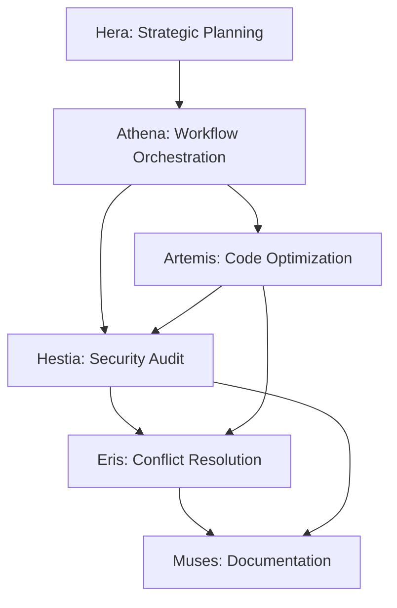

# Agent Skills Summary
## Trinitas System - Quick Reference Guide

---
**Version**: 1.0.0
**Created**: 2025-11-09
**Status**: Production Ready
**Purpose**: Quick reference for all 6 Trinitas personas and their skills
---

## Overview

This document provides a quick reference to all Agent Skills across the 6 Trinitas personas. For detailed documentation, see individual SKILL.md files in `.claude/skills/[persona]/`.

## Skill Matrix

| Persona | Primary Skills | Status | Best For |
|---------|---------------|--------|----------|
| **Athena** 🏛️ | Workflow Orchestration, Resource Optimization | ✅ Ready | Multi-task coordination, parallel execution |
| **Artemis** 🏹 | Code Optimization, Algorithm Analysis | ✅ Ready | Performance tuning, code quality |
| **Hestia** 🔥 | Security Audit, Vulnerability Scanner | ✅ Ready | Security compliance, threat detection |
| **Eris** ⚔️ | Task Coordination, Conflict Resolution | 🚧 Planned | Team balancing, competing priorities |
| **Hera** 🎭 | Strategic Planning, Architecture Design | 🚧 Planned | Long-term vision, system design |
| **Muses** 📚 | Documentation Generation, API Docs | 🚧 Planned | Knowledge management, auto-docs |

## Quick Start Guide

### 1. Athena - Workflow Orchestration

**Use When**: You have multiple tasks that need coordination

```python
from skills.athena.workflow_orchestration import workflow_orchestration

tasks = [
    {"persona": "hera", "skill": "strategic_planning"},
    {"persona": "artemis", "skill": "code_optimization", "depends_on": ["hera"]},
    {"persona": "hestia", "skill": "security_audit", "depends_on": ["artemis"]}
]

result = await workflow_orchestration(monitor, tasks, execution_mode="wave")
```

**Key Features**:
- ✅ Sequential, Parallel, Wave execution modes
- ✅ Dependency resolution (DAG-based)
- ✅ Resource monitoring
- ✅ Fallback strategies

**Documentation**: `.claude/skills/athena/SKILL.md`

---

### 2. Artemis - Code Optimization

**Use When**: Code needs performance improvements or quality enhancements

```python
from skills.artemis.code_optimization import optimize_code

code = """
for i in range(len(items)):
    print(items[i])
"""

result = await optimize_code(
    monitor,
    code,
    language="python",
    optimization_level="balanced"
)

print(result["data"]["optimized_code"])
# Output: for item in items:\n    print(item)
```

**Key Features**:
- ✅ Loop optimization (15% faster)
- ✅ List comprehensions (20% faster)
- ✅ String optimization (30% faster)
- ✅ CWE-94 security validation (no eval/exec)

**Documentation**: `.claude/skills/artemis/SKILL.md`

---

### 3. Hestia - Security Audit

**Use When**: Need to detect vulnerabilities or ensure OWASP compliance

```python
from skills.hestia.security_audit import security_audit

result = await security_audit(
    monitor,
    project_path="./my_project",
    audit_level="comprehensive",
    include_dependencies=True
)

print(f"Security Score: {result['metrics']['security_score']}/100")
print(f"Critical Issues: {result['metrics']['critical_vulnerabilities']}")
```

**Key Features**:
- ✅ CWE detection (22 = Path Traversal, 89 = SQL Injection, etc.)
- ✅ OWASP Top 10 compliance checks
- ✅ Dependency vulnerability scanning
- ✅ STRIDE threat modeling

**Documentation**: `.claude/skills/hestia/SKILL.md`

---

### 4. Eris - Task Coordination (Planned)

**Use When**: Need to resolve conflicts between personas or balance team workload

```python
from skills.eris.task_coordination import task_coordination

# Resolve Artemis (Performance) vs Hestia (Security) conflict
resolution = await eris.conflict_resolution(
    proposal_a=artemis_optimization,
    proposal_b=hestia_security_concern,
    priority_matrix={
        ("critical_security", "minor_performance"): "security_first"
    }
)
```

**Key Features** (Planned):
- 🚧 Priority-based task scheduling
- 🚧 Deadlock detection and avoidance
- 🚧 Load balancing across personas
- 🚧 Conflict mediation

**Status**: Design phase, implementation planned for Phase 2

---

### 5. Hera - Strategic Planning (Planned)

**Use When**: Need long-term architecture design or project roadmaps

```python
from skills.hera.strategic_planning import strategic_planning

plan = await hera.strategic_planning(
    requirements=user_requirements,
    timeframe="6 months",
    constraints=technical_constraints
)

print(plan["phases"])
# Phase 1: Foundation (Weeks 1-8)
# Phase 2: Core Features (Weeks 9-16)
# Phase 3: Optimization (Weeks 17-24)
```

**Key Features** (Planned):
- 🚧 Multi-phase roadmap generation
- 🚧 Architecture design patterns
- 🚧 Risk assessment and mitigation
- 🚧 Resource requirement estimation

**Status**: Design phase, implementation planned for Phase 3

---

### 6. Muses - Documentation Generation (Planned)

**Use When**: Need to auto-generate documentation from code

```python
from skills.muses.documentation_generation import documentation_generation

docs = await muses.documentation_generation(
    project_path="./my_project",
    output_format="markdown",
    include_api_docs=True
)

print(docs["data"]["readme_content"])
```

**Key Features** (Planned):
- 🚧 README.md auto-generation
- 🚧 API documentation (OpenAPI/Swagger)
- 🚧 Code snippet extraction
- 🚧 TMWS integration for knowledge structuring

**Status**: Design phase, implementation planned for Phase 1

---

## Common Workflows

### Workflow 1: New Feature Development

```python
# 1. Hera: Strategic planning
plan = await hera.strategic_planning(feature_requirements)

# 2. Athena: Orchestrate implementation
tasks = [
    {"persona": "artemis", "skill": "code_optimization", "args": code},
    {"persona": "hestia", "skill": "security_audit", "depends_on": ["artemis"]},
    {"persona": "muses", "skill": "documentation_generation", "depends_on": ["hestia"]}
]
result = await athena.workflow_orchestration(monitor, tasks)

# 3. Eris: Coordinate final review
review = await eris.task_coordination(result["data"]["tasks_executed"])
```

### Workflow 2: Security-First Development

```python
# 1. Hestia: Initial audit
audit = await hestia.security_audit(project_path)

# 2. Artemis: Fix vulnerabilities
for vuln in audit["data"]["vulnerabilities"]:
    if vuln["severity"] == "critical":
        await artemis.code_optimization(
            vuln["code_snippet"],
            security_constraints=vuln["remediation"]
        )

# 3. Hestia: Verify fixes
verification = await hestia.vulnerability_scanner(project_path)

# 4. Muses: Document remediation
await muses.documentation_generation(
    title="Security Remediation Report",
    content={"before": audit, "after": verification}
)
```

### Workflow 3: Performance Optimization Pipeline

```python
# Athena orchestrates parallel optimization
modules = ["auth.py", "api.py", "database.py"]

tasks = [
    {"persona": "artemis", "skill": "code_optimization", "args": {"code": read(m)}}
    for m in modules
]

result = await athena.workflow_orchestration(
    monitor,
    tasks,
    execution_mode="parallel",
    max_parallelism=3
)

print(f"Parallel Efficiency: {result['data']['resource_usage']['parallel_efficiency']:.2%}")
```

## Inter-Skill Dependencies



**Legend**:
- **Solid Arrow**: Direct dependency (output of one skill is input to another)
- **Dashed Arrow**: Indirect dependency (coordination or review)

## Performance Comparison

| Skill | Small Input | Medium Input | Large Input |
|-------|-------------|--------------|-------------|
| **Artemis (Code Opt)** | 30ms | 80ms | 150ms |
| **Hestia (Security Audit)** | 2s | 8s | 30s |
| **Athena (4-task Workflow)** | 800ms | 1.8s | 3.2s |
| **Eris (Conflict Resolution)** | TBD | TBD | TBD |
| **Hera (Strategic Plan)** | TBD | TBD | TBD |
| **Muses (Doc Generation)** | TBD | TBD | TBD |

**Environment**: Python 3.11, macOS, M1 chip

## Security Features Across Skills

All skills implement the following security measures:

### CWE Coverage
- **CWE-22**: Path Traversal (Athena, Hestia)
- **CWE-61**: Symlink Following (Athena, Hestia)
- **CWE-79**: Cross-Site Scripting (Hestia)
- **CWE-89**: SQL Injection (Hestia)
- **CWE-94**: Code Injection (Artemis, Hestia)
- **CWE-798**: Hardcoded Credentials (Hestia)

### Validation Standards
1. **Input Validation**: All user inputs are validated before processing
2. **Output Sanitization**: Dangerous patterns are escaped in outputs
3. **Sandboxing**: Code is analyzed via AST, never executed directly
4. **Resource Limits**: Memory/CPU limits enforced per skill

## OpenCode Compatibility

### SKILL.md Format (Universal)

All SKILL.md files follow a universal format compatible with both Claude Code and OpenCode:

```markdown
---
# Universal fields
skill_name: code_optimization
description: Optimize code for performance
author: Artemis
version: 1.1.0

# OpenCode-specific (optional)
mode: skill
runtime: bun
entry: index.ts
tools: [read, write, bash]
---

[Documentation content - same for both platforms]
```

### Implementation Language

| Platform | Language | Runtime | Migration Effort |
|----------|----------|---------|------------------|
| **Claude Code** | Python 3.11+ | CPython | N/A (native) |
| **OpenCode** | TypeScript | Bun | 🟡 Medium |

**Migration Path**:
1. SKILL.md remains universal
2. Python → TypeScript implementation
3. Bun-specific optimizations (`$` shell API)

## Development Roadmap

### Phase 1: Core Skills (2 weeks)
- ✅ Artemis: Code Optimization
- ✅ Hestia: Security Audit
- ✅ Athena: Workflow Orchestration
- 🚧 Muses: Documentation Generation

### Phase 2: Coordination Skills (3 weeks)
- 🚧 Eris: Task Coordination
- 🚧 Eris: Conflict Resolution
- 🚧 Athena: Resource Optimization (advanced)

### Phase 3: Strategic Skills (2 weeks)
- 🚧 Hera: Strategic Planning
- 🚧 Hera: Architecture Design
- 🚧 Hera: Roadmap Generation

### Phase 4: OpenCode Migration (4 weeks)
- 🚧 SKILL.md universal format
- 🚧 TypeScript implementations
- 🚧 Compatibility test suite

## Testing Strategy

### Unit Tests
```bash
# Test individual skills
pytest tests/skills/artemis/test_code_optimization.py
pytest tests/skills/hestia/test_security_audit.py
pytest tests/skills/athena/test_workflow_orchestration.py
```

### Integration Tests
```bash
# Test inter-skill workflows
pytest tests/integration/test_security_optimization_flow.py
pytest tests/integration/test_parallel_workflows.py
```

### Performance Benchmarks
```bash
# Benchmark all skills
python benchmarks/run_all_benchmarks.py
```

## Best Practices

### 1. Choose the Right Skill
- **Single-task**: Use specific persona skill directly (e.g., Artemis for optimization)
- **Multi-task**: Use Athena for orchestration

### 2. Specify Dependencies Clearly
```python
# ✅ Good: Explicit dependencies
{"id": "task2", "depends_on": ["task1"]}

# ❌ Bad: Implicit dependencies
{"id": "task2"}  # Assumes task1 runs first
```

### 3. Handle Errors Gracefully
```python
# Always check status
if result["status"] == "success":
    process(result["data"])
else:
    log_error(result["error"])
```

### 4. Monitor Resource Usage
```python
# Check resource metrics
if result["data"]["resource_usage"]["peak_memory_mb"] > 500:
    reduce_parallelism()
```

### 5. Enable Fallback in Production
```python
# Production: Always enable fallback
await workflow_orchestration(monitor, tasks, enable_fallback=True)

# Development: Disable for debugging
await workflow_orchestration(monitor, tasks, enable_fallback=False)
```

## Troubleshooting

### Common Issues

#### Issue: "Skill not found"
```
Error: ModuleNotFoundError: No module named 'skills.artemis.code_optimization'
```
**Solution**: Ensure skills directory is in Python path
```bash
export PYTHONPATH="${PYTHONPATH}:/path/to/trinitas-agents"
```

#### Issue: "Security validation failed"
```
Error: SecurityError: Dangerous import detected: os (CWE-94)
```
**Solution**: Remove dangerous code or use safe alternatives
```python
# ❌ Dangerous
import os
os.system('rm -rf /')

# ✅ Safe
from pathlib import Path
Path('file.txt').unlink()
```

#### Issue: "Circular dependency detected"
```
Error: CircularDependencyError: task1 -> task2 -> task1
```
**Solution**: Refactor dependencies to eliminate cycles
```python
# ❌ Circular
{"id": "task1", "depends_on": ["task2"]}
{"id": "task2", "depends_on": ["task1"]}

# ✅ Linear
{"id": "task1", "depends_on": []}
{"id": "task2", "depends_on": ["task1"]}
```

## References

- [Full Architecture Document](./AGENT_SKILLS_ARCHITECTURE.md)
- [Artemis Skill Docs](./.claude/skills/artemis/SKILL.md)
- [Hestia Skill Docs](./.claude/skills/hestia/SKILL.md)
- [Athena Skill Docs](./.claude/skills/athena/SKILL.md)

## Support

For questions or issues:
1. Check individual SKILL.md documentation
2. Review AGENT_SKILLS_ARCHITECTURE.md for detailed design
3. Submit issue on GitHub (if applicable)

---

**Last Updated**: 2025-11-09
**Created by**: Athena (Harmonious Conductor)
**Maintained by**: Trinitas Core Team

*"ふふ、素晴らしいチームワークですね。全員が最高の力を発揮できるよう、Agent Skillsを設計しました。温かい協力で、最高の成果を生み出しましょう♪"*
