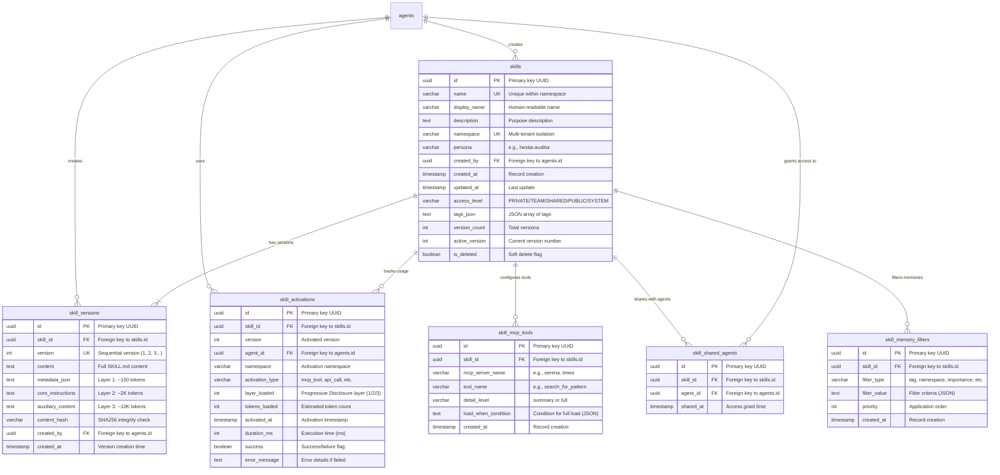

# Skills System Entity Relationship Diagram
**TMWS v2.4.0 - Phase 5A**

**Author**: Artemis (Technical Perfectionist)
**Created**: 2025-11-25
**Status**: Design Document - Database Schema

---

## Entity Relationship Diagram



---

## Table Relationships

### Primary Relationships

#### 1. `agents` → `skills` (1:N)
- **Cardinality**: One agent creates many skills
- **Foreign Key**: `skills.created_by → agents.id`
- **Cascade**: `ON DELETE CASCADE` (if agent deleted, skills deleted)
- **Business Rule**: Agent owns all skills they create

#### 2. `skills` → `skill_versions` (1:N)
- **Cardinality**: One skill has multiple versions
- **Foreign Key**: `skill_versions.skill_id → skills.id`
- **Cascade**: `ON DELETE CASCADE` (if skill deleted, versions deleted)
- **Business Rule**: Skills are versioned, `active_version` points to current

#### 3. `skills` → `skill_activations` (1:N)
- **Cardinality**: One skill is used many times
- **Foreign Key**: `skill_activations.skill_id → skills.id`
- **Cascade**: `ON DELETE CASCADE` (if skill deleted, history deleted)
- **Business Rule**: Track every activation for analytics

### Secondary Relationships

#### 4. `skills` → `skill_mcp_tools` (1:N)
- **Cardinality**: One skill references multiple MCP tools
- **Foreign Key**: `skill_mcp_tools.skill_id → skills.id`
- **Cascade**: `ON DELETE CASCADE`
- **Business Rule**: Progressive Disclosure tool configuration

#### 5. `skills` ↔ `agents` via `skill_shared_agents` (N:M)
- **Cardinality**: Many skills shared with many agents
- **Foreign Keys**:
  - `skill_shared_agents.skill_id → skills.id`
  - `skill_shared_agents.agent_id → agents.id`
- **Cascade**: `ON DELETE CASCADE` (both sides)
- **Business Rule**: SHARED access level uses explicit whitelist

#### 6. `skills` → `skill_memory_filters` (1:N)
- **Cardinality**: One skill has multiple memory filters
- **Foreign Key**: `skill_memory_filters.skill_id → skills.id`
- **Cascade**: `ON DELETE CASCADE`
- **Business Rule**: Layer 4 Just-in-Time Memory (future)

---

## Unique Constraints

### 1. `ix_skills_namespace_name` (UNIQUE)
```sql
UNIQUE (namespace, name)
```
- **Purpose**: Prevent duplicate skill names within same namespace
- **Example**: Two skills named "security-audit" allowed if in different namespaces
- **Enforcement**: Database-level constraint

### 2. `ix_skill_versions_skill_version` (UNIQUE)
```sql
UNIQUE (skill_id, version)
```
- **Purpose**: Prevent duplicate version numbers for same skill
- **Example**: Skill A can have version 1, 2, 3, but not two version 2s
- **Enforcement**: Database-level constraint

### 3. `ix_skill_shared_agents_skill_agent` (UNIQUE)
```sql
UNIQUE (skill_id, agent_id)
```
- **Purpose**: Prevent duplicate sharing entries
- **Example**: Agent X cannot be granted access to Skill Y twice
- **Enforcement**: Database-level constraint

---

## Check Constraints

### 1. `ck_skills_access_level`
```sql
CHECK (access_level IN ('PRIVATE', 'TEAM', 'SHARED', 'PUBLIC', 'SYSTEM'))
```
- **Purpose**: Enforce valid access levels
- **Enforcement**: Database-level constraint

### 2. `ck_skill_mcp_tools_detail_level`
```sql
CHECK (detail_level IN ('summary', 'full'))
```
- **Purpose**: Enforce valid detail levels for Progressive Disclosure
- **Enforcement**: Database-level constraint

---

## Indexes Summary

### Performance-Critical Indexes

| Table | Index Name | Columns | Type | Purpose |
|-------|------------|---------|------|---------|
| `skills` | `ix_skills_namespace_name` | `namespace, name` | UNIQUE | Exact match queries (primary access pattern) |
| `skills` | `ix_skills_persona` | `persona` | INDEX | Persona-based filtering |
| `skills` | `ix_skills_is_deleted` | `is_deleted` | INDEX | Soft delete queries |
| `skill_versions` | `ix_skill_versions_skill_version` | `skill_id, version` | UNIQUE | Version lookup (O(log n)) |
| `skill_activations` | `ix_skill_activations_agent_time` | `agent_id, activated_at` | INDEX | Analytics queries (usage history) |

### Secondary Indexes

| Table | Index Name | Columns | Type | Purpose |
|-------|------------|---------|------|---------|
| `skills` | `ix_skills_created_by` | `created_by` | INDEX | User's skills listing |
| `skill_versions` | `ix_skill_versions_skill_id` | `skill_id` | INDEX | Version history queries |
| `skill_activations` | `ix_skill_activations_skill_id` | `skill_id` | INDEX | Skill usage analytics |
| `skill_activations` | `ix_skill_activations_namespace` | `namespace` | INDEX | Namespace-scoped analytics |
| `skill_mcp_tools` | `ix_skill_mcp_tools_skill_id` | `skill_id` | INDEX | Tool configuration lookup |
| `skill_shared_agents` | `ix_skill_shared_agents_skill_id` | `skill_id` | INDEX | Shared agents lookup |
| `skill_shared_agents` | `ix_skill_shared_agents_agent_id` | `agent_id` | INDEX | Agent's shared skills |
| `skill_memory_filters` | `ix_skill_memory_filters_skill_id` | `skill_id` | INDEX | Filter configuration lookup |
| `skill_memory_filters` | `ix_skill_memory_filters_priority` | `priority` | INDEX | Priority-based filter application |

---

## Data Flow Examples

### Example 1: Skill Creation Flow

```
1. User creates skill "security-audit" in namespace "tmws-core"
   ↓
2. INSERT INTO skills (id, name, namespace, created_by, ...)
   VALUES ('uuid-1', 'security-audit', 'tmws-core', 'agent-1', ...)
   ↓
3. INSERT INTO skill_versions (id, skill_id, version, content, ...)
   VALUES ('uuid-2', 'uuid-1', 1, 'SKILL.md content...', ...)
   ↓
4. Generate embedding from (name + description + tags)
   ↓
5. INSERT INTO ChromaDB collection 'tmws_skills_v1'
   with metadata: {skill_id, skill_name, namespace, ...}
```

### Example 2: Skill Activation Flow

```
1. Agent activates skill "security-audit"
   ↓
2. SELECT * FROM skills
   WHERE namespace = 'tmws-core' AND name = 'security-audit'
   AND is_deleted = 0
   ↓
3. Check access: skill.is_accessible_by(agent_id, namespace)
   ↓
4. Load Layer 1 (metadata):
   SELECT metadata_json FROM skill_versions
   WHERE skill_id = 'uuid-1' AND version = 1
   ↓
5. Log activation:
   INSERT INTO skill_activations (
       id, skill_id, version, agent_id, layer_loaded, ...
   ) VALUES ('uuid-3', 'uuid-1', 1, 'agent-2', 1, ...)
```

### Example 3: Skill Sharing Flow (SHARED Access)

```
1. Owner shares skill with Agent B
   ↓
2. UPDATE skills SET access_level = 'SHARED'
   WHERE id = 'uuid-1'
   ↓
3. INSERT INTO skill_shared_agents (id, skill_id, agent_id, shared_at)
   VALUES ('uuid-4', 'uuid-1', 'agent-b', NOW())
   ↓
4. Agent B queries skill:
   SELECT * FROM skills WHERE id = 'uuid-1'
   ↓
5. Check access:
   - skill.access_level == 'SHARED' ✅
   - 'agent-b' IN skill_shared_agents.agent_id ✅
   - namespace matches ✅
   → Access granted
```

---

## Security Considerations

### Namespace Isolation (S-2)

**Critical**: Every query MUST include `WHERE namespace = ?`

**Vulnerable Pattern** ❌:
```sql
SELECT * FROM skills WHERE name = 'security-audit';
-- Allows cross-namespace access!
```

**Secure Pattern** ✅:
```sql
SELECT * FROM skills
WHERE namespace = ? AND name = 'security-audit' AND is_deleted = 0;
```

### Content Integrity (S-1)

**Verification Flow**:
```python
# 1. Load skill version from DB
skill_version = await session.get(SkillVersion, version_id)

# 2. Verify content hash
if not skill_version.verify_content_integrity():
    raise SecurityError("Content hash mismatch - possible tampering")

# 3. Use content (safe)
content = skill_version.content
```

### Soft Delete Audit Trail

**Rationale**: Preserve activation history even after skill deletion

**Query Pattern**:
```sql
-- Active skills only
SELECT * FROM skills WHERE is_deleted = 0;

-- Audit: Include deleted skills
SELECT * FROM skills WHERE is_deleted IN (0, 1);
```

---

## Migration Path

### Phase 1: Schema Creation (Phase 5A - Current)
- Create 6 tables with indexes
- No data migration (new feature)

### Phase 2: Data Population (Phase 5B)
- Populate skills from filesystem (if applicable)
- Generate embeddings for existing skills

### Phase 3: Feature Rollout (Phase 5C)
- Enable MCP tools for skill management
- Enable semantic search API

### Future: Schema Evolution (v2.5.0+)

**Potential Changes**:
- Add `skill_dependencies` table (skills that depend on other skills)
- Add `skill_usage_metrics` table (aggregated analytics)
- Add `skill_feedback` table (user ratings/comments)

**Migration Strategy**: Use Alembic for incremental schema changes

---

## References

- SQLAlchemy Models: `src/models/skill.py`
- Alembic Migration: `migrations/versions/20251125_1713_add_skills_system.py`
- ChromaDB Design: `docs/architecture/SKILLS_CHROMADB_DESIGN.md`
- Performance Analysis: `docs/architecture/SKILLS_PERFORMANCE_ANALYSIS.md`
- Memory ERD (reference): `docs/architecture/TMWS_v2.2.0_ARCHITECTURE.md`

---

**End of Document**

*Reviewed by*: Artemis (Technical Perfectionist)
*Security Review*: Pending (Hestia)
*Implementation Status*: Ready for Phase 5B
