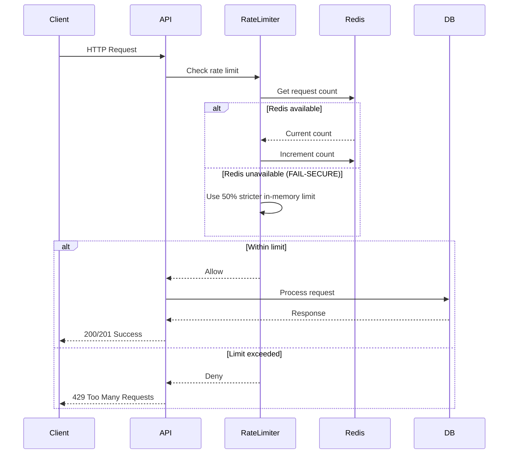

# Rate Limiting Guide

**Version**: v2.3.0
**Last Updated**: 2025-11-13

---

## Table of Contents

1. [Overview](#overview)
2. [Rate Limit Configuration](#rate-limit-configuration)
3. [How Rate Limiting Works](#how-rate-limiting-works)
4. [Error Responses](#error-responses)
5. [Monitoring Rate Limits](#monitoring-rate-limits)
6. [Bypass for Testing](#bypass-for-testing)
7. [Troubleshooting](#troubleshooting)

---

## Overview

TMWS implements **fail-secure rate limiting** to protect the API and MCP servers from abuse. All MCP Connection API endpoints have rate limits enforced per client IP and per authenticated user.

### Key Features

- **Fail-secure design**: Any rate limiter error results in access denial (503 Service Unavailable)
- **Multi-layer protection**: Global, per-IP, per-user, and per-endpoint limits
- **Graceful degradation**: Redis failures trigger 50% stricter in-memory limits
- **Burst allowance**: Temporary traffic spikes allowed within burst limit
- **Automatic blocking**: Excessive violations result in temporary/permanent bans

### Why Rate Limiting?

| Threat | Mitigation |
|--------|------------|
| DDoS attacks | Block excessive requests from single IP |
| API abuse | Limit requests per user account |
| MCP server overload | Protect external MCP servers from excessive tool executions |
| Connection exhaustion | Prevent connection pool depletion |
| Brute force attacks | Slow down authentication attacks |

---

## Rate Limit Configuration

### MCP API Limits

#### Production Environment

| Endpoint | Limit | Burst | Block Duration | Purpose |
|----------|-------|-------|----------------|---------|
| **Create Connection** | 10/min | +2 | 5 min | Prevent connection pool exhaustion |
| **Discover Tools** | 50/min | +10 | 1 min | Reduce MCP server load |
| **Execute Tool** | 100/min | +20 | 1 min | Prevent MCP server overload |
| **Disconnect** | 20/min | +5 | 1 min | Normal operation rate |

#### Development Environment

| Endpoint | Limit | Burst | Block Duration | Purpose |
|----------|-------|-------|----------------|---------|
| **Create Connection** | 30/min | +10 | 5 min | More lenient for testing |
| **Discover Tools** | 100/min | +20 | 1 min | Faster testing |
| **Execute Tool** | 200/min | +50 | 1 min | Rapid testing |
| **Disconnect** | 50/min | +10 | 1 min | Quick cleanup |

#### Test Environment

**All rate limiting is disabled** in test environment to avoid flaky tests.

### Configuration

Rate limits are configured via environment variables:

```bash
# Environment (determines which limits apply)
export TMWS_ENVIRONMENT=production  # production | development | test
```

**Note**: Individual rate limit values are hardcoded per environment in `src/api/dependencies.py` for security reasons. Contact system administrator to adjust limits.

### Understanding Rate Limit Components

#### 1. Base Limit

**Definition**: Maximum requests allowed in the time period.

**Example**: `10/min` = 10 requests per minute

#### 2. Burst Allowance

**Definition**: Extra requests allowed for temporary traffic spikes.

**Example**: `Limit: 10/min, Burst: +2` = 12 total requests allowed

**Use Case**: Handle legitimate traffic bursts without blocking users.

#### 3. Block Duration

**Definition**: How long client is blocked after exceeding limit.

**Example**: `Block: 5 min` = 5 minutes before client can retry

**Security**: Longer blocks for sensitive endpoints (e.g., connection creation).

---

## How Rate Limiting Works

### Request Flow



### Rate Limit Tracking

#### Per-IP Tracking

Requests are tracked by client IP address:

```python
# Client IP extraction (respects X-Forwarded-For header)
client_ip = request.headers.get("X-Forwarded-For", "").split(",")[0].strip()
if not client_ip:
    client_ip = request.client.host

# Rate limit key
key = f"mcp_create_connection:{client_ip}:{time_window}"
```

#### Per-User Tracking (Authenticated)

For authenticated endpoints, additional per-user limits apply:

```python
# Extract agent_id from JWT token
agent_id = current_user.agent_id

# Rate limit key
key = f"user_rate_limit:{agent_id}:{time_window}"
```

### Fail-Secure Behavior

**Critical Design Principle**: Any error in rate limiter = deny access

#### Scenario 1: Redis Unavailable

```python
# Rate limiter detects Redis failure
try:
    redis.incr(key)
except RedisConnectionError:
    # FAIL-SECURE: Use 50% stricter in-memory limit
    fallback_limit = configured_limit // 2
    logger.warning("⚠️  DEGRADED MODE: Using fallback limit")

    if request_count > fallback_limit:
        raise HTTPException(503, "Service temporarily unavailable")
```

**Result**: Service continues with stricter limits (safer)

#### Scenario 2: Rate Limiter Crash

```python
try:
    await check_rate_limit(request, "mcp_execute_tool")
except Exception as e:
    # FAIL-SECURE: Any unexpected error = deny access
    logger.error(f"❌ Rate limiter error: {e}")
    raise HTTPException(503, "Service temporarily unavailable")
```

**Result**: Access denied (prevent potential abuse)

### Degraded Mode

When Redis fails repeatedly, rate limiter enters **degraded mode**:

```python
# After 3 consecutive Redis failures
if consecutive_failures >= 3:
    degraded_mode_active = True
    logger.critical("⚠️  DEGRADED MODE ACTIVATED: Using fail-secure fallback limits")
```

**Characteristics**:
- Fallback to in-memory rate limiting
- 50% stricter limits applied
- Automatic recovery when Redis restored
- Operational visibility via logs and metrics

---

## Error Responses

### 429 Too Many Requests

**Response when rate limit exceeded:**

```http
HTTP/1.1 429 Too Many Requests
Retry-After: 60
Content-Type: application/json

{
  "error_code": "RATE_LIMIT_EXCEEDED",
  "message": "Rate limit exceeded for mcp_execute_tool",
  "details": {
    "endpoint_type": "mcp_execute_tool",
    "limit": 100,
    "period": 60,
    "retry_after": 60
  },
  "timestamp": "2025-11-13T10:30:00.123456Z"
}
```

**Headers:**

| Header | Value | Description |
|--------|-------|-------------|
| `Retry-After` | `60` | Seconds to wait before retrying |

### 503 Service Unavailable (Fail-Secure)

**Response when rate limiter fails:**

```http
HTTP/1.1 503 Service Unavailable
Retry-After: 30
Content-Type: application/json

{
  "error_code": "SERVICE_UNAVAILABLE",
  "message": "Service temporarily unavailable",
  "details": {
    "reason": "degraded_mode",
    "retry_after": 30
  },
  "timestamp": "2025-11-13T10:30:00.123456Z"
}
```

**Causes**:
- Redis connection failure
- Rate limiter internal error
- Degraded mode active

### Client Handling

#### Exponential Backoff

```python
import time
import requests

def call_api_with_retry(url, headers, max_retries=5):
    """Call API with exponential backoff on rate limit."""
    for attempt in range(max_retries):
        response = requests.get(url, headers=headers)

        if response.status_code == 200:
            return response.json()

        elif response.status_code == 429:
            # Rate limit exceeded
            retry_after = int(response.headers.get("Retry-After", 60))
            wait_time = retry_after * (2 ** attempt)  # Exponential backoff

            print(f"Rate limited. Waiting {wait_time}s before retry {attempt + 1}/{max_retries}")
            time.sleep(wait_time)

        elif response.status_code == 503:
            # Service unavailable (degraded mode)
            wait_time = 30 * (2 ** attempt)
            print(f"Service degraded. Waiting {wait_time}s")
            time.sleep(wait_time)

        else:
            # Other error
            response.raise_for_status()

    raise Exception(f"Max retries ({max_retries}) exceeded")
```

#### JavaScript Example

```javascript
async function callApiWithRetry(url, headers, maxRetries = 5) {
  for (let attempt = 0; attempt < maxRetries; attempt++) {
    const response = await fetch(url, { headers });

    if (response.ok) {
      return await response.json();
    }

    if (response.status === 429) {
      // Rate limit exceeded
      const retryAfter = parseInt(response.headers.get('Retry-After') || '60');
      const waitTime = retryAfter * Math.pow(2, attempt);

      console.log(`Rate limited. Waiting ${waitTime}s`);
      await new Promise(resolve => setTimeout(resolve, waitTime * 1000));

    } else if (response.status === 503) {
      // Service unavailable
      const waitTime = 30 * Math.pow(2, attempt);
      console.log(`Service degraded. Waiting ${waitTime}s`);
      await new Promise(resolve => setTimeout(resolve, waitTime * 1000));

    } else {
      throw new Error(`API error: ${response.status}`);
    }
  }

  throw new Error(`Max retries (${maxRetries}) exceeded`);
}
```

---

## Monitoring Rate Limits

### Rate Limit Headers (Future Feature)

**Planned for v2.4.0:**

```http
X-RateLimit-Limit: 100
X-RateLimit-Remaining: 95
X-RateLimit-Reset: 1699876543
```

### Rate Limit Statistics Endpoint

**Planned for v2.4.0:**

```http
GET /api/v1/admin/rate-limits/statistics
Authorization: Bearer <admin_token>
```

**Response:**

```json
{
  "global": {
    "total_requests": 12543,
    "blocked_requests": 234,
    "unique_clients": 156
  },
  "by_endpoint": {
    "mcp_create_connection": {
      "requests": 450,
      "blocked": 12,
      "avg_requests_per_minute": 7.5
    },
    "mcp_execute_tool": {
      "requests": 8934,
      "blocked": 189,
      "avg_requests_per_minute": 148.9
    }
  },
  "redis_health": {
    "available": true,
    "degraded_mode": false,
    "failure_count": 2,
    "last_failure": "2025-11-13T08:45:23Z"
  },
  "top_violators": [
    {
      "ip": "192.168.1.100",
      "violations": 45,
      "total_requests": 1234
    }
  ]
}
```

### Logging

Rate limit events are logged with structured metadata:

```python
# Example log entries
logger.warning(
    "IP rate limit exceeded",
    extra={
        "client_ip": "192.168.1.100",
        "endpoint_type": "mcp_execute_tool",
        "requests": 125,
        "limit": 100,
        "period": 60
    }
)

logger.critical(
    "⚠️  DEGRADED MODE ACTIVATED: Redis connection failing",
    extra={
        "consecutive_failures": 5,
        "last_failure_time": "2025-11-13T10:30:00Z"
    }
)
```

### Prometheus Metrics (Future Feature)

**Planned for v2.4.0:**

```prometheus
# Rate limit requests total
rate_limit_requests_total{endpoint="mcp_execute_tool",status="allowed"} 8934
rate_limit_requests_total{endpoint="mcp_execute_tool",status="blocked"} 189

# Rate limiter health
rate_limiter_degraded_mode{reason="redis_failure"} 0

# Redis health
rate_limiter_redis_failures_total 2
```

---

## Bypass for Testing

### Disable Rate Limiting

#### Environment Variable

```bash
# Disable all rate limiting (test environment)
export TMWS_ENVIRONMENT=test
```

#### Configuration File

```bash
# .env.test
TMWS_ENVIRONMENT=test
```

### Testing Rate Limits

#### Integration Tests

```python
# tests/integration/test_rate_limiting.py
import pytest
from fastapi.testclient import TestClient

def test_rate_limit_enforced():
    """Test rate limit is enforced after exceeding limit."""
    client = TestClient(app)

    # Override environment to enable rate limiting
    with pytest.MonkeyPatch.context() as mp:
        mp.setenv("TMWS_ENVIRONMENT", "production")

        # Make requests until rate limited
        for i in range(15):  # Limit is 10/min in production
            response = client.post(
                "/api/v1/mcp/connections",
                json={"server_name": f"server_{i}", ...},
                headers=auth_headers
            )

            if i < 12:  # Within limit + burst (10 + 2)
                assert response.status_code == 201
            else:  # Exceeded limit
                assert response.status_code == 429
                assert "Retry-After" in response.headers
```

#### Manual Testing

```bash
# Test rate limiting manually
for i in {1..15}; do
  echo "Request $i"
  curl -X POST http://localhost:8000/api/v1/mcp/connections \
    -H "Authorization: Bearer $TOKEN" \
    -d '{"server_name": "test_'$i'", ...}' \
    -w "\nHTTP Status: %{http_code}\n\n"
  sleep 1
done
```

### Load Testing

Use `locust` or `k6` for load testing:

```python
# locustfile.py
from locust import HttpUser, task, between

class MCPAPIUser(HttpUser):
    wait_time = between(1, 3)

    def on_start(self):
        # Authenticate and get token
        self.token = "your-jwt-token"

    @task
    def execute_tool(self):
        self.client.post(
            "/api/v1/mcp/connections/550e8400-e29b-41d4-a716-446655440000/tools/test_tool/execute",
            json={"arguments": {"param": "value"}},
            headers={"Authorization": f"Bearer {self.token}"}
        )
```

Run load test:

```bash
locust -f locustfile.py --host http://localhost:8000 --users 50 --spawn-rate 10
```

---

## Troubleshooting

### Issue: Legitimate Traffic Blocked

**Symptoms**: Users report 429 errors during normal usage

**Causes**:
- Limits too strict for actual usage patterns
- Burst traffic from legitimate use case
- Multiple users sharing same IP (NAT/proxy)

**Solutions**:

1. **Increase limits** (requires code change):
```python
# src/api/dependencies.py
if env == "production":
    _rate_limiter.rate_limits.update({
        "mcp_execute_tool": RateLimit(200, 60, burst=40),  # Doubled
    })
```

2. **Implement per-user tracking** (already implemented):
```python
# Per-user limits are separate from per-IP limits
# Users behind same IP have independent quotas
```

3. **Whitelist trusted IPs** (future feature):
```python
# Planned: IP whitelist configuration
TMWS_RATE_LIMIT_WHITELIST="192.168.1.0/24,10.0.0.0/8"
```

### Issue: Rate Limiter in Degraded Mode

**Symptoms**: Logs show "DEGRADED MODE ACTIVATED"

**Causes**:
- Redis connection failure
- Redis server down
- Network issues

**Solutions**:

1. **Check Redis status**:
```bash
redis-cli ping
# Expected: PONG
```

2. **Check Redis connection**:
```bash
redis-cli -h localhost -p 6379 info
```

3. **Restart Redis**:
```bash
sudo systemctl restart redis
```

4. **Check network connectivity**:
```bash
telnet localhost 6379
```

### Issue: 503 Service Unavailable Errors

**Symptoms**: All requests return 503

**Causes**:
- Rate limiter internal error
- Database connection failure
- Fail-secure mode triggered

**Solutions**:

1. **Check application logs**:
```bash
tail -f logs/tmws.log | grep -i "rate.*limit\|degraded\|503"
```

2. **Check Redis health**:
```bash
curl http://localhost:8000/api/v1/admin/rate-limits/statistics \
  -H "Authorization: Bearer $ADMIN_TOKEN"
```

3. **Restart application** (clears in-memory state):
```bash
pkill -f "uvicorn src.api.main:app"
uvicorn src.api.main:app --reload
```

### Issue: Rate Limit Not Enforced

**Symptoms**: Can exceed limits without getting 429

**Causes**:
- Test environment enabled
- Rate limiting disabled

**Solutions**:

1. **Check environment**:
```bash
echo $TMWS_ENVIRONMENT
# Should be: production (not test)
```

2. **Verify rate limiter initialized**:
```python
# Add debug logging
logger.info(f"Rate limiter initialized: {get_rate_limiter() is not None}")
logger.info(f"Environment: {settings.environment}")
```

---

## Best Practices

### For API Clients

1. **Implement exponential backoff** for 429 responses
2. **Respect `Retry-After` header** values
3. **Cache results** to reduce API calls
4. **Batch operations** where possible
5. **Monitor your request rate** to stay within limits

### For API Administrators

1. **Monitor rate limiter health** (Redis availability)
2. **Set alerts** for degraded mode activations
3. **Review top violators** regularly
4. **Adjust limits** based on actual usage patterns
5. **Keep Redis highly available** (cluster, sentinel, or replicas)

### For Developers

1. **Test with rate limiting enabled** (staging environment)
2. **Document rate limits** for each endpoint
3. **Provide clear error messages** with retry guidance
4. **Log rate limit events** for analysis
5. **Implement graceful degradation** in clients

---

## Reference

### Related Documentation

- [MCP Connection API](../api/MCP_CONNECTION_API.md)
- [Authentication Guide](AUTHENTICATION_GUIDE.md)
- [Deployment Guide](../deployment/MCP_API_DEPLOYMENT.md)

### Configuration Reference

**Source Code**:
- Rate limiter: `src/security/rate_limiter.py`
- MCP API limits: `src/api/dependencies.py` (lines 283-302)
- Rate limit middleware: `src/api/dependencies.py` (lines 305-400)

---

**Document Author**: Muses (Knowledge Architect)
**Last Reviewed**: 2025-11-13
**Status**: Production-ready
