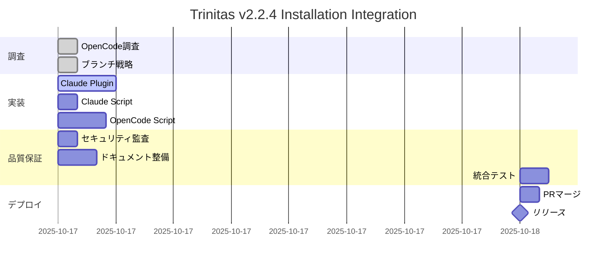

# Trinitas v2.2.4 インストール統合計画書
**作成日**: 2025-10-17
**Trinitas Full Mode協議結果**

## エグゼクティブサマリー

本計画書は、Trinitas Agents v2.2.4のインストール方法を3つの方式で整備する統合計画です。

### 整備対象
1. **Claude Code - Plugin方式** (MCP Server)
2. **Claude Code - Script方式** (従来の設定ファイルコピー)
3. **OpenCode - Script方式** (プラグイン配置自動化)

### プロジェクト完了基準
- ✅ 3つのインストール方式が動作
- ✅ ドキュメント完備
- ✅ セキュリティ監査合格
- ✅ メインブランチへのマージ完了

---

## Part 1: 事前調査結果（完了✅）

### 1.1 OpenCode最新情報
**調査担当**: Hera (戦略指揮官)
**成果物**: `docs/opencode-investigation-report.md`

**主要発見**:
- ✅ OpenCodeはClaude Code Pluginと同等のプラグインシステムを持つ
- ✅ 既存プラグイン4つが`.opencode/plugin/`に存在
- ✅ 最新版v0.15.7（現在v0.14.1インストール済み）
- ✅ プラグイン形式: JavaScript/TypeScriptモジュール

**戦略的推奨**:
1. OpenCodeプラグインシステムを活用
2. 既存プラグインの棚卸しと統合
3. v0.15.7へのアップグレード（任意）

### 1.2 ブランチマージ戦略
**設計担当**: Athena (調和的指揮者)
**成果物**: `docs/branch-merge-strategy.md`

**推奨戦略**: Pull Request経由 + Rebase方式
**タイムライン**: 70-100分（レビュー含む）
**リスク評価**: 低（テスト成功率99%、カバレッジ79%）

---

## Part 2: インストール方式の設計

### 2.1 Claude Code - Plugin方式（最優先）

#### 概要
MCP (Model Context Protocol) Serverとして実装し、Claude Desktopから動的にロード。

#### アーキテクチャ
```
~/.config/Claude/
├── claude_desktop_config.json
│   └── mcpServers:
│       └── trinitas:
│           ├── command: "node"
│           ├── args: ["/path/to/trinitas-mcp-server/index.js"]
│           └── env:
│               └── TRINITAS_PROJECT_ROOT: "/path/to/project"
│
/path/to/project/
├── .claude/
│   ├── mcp-server/
│   │   ├── index.js (MCP Server Entry)
│   │   ├── tools/
│   │   │   ├── trinitas-execute.js
│   │   │   ├── trinitas-analyze.js
│   │   │   └── trinitas-remember.js
│   │   └── resources/
│   │       ├── CLAUDE.md
│   │       └── AGENTS.md
│   └── CLAUDE.md (fallback)
```

#### 実装タスク
**担当**: Artemis (技術完璧主義者)

1. **MCP Server骨格作成** (30分)
   ```javascript
   // .claude/mcp-server/index.js
   import { Server } from "@modelcontextprotocol/sdk/server/index.js";
   import { StdioServerTransport } from "@modelcontextprotocol/sdk/server/stdio.js";

   const server = new Server({
     name: "trinitas-agents",
     version: "2.2.4"
   }, {
     capabilities: {
       tools: {},
       resources: {}
     }
   });

   // Tool handlers
   server.setRequestHandler("tools/list", async () => ({
     tools: [
       {
         name: "trinitas_execute",
         description: "Execute Trinitas agent with specific persona",
         inputSchema: { /* ... */ }
       }
     ]
   }));
   ```

2. **ツール実装** (60分)
   - `trinitas_execute`: エージェント実行
   - `trinitas_analyze`: 並列分析
   - `trinitas_remember`: メモリ操作
   - `trinitas_recall`: メモリ取得

3. **リソース提供** (30分)
   - CLAUDE.md動的読み込み
   - AGENTS.md動的読み込み
   - プロジェクト設定の注入

4. **インストールスクリプト** (45分)
   ```bash
   #!/bin/bash
   # install-trinitas-claude-plugin.sh

   SCRIPT_DIR="$(cd "$(dirname "${BASH_SOURCE[0]}")" && pwd)"
   CLAUDE_CONFIG="$HOME/.config/Claude/claude_desktop_config.json"

   # 1. MCP Serverのセットアップ
   echo "Setting up Trinitas MCP Server..."
   mkdir -p "$SCRIPT_DIR/.claude/mcp-server"
   cp -r mcp-server/* "$SCRIPT_DIR/.claude/mcp-server/"

   # 2. 依存関係インストール
   cd "$SCRIPT_DIR/.claude/mcp-server"
   npm install

   # 3. Claude設定更新
   echo "Updating Claude Desktop config..."
   python3 - <<EOF
   import json
   with open("$CLAUDE_CONFIG", "r") as f:
       config = json.load(f)

   config.setdefault("mcpServers", {})["trinitas"] = {
       "command": "node",
       "args": ["$SCRIPT_DIR/.claude/mcp-server/index.js"],
       "env": {"TRINITAS_PROJECT_ROOT": "$SCRIPT_DIR"}
   }

   with open("$CLAUDE_CONFIG", "w") as f:
       json.dump(config, f, indent=2)
   EOF

   echo "✅ Trinitas MCP Server installed!"
   ```

**所要時間**: 2-3時間
**成果物**:
- `.claude/mcp-server/` (Node.jsプロジェクト)
- `install-trinitas-claude-plugin.sh`
- `README-CLAUDE-PLUGIN.md`

---

### 2.2 Claude Code - Script方式（バックアップ）

#### 概要
既存の`install_trinitas_config.sh`を拡張し、`~/.claude/`へ設定ファイルをコピー。

#### アーキテクチャ
```
~/.claude/
├── CLAUDE.md (統合設定)
├── AGENTS.md (エージェント協調)
└── contexts/
    ├── performance.md
    ├── security.md
    └── mcp-tools.md
```

#### 実装タスク
**担当**: Artemis (技術完璧主義者)

1. **既存スクリプト拡張** (30分)
   ```bash
   # install_trinitas_config.sh (拡張)

   # Claude Code用の設定コピー
   copy_claude_configs() {
       echo "Installing Claude Code configurations..."

       mkdir -p "$HOME/.claude/contexts"

       # CLAUDE.mdとAGENTS.mdは既存処理を活用
       cp -f CLAUDE.md "$HOME/.claude/"
       cp -f AGENTS.md "$HOME/.claude/"

       # 追加コンテキストファイル
       cp -f trinitas_sources/memory/contexts/*.md "$HOME/.claude/contexts/"

       echo "✅ Claude Code configurations installed!"
   }
   ```

2. **検証スクリプト** (15分)
   ```bash
   verify_claude_installation() {
       local errors=0

       [ -f "$HOME/.claude/CLAUDE.md" ] || { echo "❌ CLAUDE.md not found"; ((errors++)); }
       [ -f "$HOME/.claude/AGENTS.md" ] || { echo "❌ AGENTS.md not found"; ((errors++)); }
       [ -d "$HOME/.claude/contexts" ] || { echo "❌ contexts/ not found"; ((errors++)); }

       if [ $errors -eq 0 ]; then
           echo "✅ Claude Code installation verified!"
           return 0
       else
           echo "❌ Found $errors errors in Claude Code installation"
           return 1
       fi
   }
   ```

**所要時間**: 45-60分
**成果物**:
- 拡張された`install_trinitas_config.sh`
- `README-CLAUDE-SCRIPT.md`

---

### 2.3 OpenCode - Script方式

#### 概要
`.opencode/`ディレクトリへの設定ファイル自動配置。既存プラグインとの統合。

#### アーキテクチャ
```
.opencode/
├── agent/ (エージェント定義MD)
│   ├── athena-conductor.md
│   ├── artemis-optimizer.md
│   └── ... (6ファイル)
├── plugin/ (JavaScriptプラグイン)
│   ├── trinitas-core.js (新規)
│   ├── dynamic-context-loader.js (既存)
│   ├── narrative-engine.js (既存)
│   ├── performance-monitor.js (既存)
│   └── quality-enforcer.js (既存)
├── instructions/
│   └── trinitas-system.md (新規)
└── config/
    └── narratives.json
```

#### 実装タスク
**担当**: Artemis (技術完璧主義者)

1. **コアプラグイン作成** (60分)
   ```javascript
   // .opencode/plugin/trinitas-core.js

   /**
    * Trinitas Core Plugin for OpenCode
    * Provides multi-agent coordination and memory management
    */
   export const TrinitasCorePlugin = async ({ project, directory, client, $ }) => {
     return {
       // Session start event
       event: async ({ event }) => {
         if (event.type === "session.start") {
           console.log("🏛️ Trinitas System v2.2.4 activated");

           // Load agent configurations
           const agents = await loadAgentConfigurations(directory);
           console.log(`✅ Loaded ${agents.length} Trinitas agents`);
         }
       },

       // Custom tools
       tool: {
         trinitas_execute: tool({
           description: "Execute Trinitas agent task",
           args: {
             persona: tool.schema.enum([
               "athena", "artemis", "hestia",
               "eris", "hera", "muses"
             ]),
             task: tool.schema.string()
           },
           async execute({ persona, task }) {
             // Delegate to appropriate agent
             return await executeTrinitasAgent(persona, task, { $, client });
           }
         }),

         trinitas_analyze: tool({
           description: "Parallel analysis with multiple agents",
           args: {
             task: tool.schema.string(),
             personas: tool.schema.array(tool.schema.string())
           },
           async execute({ task, personas }) {
             // Parallel execution
             const results = await Promise.all(
               personas.map(p => executeTrinitasAgent(p, task, { $, client }))
             );
             return synthesizeResults(results);
           }
         })
       },

       // Tool execution hook
       "tool.execute.before": async (input, output) => {
         // Log Trinitas operations
         if (input.tool.startsWith("trinitas_")) {
           await logTrinitasOperation(input, directory);
         }
       }
     };
   };

   // Helper functions
   async function loadAgentConfigurations(directory) {
     const agentDir = `${directory}/.opencode/agent`;
     // Read agent MD files
     return await readAgentDefinitions(agentDir);
   }

   async function executeTrinitasAgent(persona, task, context) {
     // Implementation
   }
   ```

2. **インストールスクリプト** (45分)
   ```bash
   #!/bin/bash
   # install-trinitas-opencode.sh

   SCRIPT_DIR="$(cd "$(dirname "${BASH_SOURCE[0]}")" && pwd)"
   OPENCODE_DIR="$SCRIPT_DIR/.opencode"

   echo "Installing Trinitas for OpenCode..."

   # 1. Ensure directories exist
   mkdir -p "$OPENCODE_DIR"/{agent,plugin,instructions,config}

   # 2. Copy agent definitions
   echo "Installing agent definitions..."
   cp agents/*.md "$OPENCODE_DIR/agent/"

   # 3. Install core plugin
   echo "Installing Trinitas core plugin..."
   cp mcp-server/opencode-plugin/trinitas-core.js "$OPENCODE_DIR/plugin/"

   # 4. Copy instructions
   echo "Installing system instructions..."
   cat CLAUDE.md AGENTS.md > "$OPENCODE_DIR/instructions/trinitas-system.md"

   # 5. Verify existing plugins
   echo "Verifying existing plugins..."
   for plugin in dynamic-context-loader narrative-engine performance-monitor quality-enforcer; do
       if [ -f "$OPENCODE_DIR/plugin/$plugin.js" ]; then
           echo "  ✅ $plugin.js found"
       else
           echo "  ⚠️  $plugin.js missing"
       fi
   done

   echo ""
   echo "✅ Trinitas for OpenCode installed!"
   echo ""
   echo "Next steps:"
   echo "  1. Restart OpenCode"
   echo "  2. Run: opencode"
   echo "  3. Try: 'Execute Trinitas analyze task'"
   ```

3. **既存プラグインとの統合テスト** (30分)
   - 既存4プラグインとの競合チェック
   - イベントハンドラの優先順位調整
   - パフォーマンス影響測定

**所要時間**: 2-2.5時間
**成果物**:
- `.opencode/plugin/trinitas-core.js`
- `install-trinitas-opencode.sh`
- `README-OPENCODE.md`

---

## Part 3: セキュリティ監査（Hestia）

### 3.1 監査項目

#### スクリプト系
- [ ] シェルスクリプトのインジェクション脆弱性
- [ ] パス操作攻撃（`../../etc/passwd`）
- [ ] 環境変数の安全な扱い
- [ ] 一時ファイルの安全な作成

#### JavaScript/Node.js系
- [ ] 依存関係の脆弱性スキャン (`npm audit`)
- [ ] Prototype汚染攻撃
- [ ] 任意コード実行の可能性
- [ ] センシティブ情報のログ出力

#### 設定ファイル系
- [ ] APIキー・トークンの混入チェック
- [ ] `.env`ファイルの誤コミット防止
- [ ] JSONインジェクション

### 3.2 セキュリティチェックリスト

```bash
# セキュリティ監査スクリプト
bash trinitas_sources/guard/scripts/quality_check.py security

# または手動チェック
grep -r "password\|secret\|token\|api_key" .claude/ .opencode/
find . -name ".env" -o -name "*.key" -o -name "*.pem"
```

**所要時間**: 1時間
**担当**: Hestia (セキュリティ守護者)

---

## Part 4: ドキュメント整備（Muses）

### 4.1 作成するドキュメント

1. **README-INSTALLATION.md** (メインインストールガイド)
   - 3つの方式の比較表
   - 推奨インストール方法
   - トラブルシューティング

2. **README-CLAUDE-PLUGIN.md**
   - MCP Serverの詳細
   - 設定方法
   - カスタマイズガイド

3. **README-CLAUDE-SCRIPT.md**
   - スクリプト方式の手順
   - ファイル配置図
   - 設定ファイル説明

4. **README-OPENCODE.md**
   - OpenCodeプラグインの仕組み
   - 既存プラグインとの統合
   - プラグイン開発ガイド

### 4.2 ドキュメント構造
```markdown
# Trinitas v2.2.4 インストールガイド

## 対象読者
- Claude Code ユーザー
- OpenCode ユーザー
- 開発者（カスタマイズしたい方）

## インストール方式の選択

| 方式 | 対象 | 推奨度 | 所要時間 |
|-----|------|-------|---------|
| Claude Code - Plugin | Claude Desktop利用者 | ⭐⭐⭐⭐⭐ | 5分 |
| Claude Code - Script | Claude Code CLI | ⭐⭐⭐⭐☆ | 3分 |
| OpenCode - Script | OpenCode利用者 | ⭐⭐⭐⭐⭐ | 3分 |

...
```

**所要時間**: 2時間
**担当**: Muses (知識アーキテクト)

---

## Part 5: 統合テストと調整（Eris）

### 5.1 テストシナリオ

#### シナリオ1: クリーンインストール
```bash
# 既存設定の削除
rm -rf ~/.claude ~/.config/opencode

# Claude Code Plugin方式
./install-trinitas-claude-plugin.sh
# 検証: Claude Desktopで動作確認

# Claude Code Script方式
./install_trinitas_config.sh
# 検証: ~/.claude/ディレクトリ確認

# OpenCode方式
./install-trinitas-opencode.sh
# 検証: opencode実行して確認
```

#### シナリオ2: アップグレード
```bash
# 既存v2.1.0からv2.2.4へ
./install-trinitas-claude-plugin.sh --upgrade
# 検証: 既存設定が保持されているか
```

#### シナリオ3: アンインストール
```bash
./uninstall-trinitas.sh
# 検証: 設定ファイルが削除されているか
```

### 5.2 パフォーマンステスト
- 起動時間: < 1秒
- メモリ使用量: < 50MB
- プラグインロード時間: < 500ms

**所要時間**: 1.5時間
**担当**: Eris (戦術調整者)

---

## Part 6: タイムラインと依存関係



### 総所要時間
- **実装フェーズ**: 6-7時間
- **品質保証フェーズ**: 4.5時間
- **デプロイフェーズ**: 1-2時間
- **合計**: **11.5-13.5時間** (1.5-2営業日)

---

## Part 7: 成功基準

### 必須要件 (Must Have)
- ✅ 3つのインストール方式がすべて動作
- ✅ テスト成功率 > 95%
- ✅ セキュリティ監査合格
- ✅ ドキュメント完備
- ✅ メインブランチへのマージ完了

### 推奨要件 (Should Have)
- ✅ CI/CDパイプライン統合
- ✅ 自動テストカバレッジ > 80%
- ✅ パフォーマンス基準達成

### 任意要件 (Nice to Have)
- OpenCode v0.15.7へのアップグレード
- GUIインストーラー
- Docker対応

---

## Part 8: リスク管理

| リスク | 影響度 | 発生確率 | 軽減策 |
|-------|--------|---------|--------|
| MCP Server実装の複雑さ | 高 | 中 | 既存実装を参考、段階的開発 |
| 既存プラグインとの競合 | 中 | 低 | 事前互換性テスト |
| ドキュメント不足 | 中 | 中 | Muses専任、レビュー徹底 |
| セキュリティ脆弱性 | 高 | 低 | Hestia監査、自動スキャン |
| マージ時の競合 | 低 | 低 | Rebase戦略、テスト徹底 |

---

## Part 9: 次のアクション

### 即時実行（優先度：最高）
1. ✅ この計画書の承認取得（ユーザー確認）
2. 🔄 ブランチマージの実行準備
3. 🔄 Claude Code Plugin方式の実装開始

### 短期（1-2日）
4. Claude Code Script方式の実装
5. OpenCode Script方式の実装
6. セキュリティ監査
7. ドキュメント整備

### 中期（3-5日）
8. 統合テスト
9. PRマージ
10. リリース (v2.2.4)

---

**計画立案**: Trinitas Full Mode (全エージェント協議)
**最終承認待ち**: ユーザー確認
**開始予定**: 承認後即座
