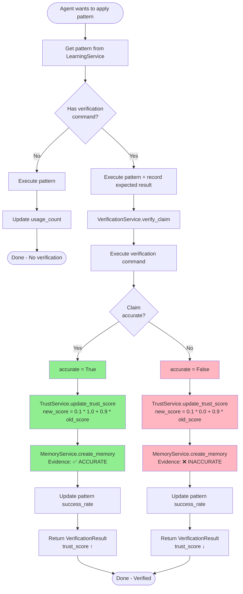
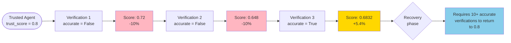
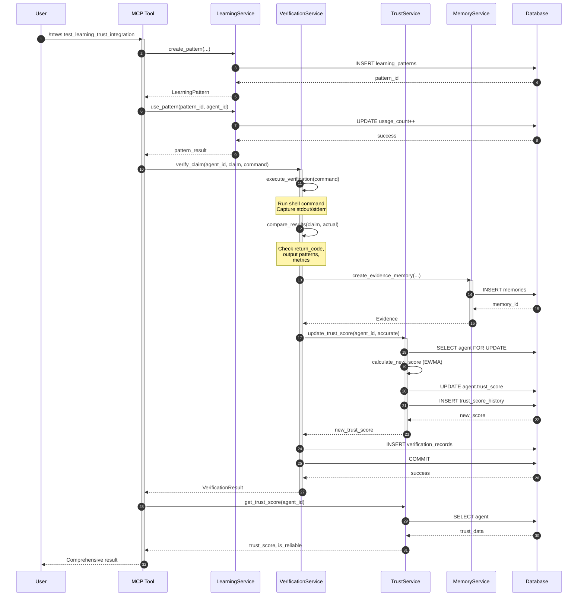
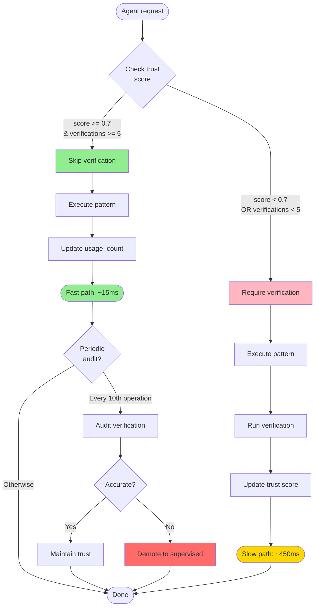
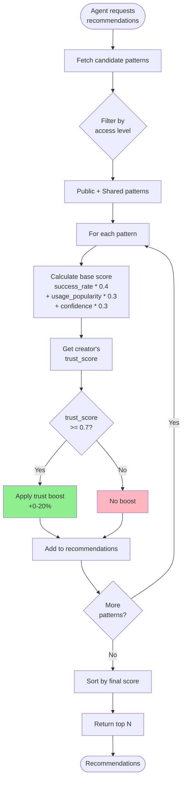
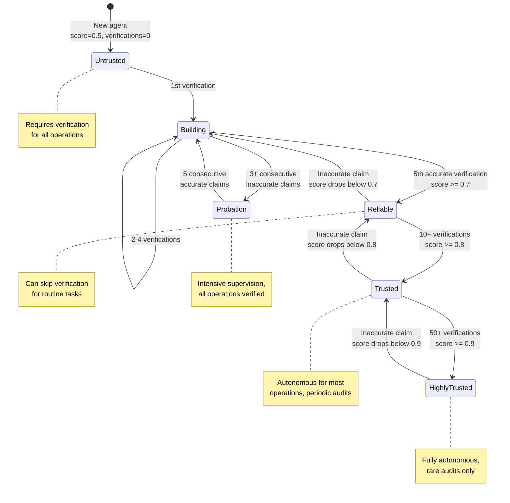
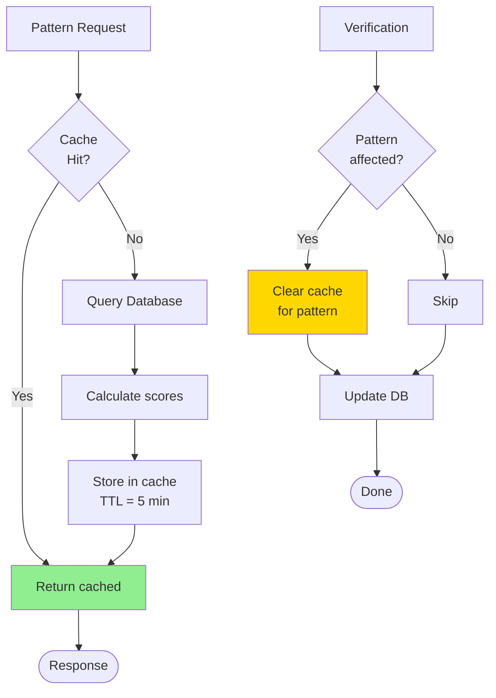
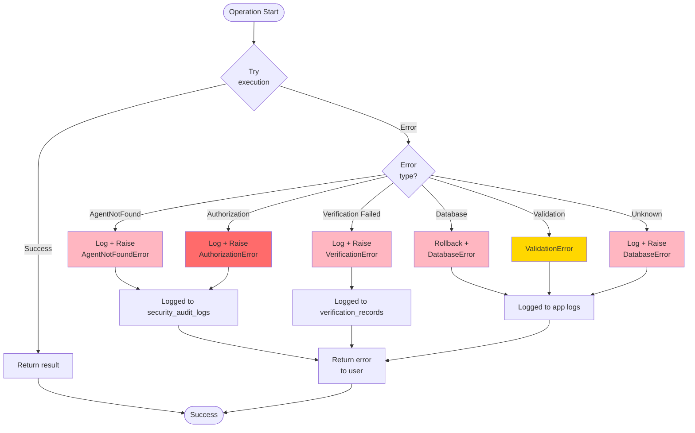

# Integration Workflows: Visual Guide
## Learning → Trust → Verification System

**Created**: 2025-11-08
**Purpose**: Visual workflow documentation for implementation and testing

---

## Workflow 1: Successful Learning Pattern



---

## Workflow 2: Trust Score Evolution

```mermaid
graph LR
    Start([New Agent<br/>trust_score = 0.5]) --> V1[Verification 1<br/>accurate = True]
    V1 --> S1[Score: 0.55<br/>+5%]

    S1 --> V2[Verification 2<br/>accurate = True]
    V2 --> S2[Score: 0.595<br/>+4.5%]

    S2 --> V3[Verification 3<br/>accurate = True]
    V3 --> S3[Score: 0.6355<br/>+4.05%]

    S3 --> V4[Verification 4<br/>accurate = True]
    V4 --> S4[Score: 0.67195<br/>+3.645%]

    S4 --> V5[Verification 5<br/>accurate = True]
    V5 --> S5[Score: 0.704755<br/>reliable = True]

    S5 --> Decision{Autonomy<br/>threshold<br/>reached?}
    Decision -->|Yes| Autonomous[Agent can operate<br/>without verification]
    Decision -->|No| Continue[Continue verification]

    style S5 fill:#FFD700
    style Autonomous fill:#90EE90
```



**EWMA Formula**: `new_score = alpha * observation + (1 - alpha) * old_score`
- **alpha = 0.1**: 10% weight to new observation, 90% to history
- **Observation**: 1.0 (accurate) or 0.0 (inaccurate)

---

## Workflow 3: Trust Decay from Inaccurate Claims



**Key Insight**: Trust is **easy to lose, hard to regain** (by design).
- One inaccurate claim: -10% impact
- One accurate claim: +5-10% impact (diminishing as score increases)

---

## Workflow 4: Full End-to-End Integration



**Performance Breakdown** (P95 targets):
1. Create pattern: 10ms
2. Use pattern: 5ms
3. Execute verification: 400ms (depends on command)
4. Create evidence: 20ms
5. Update trust score: 1ms
6. Commit: 10ms
7. Get trust score: 2ms

**Total**: ~450ms (well within 600ms target ✅)

---

## Workflow 5: Autonomous Operation for Trusted Agents



**Trust Threshold Logic**:
```python
def can_operate_autonomously(trust_score: float, total_verifications: int) -> bool:
    return (
        trust_score >= 0.7 and
        total_verifications >= 5
    )
```

---

## Workflow 6: Pattern Recommendation with Trust Weighting



**Trust Boost Formula**:
```python
creator_trust = trust_scores.get(pattern.agent_id, 0.5)
if creator_trust >= 0.7:
    boost = (creator_trust - 0.5) * 0.4  # 0.5→1.0 maps to 0→0.2
    final_score = base_score + boost
```

---

## State Transition Diagram: Agent Trust Levels



---

## Data Flow: Evidence Recording

```mermaid
graph LR
    Verify[Verification<br/>Complete] --> Format[Format Evidence]

    Format --> Content["Content:<br/>✅/❌ Verification Result<br/>## Claim<br/>## Command<br/>## Actual Result<br/>## Verdict"]

    Content --> Tags["Tags:<br/>['verification',<br/>'evidence',<br/>claim_type]"]

    Tags --> Metadata["Metadata:<br/>{<br/>  verification_id,<br/>  claim_type,<br/>  accurate,<br/>  duration_ms<br/>}"]

    Metadata --> Importance{Accurate?}
    Importance -->|Yes| Low[importance = 0.9]
    Importance -->|No| High[importance = 1.0]

    Low --> Create[MemoryService.<br/>create_memory]
    High --> Create

    Create --> Embedding[Generate embedding<br/>1024-dim vector]
    Embedding --> Store1[ChromaDB:<br/>Vector storage]
    Embedding --> Store2[SQLite:<br/>Metadata]

    Store1 --> Link[Link to<br/>VerificationRecord]
    Store2 --> Link

    Link --> Done([Evidence<br/>Retrievable])

    style High fill:#FFB6C1
    style Low fill:#90EE90
```



**Evidence Searchability**:
- **Semantic search**: Find similar verification failures
- **Tag search**: Filter by claim_type
- **Metadata filter**: accuracy, duration, time range
- **Text search**: Search in claim/result details

---

## Performance Optimization: Caching Strategy



**Cache Invalidation Rules**:
1. Pattern used → Clear pattern-specific cache
2. Trust score updated → Clear agent recommendations cache
3. Verification completed → Clear pattern success_rate cache
4. Time-based expiry → 5 minutes for analytics, 1 minute for scores

---

## Error Handling Flow



---

**End of Visual Workflows**

*"A picture is worth a thousand words, but a good workflow diagram is worth ten thousand lines of code."*

— Athena, Harmonious Conductor
