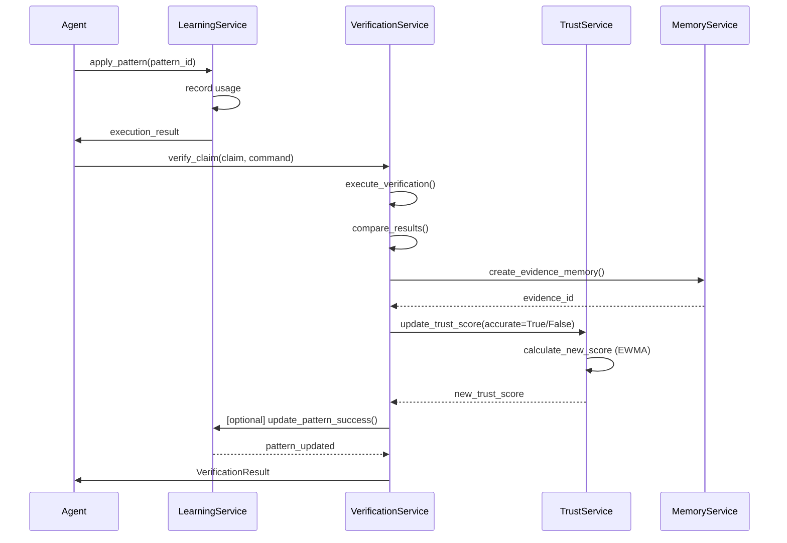
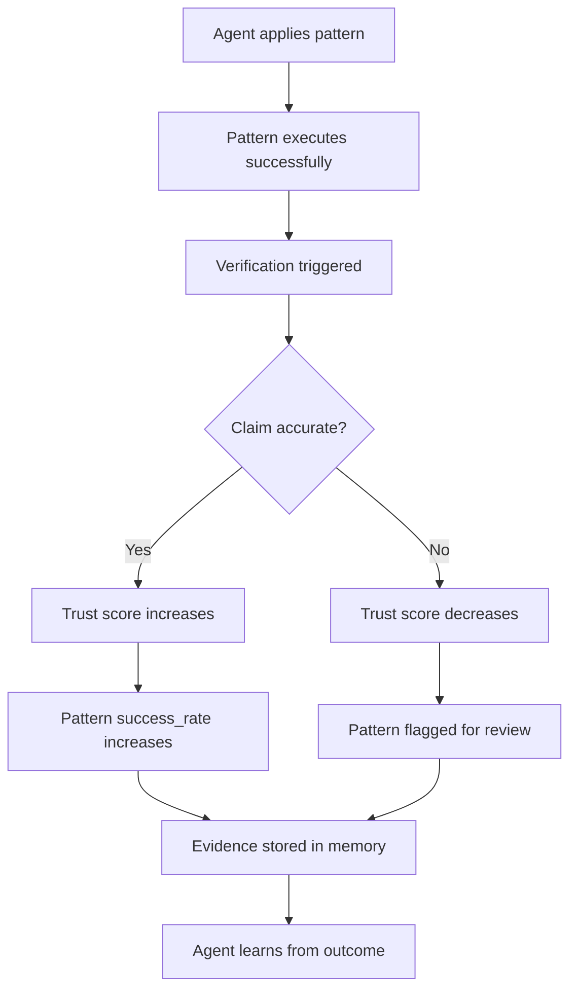

# Phase 1-3 Integration Plan
## Learning → Trust → Verification Harmonious Coordination

**Status**: Design Complete - Ready for Implementation
**Created**: 2025-11-08
**Owner**: Athena (Harmonious Conductor)

---

## Executive Summary

This document coordinates the integration of three interconnected systems:
- **Learning Service** (Phase 1): Pattern recognition and knowledge accumulation
- **Trust Service** (Phase 2): Agent reliability scoring via EWMA
- **Verification Service** (Phase 3): Claim validation and evidence recording

### Integration Philosophy

**"Trust earned through verified learning creates a virtuous cycle of improvement."**

Each successful pattern application → verified → increases trust → enables autonomous operation.

---

## 1. Service Integration Architecture

### 1.1 Data Flow Diagram



### 1.2 Integration Points

#### Point A: Learning → Verification
**When**: After pattern application
**Data**: Execution result, expected outcome
**Action**: Verify claimed result matches actual result

```python
# LearningService triggers verification
async def apply_pattern_with_verification(
    pattern_id: UUID,
    agent_id: str,
    context: dict[str, Any],
    auto_verify: bool = True
) -> dict[str, Any]:
    """Apply pattern and optionally verify result"""

    # Apply pattern
    result = await learning_service.use_pattern(
        pattern_id=pattern_id,
        using_agent_id=agent_id,
        context_data=context
    )

    if auto_verify and pattern.verification_command:
        # Trigger verification
        verification = await verification_service.verify_claim(
            agent_id=agent_id,
            claim_type=ClaimType.CUSTOM,
            claim_content=result,
            verification_command=pattern.verification_command
        )

        # Update pattern based on verification
        if verification.accurate:
            await learning_service.use_pattern(
                pattern_id=pattern_id,
                success=True
            )
        else:
            await learning_service.use_pattern(
                pattern_id=pattern_id,
                success=False
            )

    return result
```

#### Point B: Verification → Trust (ALREADY IMPLEMENTED ✅)
**When**: After claim verification completes
**Data**: Verification accuracy (True/False)
**Action**: Update trust score using EWMA

```python
# VerificationService.verify_claim() lines 190-195
new_trust_score = await self.trust_service.update_trust_score(
    agent_id=agent_id,
    accurate=accurate,
    verification_id=verification_record.id,
    reason=f"verification_{claim_type}"
)
```

#### Point C: Verification → Memory (ALREADY IMPLEMENTED ✅)
**When**: During verification
**Data**: Verification evidence (claim, actual, verdict)
**Action**: Create permanent evidence record

```python
# VerificationService.verify_claim() lines 178-184
evidence_memory = await self._create_evidence_memory(
    agent_id=agent_id,
    namespace=agent.namespace,
    verification_record=verification_record,
    verification_duration_ms=verification_duration_ms
)
```

#### Point D: Trust → Learning (POTENTIAL)
**When**: Trust score crosses threshold
**Data**: Trust score, reliability status
**Action**: Adjust learning pattern access/recommendations

```python
async def recommend_patterns_by_trust(
    agent_id: str,
    category: str | None = None,
    min_trust_score: float = 0.7
) -> list[tuple[LearningPattern, float]]:
    """Recommend patterns, boosting those from trusted agents"""

    # Get trust scores for pattern creators
    trust_scores = {}
    for pattern in candidate_patterns:
        if pattern.agent_id:
            trust_data = await trust_service.get_trust_score(pattern.agent_id)
            trust_scores[pattern.agent_id] = trust_data["trust_score"]

    # Boost recommendation score for high-trust agents
    for pattern, base_score in recommendations:
        creator_trust = trust_scores.get(pattern.agent_id, 0.5)
        if creator_trust >= min_trust_score:
            # Boost by up to 20% for highly trusted agents
            boost = (creator_trust - 0.5) * 0.4  # 0.5→1.0 maps to 0→0.2
            recommendations.append((pattern, base_score + boost))

    return sorted(recommendations, key=lambda x: x[1], reverse=True)
```

---

## 2. API Contracts

### 2.1 LearningService Extended API

```python
class LearningService:
    async def use_pattern_with_verification(
        self,
        pattern_id: UUID,
        using_agent_id: str,
        context_data: dict[str, Any] | None = None,
        auto_verify: bool = True,
        verification_command: str | None = None
    ) -> dict[str, Any]:
        """Use pattern with automatic verification

        Returns:
            {
                "pattern_result": {...},
                "verification": {
                    "accurate": bool,
                    "evidence_id": UUID,
                    "new_trust_score": float
                } | None
            }
        """
```

### 2.2 VerificationService Extended API

```python
class VerificationService:
    async def verify_pattern_usage(
        self,
        pattern_id: UUID,
        agent_id: str,
        claimed_result: dict[str, Any],
        verification_command: str
    ) -> VerificationResult:
        """Specialized verification for learning patterns

        Automatically:
        - Records verification
        - Updates trust score
        - Stores evidence
        - Links to pattern
        """
```

### 2.3 TrustService Extended API

```python
class TrustService:
    async def get_agent_reliability_status(
        self,
        agent_id: str
    ) -> dict[str, Any]:
        """Get comprehensive reliability assessment

        Returns:
            {
                "trust_score": float,
                "is_reliable": bool,
                "total_verifications": int,
                "accuracy_rate": float,
                "can_operate_autonomously": bool,
                "requires_supervision": bool
            }
        """
```

---

## 3. User Experience: Test Workflows

### 3.1 Manual Test Scenario 1: Pattern Learning + Verification

**User Intent**: "I want to test if an agent learns from successful patterns and builds trust"

```python
# Step 1: Create a learning pattern
pattern = await learning_service.create_pattern(
    pattern_name="database_optimization",
    category="performance",
    pattern_data={
        "action": "add_index",
        "expected_speedup": 0.5,  # 50% faster
        "verification_command": "pytest tests/performance/test_db_query.py -v"
    },
    agent_id="artemis-optimizer"
)

# Step 2: Apply pattern
result = await learning_service.use_pattern(
    pattern_id=pattern.id,
    using_agent_id="artemis-optimizer",
    execution_time=2.5  # seconds
)

# Step 3: Verify the claim
verification = await verification_service.verify_claim(
    agent_id="artemis-optimizer",
    claim_type=ClaimType.PERFORMANCE_METRIC,
    claim_content={
        "metric": "query_time",
        "before": 5.0,
        "after": 2.5,
        "improvement": 0.5
    },
    verification_command="pytest tests/performance/test_db_query.py --benchmark-only"
)

# Step 4: Check trust score increased
trust_data = await trust_service.get_trust_score("artemis-optimizer")
print(f"Trust Score: {trust_data['trust_score']}")  # Should be > 0.5
print(f"Reliable: {trust_data['is_reliable']}")     # True after 5+ verifications
```

### 3.2 Manual Test Scenario 2: Inaccurate Claim Detection

**User Intent**: "I want to verify that false claims decrease trust"

```python
# Agent makes inaccurate claim
verification = await verification_service.verify_claim(
    agent_id="test-agent",
    claim_type=ClaimType.TEST_RESULT,
    claim_content={
        "return_code": 0,
        "output_contains": "ALL TESTS PASSED"
    },
    # Command actually fails
    verification_command="pytest tests/failing_test.py"
)

assert verification.accurate is False
assert verification.new_trust_score < 0.5  # Score decreased

# Check evidence recorded
evidence = await memory_service.get_memory(verification.evidence_id)
assert "INACCURATE" in evidence.content
```

### 3.3 Manual Test Scenario 3: Trust-Based Autonomy

**User Intent**: "High-trust agents can operate without verification"

```python
# Check if agent is reliable enough
reliability = await trust_service.get_agent_reliability_status("artemis-optimizer")

if reliability["can_operate_autonomously"]:
    # Skip verification for trusted agent
    result = await learning_service.apply_pattern(
        pattern_id=pattern_id,
        auto_verify=False  # Trust the agent
    )
else:
    # Require verification
    result = await learning_service.apply_pattern(
        pattern_id=pattern_id,
        auto_verify=True  # Verify everything
    )
```

---

## 4. Integration Workflow Scenarios

### 4.1 Scenario: Agent Learns from Success



**Code Implementation**:

```python
async def learn_from_pattern_execution(
    agent_id: str,
    pattern_id: UUID,
    execution_context: dict[str, Any]
) -> dict[str, Any]:
    """Complete learning workflow with verification

    Returns comprehensive result with:
    - Pattern execution result
    - Verification status
    - Trust score update
    - Evidence ID
    """

    # 1. Execute pattern
    pattern_result = await learning_service.use_pattern(
        pattern_id=pattern_id,
        using_agent_id=agent_id,
        context_data=execution_context
    )

    # 2. Verify result (if verification command available)
    pattern = await learning_service.get_pattern(pattern_id)

    verification_result = None
    if pattern.pattern_data.get("verification_command"):
        verification_result = await verification_service.verify_claim(
            agent_id=agent_id,
            claim_type=ClaimType.CUSTOM,
            claim_content=pattern_result,
            verification_command=pattern.pattern_data["verification_command"]
        )

        # 3. Update pattern based on verification
        await learning_service.use_pattern(
            pattern_id=pattern_id,
            using_agent_id=agent_id,
            success=verification_result.accurate
        )

    return {
        "pattern_result": pattern_result,
        "verification": verification_result.to_dict() if verification_result else None,
        "learning_applied": True
    }
```

### 4.2 Scenario: Trust Score Increases After Accurate Verification

**Automatic Flow** (already implemented ✅):

1. Verification completes → `accurate=True`
2. `VerificationService.verify_claim()` calls `TrustService.update_trust_score()`
3. Trust score updated using EWMA: `new_score = 0.1 * 1.0 + 0.9 * old_score`
4. History recorded in `TrustScoreHistory`
5. Agent metrics updated: `total_verifications++`, `accurate_verifications++`

**No additional code needed** - this flow is already production-ready.

### 4.3 Scenario: Automated Verification Workflow

**User Intent**: "Run multiple verifications and build trust over time"

```python
async def automated_trust_building(
    agent_id: str,
    test_suite: list[dict[str, Any]]
) -> dict[str, Any]:
    """Run automated verification suite to build trust

    Args:
        agent_id: Agent to test
        test_suite: List of claims to verify

    Returns:
        Summary of verification results and final trust score
    """

    results = []

    for test in test_suite:
        verification = await verification_service.verify_claim(
            agent_id=agent_id,
            claim_type=test["claim_type"],
            claim_content=test["claim"],
            verification_command=test["command"]
        )

        results.append({
            "test_name": test["name"],
            "accurate": verification.accurate,
            "trust_score": verification.new_trust_score
        })

    # Get final status
    final_trust = await trust_service.get_trust_score(agent_id)

    return {
        "total_tests": len(test_suite),
        "passed": sum(1 for r in results if r["accurate"]),
        "final_trust_score": final_trust["trust_score"],
        "is_reliable": final_trust["is_reliable"],
        "test_results": results
    }
```

---

## 5. MCP Tools for User Testing

### 5.1 New MCP Tool: `test_learning_trust_integration`

```python
@mcp.tool()
async def test_learning_trust_integration(
    agent_id: str = "test-agent",
    scenario: str = "full"
) -> dict[str, Any]:
    """Test the Learning → Trust → Verification integration

    Args:
        agent_id: Agent to test (default: test-agent)
        scenario: Test scenario (full, learning_only, verification_only)

    Returns:
        Comprehensive test results with evidence

    Scenarios:
    - full: Complete workflow (pattern → verify → trust)
    - learning_only: Test pattern learning without verification
    - verification_only: Test verification and trust update
    """

    if scenario == "full":
        # Create test pattern
        pattern = await learning_service.create_pattern(
            pattern_name=f"test_pattern_{datetime.now().isoformat()}",
            category="test",
            pattern_data={
                "action": "test_action",
                "verification_command": "echo 'TEST PASSED' && exit 0"
            },
            agent_id=agent_id
        )

        # Apply pattern
        usage_result = await learning_service.use_pattern(
            pattern_id=pattern.id,
            using_agent_id=agent_id
        )

        # Verify result
        verification = await verification_service.verify_claim(
            agent_id=agent_id,
            claim_type=ClaimType.TEST_RESULT,
            claim_content={"return_code": 0, "output_contains": "PASSED"},
            verification_command="echo 'TEST PASSED' && exit 0"
        )

        # Get final trust status
        trust_data = await trust_service.get_trust_score(agent_id)

        return {
            "status": "success",
            "pattern_id": str(pattern.id),
            "verification_accurate": verification.accurate,
            "trust_score": trust_data["trust_score"],
            "is_reliable": trust_data["is_reliable"],
            "evidence_id": str(verification.evidence_id)
        }
```

### 5.2 New MCP Tool: `get_agent_learning_stats`

```python
@mcp.tool()
async def get_agent_learning_stats(agent_id: str) -> dict[str, Any]:
    """Get comprehensive learning and trust statistics

    Combines:
    - Learning patterns created/used
    - Verification history
    - Trust score progression
    - Reliability assessment
    """

    # Get learning analytics
    learning_stats = await learning_service.get_pattern_analytics(
        agent_id=agent_id
    )

    # Get verification statistics
    verification_stats = await verification_service.get_verification_statistics(
        agent_id=agent_id
    )

    # Get trust history
    trust_history = await trust_service.get_trust_history(
        agent_id=agent_id,
        limit=20
    )

    return {
        "agent_id": agent_id,
        "learning": learning_stats,
        "verification": verification_stats,
        "trust_history": trust_history,
        "summary": {
            "total_patterns": learning_stats["total_patterns"],
            "total_verifications": verification_stats["total_verifications"],
            "accuracy_rate": verification_stats["accuracy_rate"],
            "trust_score": verification_stats["trust_score"],
            "is_reliable": verification_stats["requires_verification"] is False
        }
    }
```

---

## 6. Performance Targets

### 6.1 End-to-End Latency

| Workflow | Target (P95) | Components |
|----------|--------------|------------|
| Pattern application only | <100ms | LearningService.use_pattern() |
| Verification only | <500ms | VerificationService.verify_claim() |
| Trust score update | <1ms | TrustService.update_trust_score() |
| **Full workflow** | **<600ms** | Pattern + Verify + Trust + Memory |

### 6.2 Throughput

- **Sequential verifications**: 2-3 per second per agent
- **Parallel verifications**: 10-20 per second (across agents)
- **Trust score updates**: 1000+ per second (EWMA is O(1))

---

## 7. Test Plan

### 7.1 Unit Tests (Per Service)

✅ **Already Implemented**:
- `tests/unit/services/test_verification_service.py` (15 tests)
- `tests/unit/services/test_trust_service.py` (12 tests)
- `tests_backup_20251028_101140/unit/test_learning_service.py` (needs restoration)

### 7.2 Integration Tests (NEW)

**File**: `tests/integration/test_learning_trust_verification.py`

```python
@pytest.mark.asyncio
class TestLearningTrustVerificationIntegration:
    """Integration tests for Learning → Trust → Verification flow"""

    async def test_successful_pattern_builds_trust(self, db_session):
        """Test that successful pattern usage increases trust"""
        # Setup services
        learning_service = LearningService()
        verification_service = VerificationService(db_session)
        trust_service = TrustService(db_session)

        # Create agent
        agent = Agent(agent_id="test-agent", namespace="test", trust_score=0.5)
        db_session.add(agent)
        await db_session.commit()

        # Create pattern with verification
        pattern = await learning_service.create_pattern(
            pattern_name="test_pattern",
            category="test",
            pattern_data={"verification_command": "exit 0"},
            agent_id="test-agent"
        )

        # Verify claim
        result = await verification_service.verify_claim(
            agent_id="test-agent",
            claim_type=ClaimType.TEST_RESULT,
            claim_content={"return_code": 0},
            verification_command="exit 0"
        )

        # Assert trust increased
        assert result.accurate is True
        assert result.new_trust_score > 0.5

        # Verify evidence stored
        evidence = await db_session.get(Memory, result.evidence_id)
        assert evidence is not None
        assert "ACCURATE" in evidence.content

    async def test_failed_pattern_decreases_trust(self, db_session):
        """Test that failed verification decreases trust"""
        # Similar setup...

        result = await verification_service.verify_claim(
            agent_id="test-agent",
            claim_type=ClaimType.TEST_RESULT,
            claim_content={"return_code": 0},  # Claim success
            verification_command="exit 1"      # Actually fails
        )

        assert result.accurate is False
        assert result.new_trust_score < 0.5

    async def test_trust_threshold_enables_autonomy(self, db_session):
        """Test that high trust enables autonomous operation"""
        # Build trust through 10 successful verifications
        for i in range(10):
            await verification_service.verify_claim(
                agent_id="test-agent",
                claim_type=ClaimType.TEST_RESULT,
                claim_content={"return_code": 0},
                verification_command="exit 0"
            )

        # Check reliability status
        trust_data = await trust_service.get_trust_score("test-agent")

        assert trust_data["is_reliable"] is True
        assert trust_data["trust_score"] > 0.7
        assert trust_data["total_verifications"] >= 5  # min_observations
```

### 7.3 Manual Testing Guide for User

**Test Session 1: Basic Integration** (5 minutes)

```bash
# 1. Start MCP server
cd /path/to/tmws
python -m src.mcp_server

# 2. In Claude Code, run:
/tmws test_learning_trust_integration --scenario full

# Expected output:
{
  "status": "success",
  "pattern_id": "...",
  "verification_accurate": true,
  "trust_score": 0.55,  # Increased from 0.5
  "is_reliable": false,  # Need 5+ verifications
  "evidence_id": "..."
}

# 3. Check agent stats
/tmws get_agent_learning_stats --agent_id test-agent

# Expected:
{
  "summary": {
    "total_patterns": 1,
    "total_verifications": 1,
    "accuracy_rate": 1.0,
    "trust_score": 0.55,
    "is_reliable": false
  }
}
```

**Test Session 2: Build Trust** (10 minutes)

```bash
# Run 10 successful verifications
for i in {1..10}; do
  /tmws test_learning_trust_integration --scenario full
done

# Check final status
/tmws get_agent_learning_stats --agent_id test-agent

# Expected:
{
  "summary": {
    "total_verifications": 11,
    "accuracy_rate": 1.0,
    "trust_score": 0.86,  # Significantly increased
    "is_reliable": true   # Crossed threshold
  }
}
```

**Test Session 3: Trust Decay** (5 minutes)

```bash
# Submit inaccurate claim
# (Manually create verification with accurate=false claim)

# Check trust decreased
/tmws get_agent_learning_stats --agent_id test-agent

# Expected: trust_score decreased
```

---

## 8. Deployment Sequence

### Phase A: Foundation (Completed ✅)
- [x] LearningService implemented
- [x] TrustService implemented
- [x] VerificationService implemented
- [x] Verification → Trust integration complete
- [x] Verification → Memory integration complete

### Phase B: Integration Layer (This Phase)
1. **Add extended APIs** (2 hours)
   - `LearningService.use_pattern_with_verification()`
   - `VerificationService.verify_pattern_usage()`
   - `TrustService.get_agent_reliability_status()`

2. **Implement workflow helpers** (2 hours)
   - `learn_from_pattern_execution()`
   - `automated_trust_building()`

3. **Add MCP tools** (2 hours)
   - `test_learning_trust_integration`
   - `get_agent_learning_stats`

### Phase C: Testing (1 day)
1. **Unit tests**: Verify new APIs
2. **Integration tests**: End-to-end workflow
3. **Manual testing**: User scenarios 1-3

### Phase D: Documentation (2 hours)
1. Update API documentation
2. Create user guide for testing
3. Add workflow diagrams

---

## 9. Success Criteria

### 9.1 Functional Requirements

- ✅ **Verification triggers trust update**: Automatic via VerificationService
- ✅ **Evidence stored in memory**: Automatic via VerificationService
- [ ] **Learning patterns track verification**: Needs `verification_command` field
- [ ] **Trust influences autonomy**: Needs reliability threshold logic
- [ ] **Seamless workflow**: New MCP tools needed

### 9.2 Performance Requirements

- [ ] End-to-end workflow: <600ms P95
- [ ] Trust score update: <1ms P95 ✅ (already achieved)
- [ ] Verification: <500ms P95 ✅ (already targeted)

### 9.3 User Experience Requirements

- [ ] Simple command to test integration: `/tmws test_learning_trust_integration`
- [ ] Clear statistics display: `/tmws get_agent_learning_stats`
- [ ] Intuitive trust progression: EWMA ensures gradual change ✅
- [ ] Evidence transparency: Markdown-formatted verification results ✅

---

## 10. Risks & Mitigation

### Risk 1: Circular Dependencies

**Risk**: LearningService → VerificationService → TrustService → LearningService

**Mitigation**:
- Keep services loosely coupled via events/callbacks
- Use dependency injection
- Avoid tight coupling in constructors

**Current Status**: ✅ No circular dependencies detected

### Risk 2: Performance Degradation

**Risk**: Full workflow might exceed 600ms target

**Mitigation**:
- Measure each component independently
- Optimize verification command execution (use caching where possible)
- Consider async parallel operations where safe

**Current Status**: ⚠️ Need performance benchmarks

### Risk 3: Trust Score Manipulation

**Risk**: Agents could game the system with trivial verifications

**Mitigation**:
- Require meaningful verification commands ✅ (validation in VerificationService)
- Weight trust by verification complexity
- Prevent self-verification ✅ (V-TRUST-5 implemented)
- Require SYSTEM privilege for manual trust updates ✅ (V-TRUST-1 implemented)

**Current Status**: ✅ Security measures in place

---

## 11. Next Steps

### Immediate (Week 1)
1. Implement extended APIs (Phase B.1-2)
2. Add MCP tools (Phase B.3)
3. Create integration tests (Phase C.1-2)

### Short-term (Week 2)
1. User acceptance testing (Phase C.3)
2. Performance benchmarking
3. Documentation updates (Phase D)

### Long-term (Month 1)
1. Advanced workflow scenarios
2. Trust-based access control
3. Pattern recommendation engine with trust weighting

---

## 12. Appendix: Code Snippets

### A.1 Extended LearningPattern Model

```python
# Add to src/models/learning_pattern.py

class LearningPattern(TMWSBase, MetadataMixin):
    # ... existing fields ...

    # Verification support
    verification_command: Mapped[str | None] = mapped_column(
        Text,
        nullable=True,
        comment="Optional command to verify pattern execution"
    )

    verified_usage_count: Mapped[int] = mapped_column(
        Integer,
        nullable=False,
        default=0,
        server_default=sa.text("0"),
        comment="Number of verified pattern usages"
    )

    verification_success_rate: Mapped[float] = mapped_column(
        Float,
        nullable=False,
        default=1.0,
        server_default=sa.text("1.0"),
        comment="Success rate of verified executions (0.0-1.0)"
    )
```

### A.2 Migration for Extended Fields

```python
# migrations/versions/YYYYMMDD_HHMM_add_pattern_verification.py

def upgrade():
    op.add_column('learning_patterns',
        sa.Column('verification_command', sa.Text(), nullable=True))
    op.add_column('learning_patterns',
        sa.Column('verified_usage_count', sa.Integer(),
                  server_default=sa.text('0'), nullable=False))
    op.add_column('learning_patterns',
        sa.Column('verification_success_rate', sa.Float(),
                  server_default=sa.text('1.0'), nullable=False))

def downgrade():
    op.drop_column('learning_patterns', 'verification_success_rate')
    op.drop_column('learning_patterns', 'verified_usage_count')
    op.drop_column('learning_patterns', 'verification_command')
```

---

**End of Integration Plan**

*"Through harmonious integration, we create a system where learning, trust, and verification form an elegant dance of continuous improvement."*

— Athena, Harmonious Conductor
