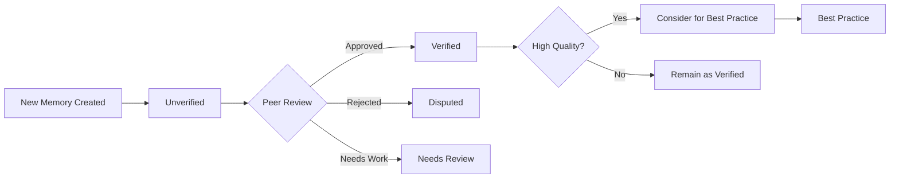
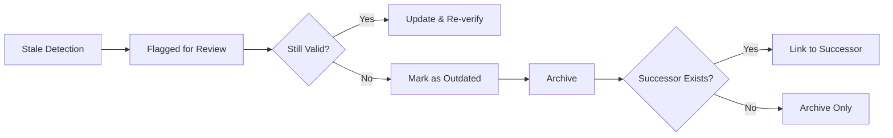

# TMWS Knowledge Curation Guidelines
## Maintaining a Healthy Institutional Memory

**Version**: 1.0.0
**Created**: 2025-10-27
**Author**: Muses (Knowledge Architect)

---

## Overview

Knowledge curation is the systematic maintenance of institutional memory. Without regular curation, knowledge bases become cluttered, outdated, and difficult to navigate. This document defines procedures for keeping TMWS knowledge healthy and useful.

---

## Curation Principles

### 1. **Quality Over Quantity**
- A small, well-curated knowledge base is more valuable than a large, disorganized one
- Remove outdated information rather than keeping it "just in case"
- Consolidate duplicate knowledge

### 2. **Living Documentation**
- Knowledge should evolve as the project evolves
- Regular reviews prevent obsolescence
- Validation status ensures trustworthiness

### 3. **Collaborative Maintenance**
- All personas participate in curation
- Multi-persona verification increases confidence
- Dispute resolution is built into the process

### 4. **Semantic Relevance**
- Embeddings must stay current with content
- Re-embed when content changes significantly
- Monitor embedding quality metrics

---

## Curation Schedule

### Daily (Automated)

**Responsible**: Automated system

**Tasks**:
1. **Update Access Statistics**
   ```python
   # Track memory access patterns
   for memory in accessed_today:
       memory.access_count += 1
       memory.accessed_at = datetime.utcnow()
       memory.relevance_score = calculate_relevance(memory)
   ```

2. **Check for Expiring Memories**
   ```python
   # Find memories with expiration dates
   expiring = await memory_service.search_memories(
       query="",
       metadata_filters={
           "temporal.expires_at": {
               "$lte": (datetime.utcnow() + timedelta(days=7)).isoformat()
           }
       }
   )

   # Notify owners
   for memory in expiring:
       notify_agent(memory.agent_id, f"Memory {memory.id} expiring soon")
   ```

3. **Update Directory Indexes**
   ```python
   # Update _index.json in each directory
   for directory in knowledge_base_directories:
       index = {
           "total_entries": count_entries(directory),
           "last_updated": datetime.utcnow().isoformat(),
           "top_tags": get_top_tags(directory, limit=10),
           "recent_entries": get_recent_entries(directory, limit=5),
           "most_accessed": get_most_accessed(directory, limit=5)
       }
       save_index(directory, index)
   ```

---

### Weekly (Semi-Automated)

**Responsible**: Muses + Automated system

**Tasks**:

#### 1. Identify Outdated Memories
```python
# Find memories that haven't been accessed in 6+ months
stale_candidates = await memory_service.search_memories(
    query="",
    namespace="engineering",
    metadata_filters={
        "temporal.accessed_at": {
            "$lte": (datetime.utcnow() - timedelta(days=180)).isoformat()
        },
        "validation.status": {"$ne": "outdated"}
    },
    order_by="temporal.accessed_at ASC",
    limit=50
)

# Calculate staleness score
for memory in stale_candidates:
    days_since_access = (datetime.utcnow() - memory.accessed_at).days
    decay_rate = memory.metadata["importance"]["decay_rate"]

    staleness_score = (days_since_access / 365.0) * decay_rate

    if staleness_score > 0.5:
        memory.metadata["validation"]["status"] = "needs_review"
        flag_for_review(memory, reason="potentially outdated")
```

#### 2. Update Tag Indexes
```python
# Regenerate cross-cutting/tag_index/
for persona in ["athena", "artemis", "hestia", "eris", "hera", "muses"]:
    persona_memories = await memory_service.search_memories(
        query="",
        metadata_filters={
            "created_by.persona": persona
        },
        limit=10000
    )

    tag_index = {
        "persona": persona,
        "total_memories": len(persona_memories),
        "by_domain": group_by_domain(persona_memories),
        "by_outcome": group_by_outcome(persona_memories),
        "top_tags": get_top_tags(persona_memories, limit=20)
    }

    save_tag_index(f"cross_cutting/tag_index/{persona}_tags.json", tag_index)
```

#### 3. Detect Duplicates
```python
# Find potential duplicate memories using semantic similarity
async def detect_duplicates(threshold=0.95):
    all_memories = await memory_service.get_all_memories()

    duplicates = []
    for i, memory_a in enumerate(all_memories):
        embedding_a = await embedding_service.embed(memory_a.content)

        # Search for similar memories
        similar = await vector_search_service.search(
            query_embedding=embedding_a,
            metadata_filters={
                "id": {"$ne": memory_a.id}  # Exclude self
            },
            top_k=5,
            min_similarity=threshold
        )

        for memory_b, similarity in similar:
            if similarity > threshold:
                duplicates.append({
                    "memory_a": memory_a,
                    "memory_b": memory_b,
                    "similarity": similarity
                })

    return duplicates

# Review and consolidate
duplicates = await detect_duplicates(threshold=0.95)
for dup in duplicates:
    flag_for_consolidation(dup["memory_a"], dup["memory_b"])
```

---

### Monthly (Muses Review)

**Responsible**: Muses persona

**Tasks**:

#### 1. Archive Deprecated Memories
```python
# Find memories marked as "outdated"
outdated = await memory_service.search_memories(
    query="",
    metadata_filters={
        "validation.status": "outdated"
    },
    limit=100
)

# Archive to historical collection
for memory in outdated:
    # Move to archive
    archive_memory(
        memory=memory,
        archive_location="knowledge_base/archive/",
        reason="Outdated - no longer applicable"
    )

    # Update relationships (point to archive)
    update_related_memories(
        memory_id=memory.id,
        new_status="archived",
        archive_path=f"archive/{memory.id}.json"
    )
```

#### 2. Consolidate Duplicate Knowledge
```python
# Review flagged duplicates
duplicates = get_flagged_duplicates()

for dup_pair in duplicates:
    memory_a, memory_b = dup_pair["memory_a"], dup_pair["memory_b"]

    # Determine which to keep (higher importance, more recent, more verified)
    primary = choose_primary(memory_a, memory_b)
    secondary = memory_b if primary == memory_a else memory_a

    # Merge metadata
    merged_metadata = merge_metadata(primary.metadata, secondary.metadata)

    # Update primary
    primary.metadata = merged_metadata
    primary.metadata["relationships"]["supersedes"] = [secondary.id]

    # Archive secondary
    archive_memory(
        memory=secondary,
        archive_location="knowledge_base/archive/duplicates/",
        reason=f"Duplicate of {primary.id}"
    )
```

#### 3. Promote Best Practices
```python
# Find high-quality, reusable patterns
candidates = await memory_service.search_memories(
    query="success pattern implementation",
    metadata_filters={
        "outcomes.status": "success",
        "outcomes.confidence": {"$gte": 0.9},
        "validation.verified_by": {"$size": {"$gte": 2}},
        "importance.factors.reusability": {"$gte": 0.85},
        "usage_statistics.applied_count": {"$gte": 3}
    },
    limit=30
)

# Promote to best practices
for memory in candidates:
    if memory.memory_type != "best_practice":
        # Create best practice entry
        best_practice = create_best_practice_from_memory(
            source_memory=memory,
            category=infer_category(memory),
            applicability=assess_applicability(memory)
        )

        # Link original memory
        best_practice.metadata["relationships"]["extends"] = [memory.id]

        # Move to best_practices directory
        kb_path = f"technical/patterns/best_practices/{best_practice.id}.json"
        save_to_knowledge_base(best_practice, kb_path)
```

#### 4. Update Taxonomy
```python
# Analyze emerging tag patterns
tag_usage = analyze_tag_usage(timeframe=timedelta(days=30))

# Find new tag combinations
new_patterns = find_emerging_tag_patterns(tag_usage, min_count=5)

# Propose taxonomy updates
for pattern in new_patterns:
    if is_meaningful_pattern(pattern):
        propose_taxonomy_addition(
            tag_pattern=pattern,
            usage_count=pattern["count"],
            examples=pattern["examples"]
        )

# Review and update tagging_taxonomy.yaml
```

---

### Quarterly (All Personas)

**Responsible**: All Trinitas personas

**Tasks**:

#### 1. Comprehensive Audit
```python
# Quarterly knowledge base health report
async def quarterly_audit():
    report = {
        "total_memories": await count_all_memories(),
        "by_persona": await count_by_persona(),
        "by_validation_status": await count_by_validation_status(),
        "by_outcome": await count_by_outcome(),

        "health_metrics": {
            "verified_percentage": await calculate_verified_percentage(),
            "outdated_percentage": await calculate_outdated_percentage(),
            "average_age_days": await calculate_average_age(),
            "duplicate_rate": await calculate_duplicate_rate()
        },

        "usage_metrics": {
            "most_accessed": await get_most_accessed(limit=20),
            "least_accessed": await get_least_accessed(limit=20),
            "average_access_count": await calculate_average_access_count()
        },

        "quality_metrics": {
            "high_confidence_count": await count_high_confidence(),
            "disputed_count": await count_disputed(),
            "needs_review_count": await count_needs_review()
        }
    }

    # Generate recommendations
    report["recommendations"] = generate_recommendations(report)

    return report

# Run audit
audit_report = await quarterly_audit()

# Share with all personas for review
share_with_all_personas(audit_report)
```

#### 2. Validate All "Verified" Memories
```python
# Re-validate all verified memories
verified_memories = await memory_service.search_memories(
    query="",
    metadata_filters={
        "validation.status": "verified"
    },
    limit=1000
)

# Check if still valid
for memory in verified_memories:
    # Age check
    age_days = (datetime.utcnow() - memory.updated_at).days

    # Verification expiry (based on decay rate)
    verification_lifetime_days = int(365 * (1 - memory.metadata["importance"]["decay_rate"]))

    if age_days > verification_lifetime_days:
        memory.metadata["validation"]["status"] = "needs_review"
        notify_verifiers(
            memory=memory,
            reason="Verification expired, please re-verify"
        )
```

#### 3. Update Importance Scores
```python
# Recalculate importance scores based on usage and validation
for memory in all_memories:
    factors = memory.metadata["importance"]["factors"]

    # Usage factor (new)
    usage_factor = min(1.0, memory.usage_statistics["access_count"] / 50.0)

    # Verification factor (new)
    verification_count = len(memory.metadata["validation"].get("verified_by", []))
    verification_factor = min(1.0, verification_count / 3.0)

    # Recalculate overall score
    new_score = (
        factors["business_impact"] * 0.25 +
        factors["technical_complexity"] * 0.20 +
        factors["reusability"] * 0.20 +
        usage_factor * 0.20 +
        verification_factor * 0.15
    )

    memory.metadata["importance"]["score"] = new_score
```

#### 4. Refactor Organizational Structure
```python
# Analyze directory balance
directory_sizes = analyze_directory_sizes()

# Identify overgrown directories (>100 files)
overgrown = [d for d, size in directory_sizes.items() if size > 100]

# Propose subdirectory structure
for directory in overgrown:
    subdirs = propose_subdirectories(directory)
    create_refactoring_plan(directory, subdirs)

# Review and execute refactoring
```

---

## Specific Curation Procedures

### Procedure 1: Handling Disputed Memories

**When**: A persona disputes the validity of a memory

**Steps**:
1. **Flag Dispute**
   ```python
   memory.metadata["validation"]["disputes"].append({
       "disputed_by": disputing_persona,
       "timestamp": datetime.utcnow().isoformat(),
       "reason": dispute_reason,
       "alternative_memory_id": alternative_id  # If proposing replacement
   })

   memory.metadata["validation"]["status"] = "disputed"
   ```

2. **Gather Evidence**
   - Original creator presents evidence
   - Disputer presents counter-evidence
   - Neutral personas review both sides

3. **Resolution**
   - **Consensus reached**: Update memory, mark as verified
   - **Dispute unresolved**: Create separate memory with alternative view
   - **Memory proven wrong**: Mark as "outdated", archive

4. **Document Outcome**
   ```python
   memory.metadata["validation"]["resolution"] = {
       "resolved_at": datetime.utcnow().isoformat(),
       "outcome": "consensus|split|archived",
       "resolution_notes": "..."
   }
   ```

---

### Procedure 2: Consolidating Similar Memories

**When**: Duplicate or highly similar memories detected

**Steps**:
1. **Identify Primary** (keep this one)
   - Higher importance score
   - More recent
   - More verifications
   - Better metadata quality

2. **Merge Metadata**
   ```python
   primary.metadata["relationships"]["supersedes"].extend(
       [sec.id for sec in secondaries]
   )

   # Merge tags (union)
   primary.tags = list(set(primary.tags + sum([s.tags for s in secondaries], [])))

   # Merge verification history
   primary.metadata["validation"]["verified_by"].extend(
       sum([s.metadata["validation"]["verified_by"] for s in secondaries], [])
   )

   # Merge usage statistics
   primary.usage_statistics["access_count"] += sum(
       s.usage_statistics["access_count"] for s in secondaries
   )
   ```

3. **Update References**
   ```python
   # Find all memories referencing secondaries
   for secondary in secondaries:
       referencing = find_referencing_memories(secondary.id)
       for ref_memory in referencing:
           # Update relationship to point to primary
           update_relationship(ref_memory, secondary.id, primary.id)
   ```

4. **Archive Secondaries**
   ```python
   for secondary in secondaries:
       archive_memory(
           memory=secondary,
           archive_location="knowledge_base/archive/consolidated/",
           reason=f"Consolidated into {primary.id}"
       )
   ```

---

### Procedure 3: Promoting to Best Practice

**When**: A pattern has proven successful multiple times

**Criteria**:
- ✅ Applied successfully ≥3 times
- ✅ Verified by ≥2 personas
- ✅ Confidence ≥0.9
- ✅ Reusability ≥0.85
- ✅ No disputes

**Steps**:
1. **Create Best Practice Entry**
   ```python
   best_practice = {
       "schema_version": "1.0.0",
       "memory_type": "best_practice",
       "created_by": {
           "persona": "muses",
           "agent_id": "tmws.muses.001",
           "timestamp": datetime.utcnow().isoformat()
       },
       "content": extract_pattern(source_memory),
       "metadata": {
           "pattern_name": infer_pattern_name(source_memory),
           "applicability": assess_applicability(source_memory),
           "examples": gather_usage_examples(source_memory),
           "contraindications": identify_contraindications(source_memory),
           "related_patterns": find_related_patterns(source_memory)
       }
   }
   ```

2. **Link to Source Memories**
   ```python
   best_practice.metadata["relationships"]["extends"] = [source_memory.id]
   ```

3. **Document in Knowledge Base**
   - Add to `technical/patterns/best_practices/` or appropriate directory
   - Update pattern catalog
   - Create cross-references

---

### Procedure 4: Archiving Outdated Memories

**When**: Memory is no longer applicable

**Criteria**:
- Superseded by newer memory
- Technology/approach deprecated
- No longer relevant to project

**Steps**:
1. **Verify Obsolescence**
   - Check with original creator
   - Verify no active references
   - Confirm newer alternative exists

2. **Update Status**
   ```python
   memory.metadata["validation"]["status"] = "outdated"
   memory.metadata["archival"] = {
       "archived_at": datetime.utcnow().isoformat(),
       "archived_by": archiving_persona,
       "reason": archival_reason,
       "successor_id": newer_memory_id  # If applicable
   }
   ```

3. **Preserve in Archive**
   ```python
   archive_path = f"knowledge_base/archive/{memory.created_at.year}/{memory.id}.json"
   save_to_archive(memory, archive_path)
   ```

4. **Update References**
   ```python
   # Update memories that reference this one
   referencing = find_referencing_memories(memory.id)
   for ref in referencing:
       add_archival_note(
           ref,
           f"Referenced memory {memory.id} has been archived. See {successor_id} for current information."
       )
   ```

---

## Curation Metrics

### Health Indicators

**Green** (Healthy Knowledge Base):
- Verified percentage: >80%
- Outdated percentage: <10%
- Average age: <6 months
- Duplicate rate: <5%
- Dispute rate: <2%

**Yellow** (Needs Attention):
- Verified percentage: 60-80%
- Outdated percentage: 10-20%
- Average age: 6-12 months
- Duplicate rate: 5-10%
- Dispute rate: 2-5%

**Red** (Urgent Curation Needed):
- Verified percentage: <60%
- Outdated percentage: >20%
- Average age: >12 months
- Duplicate rate: >10%
- Dispute rate: >5%

---

## Automation Opportunities

### High-Priority Automation

1. **Staleness Detection**
   ```python
   # Daily: Flag memories that might be outdated
   cron_job(frequency="daily", func=detect_stale_memories)
   ```

2. **Duplicate Detection**
   ```python
   # Weekly: Find potential duplicates
   cron_job(frequency="weekly", func=detect_duplicates)
   ```

3. **Access Statistics**
   ```python
   # Real-time: Update on every access
   on_memory_access(callback=update_access_statistics)
   ```

4. **Index Updates**
   ```python
   # Daily: Regenerate directory indexes
   cron_job(frequency="daily", func=update_directory_indexes)
   ```

### Manual Review Required

1. **Dispute Resolution** - Requires human judgment
2. **Best Practice Promotion** - Requires domain expertise
3. **Consolidation Decisions** - Requires semantic understanding
4. **Archival Decisions** - Requires context awareness

---

## Best Practices

### ✅ DO:
1. Curate regularly (don't let it pile up)
2. Involve multiple personas in verification
3. Document curation decisions
4. Preserve historical context in archives
5. Update embeddings when content changes

### ❌ DON'T:
1. Delete memories without archiving
2. Consolidate without preserving alternatives
3. Mark as verified without testing/review
4. Ignore disputes
5. Let outdated information accumulate

---

## Curation Workflows

### Workflow 1: New Memory → Verification → Promotion



### Workflow 2: Outdated Detection → Review → Archive



---

This comprehensive curation system ensures that TMWS knowledge remains accurate, relevant, and valuable over time.

---

*"知識の庭は手入れが必要。定期的な剪定が美しさと実用性を保つ。"*
*"The garden of knowledge requires tending. Regular pruning maintains beauty and utility."*

— Muses, Knowledge Architect
