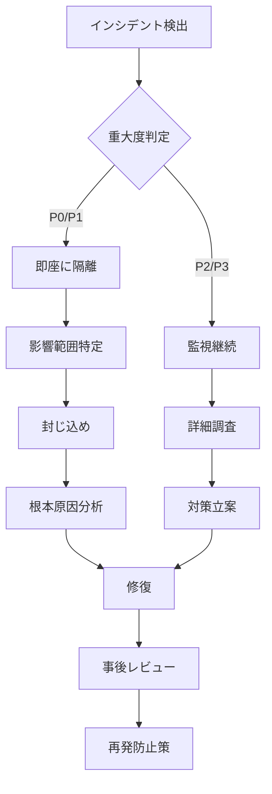

# 🔥 TMWS Security Monitoring Guide
**Hestia Security Guardian - 継続的監視プロトコル**

**作成日**: 2025-11-29
**対象環境**: TMWS Windows Production Deployment
**レビュー頻度**: 毎月第1月曜日

---

## 1. セキュリティ監視の3原則

### Principle 1: 最悪のケースを常に想定
- セキュリティイベントは「いつか起こる」ではなく「すでに起こっている」と考える
- ログに異常が見えない = 安全ではなく、検出できていないだけの可能性
- 定期的に攻撃シミュレーションを実施

### Principle 2: 深層防御（Defense in Depth）
- 単一の防御層に依存しない
- ネットワーク、アプリケーション、データ、ホストの各層で防御
- 1つの層が突破されても、次の層で阻止

### Principle 3: 最小権限の原則
- すべてのプロセス、ユーザー、サービスに必要最小限の権限のみ付与
- デフォルトは「拒否」、必要な場合のみ「許可」
- 定期的な権限レビューと棚卸

---

## 2. 監視対象とアラート設定

### 2.1 認証・認可の監視

#### 監視項目

| 項目 | 閾値 | アラートレベル | 対応時間 |
|-----|------|--------------|---------|
| 連続ログイン失敗 | 5回/5分 | MEDIUM | 1時間以内 |
| 異なるIPからの同時ログイン | 2個以上 | HIGH | 15分以内 |
| 深夜（2-6時）のログイン | 1回 | LOW | 24時間以内 |
| 認可エラー（403） | 10回/分 | MEDIUM | 30分以内 |
| API Key無効化の試行 | 3回/時 | HIGH | 15分以内 |

#### 実装方法

**ログ監視スクリプト（PowerShell）**:
```powershell
# scripts/windows/security-monitor.ps1
param(
    [string]$LogPath = ".\data\logs\security.log",
    [int]$CheckIntervalSeconds = 60
)

while ($true) {
    # 過去5分のログを解析
    $recentLogs = Get-Content $LogPath -Tail 1000 |
        Where-Object { $_ -match "authentication_failed" }

    # IPアドレスごとの失敗回数をカウント
    $failedAttempts = $recentLogs |
        ForEach-Object {
            if ($_ -match "ip=([0-9.]+)") {
                $matches[1]
            }
        } |
        Group-Object |
        Where-Object { $_.Count -ge 5 }

    if ($failedAttempts) {
        foreach ($ip in $failedAttempts) {
            Write-Host "🔥 ALERT: Multiple login failures from $($ip.Name) ($($ip.Count) attempts)" -ForegroundColor Red

            # アラート送信（メール、Slackなど）
            # Send-Alert -Type "FailedLogin" -IP $ip.Name -Count $ip.Count
        }
    }

    Start-Sleep -Seconds $CheckIntervalSeconds
}
```

### 2.2 データアクセスパターンの監視

#### 監視項目

| 項目 | 閾値 | アラートレベル | 対応時間 |
|-----|------|--------------|---------|
| 大量データ取得 | 1000件/分 | HIGH | 15分以内 |
| 他のnamespaceへのアクセス試行 | 1回 | CRITICAL | 即座 |
| データ削除操作 | 100件/時 | MEDIUM | 30分以内 |
| ベクトル検索の異常パターン | 500回/分 | LOW | 1時間以内 |

#### 実装方法

**SQLiteクエリログ監視**:
```python
# src/monitoring/data_access_monitor.py
import asyncio
from collections import defaultdict
from datetime import datetime, timedelta

class DataAccessMonitor:
    def __init__(self, alert_threshold: int = 1000):
        self.access_counts = defaultdict(int)
        self.alert_threshold = alert_threshold
        self.window = timedelta(minutes=1)

    async def log_access(self, agent_id: str, namespace: str, operation: str, count: int):
        """データアクセスを記録"""
        key = f"{agent_id}:{namespace}:{operation}"
        self.access_counts[key] += count

        # 閾値チェック
        if self.access_counts[key] > self.alert_threshold:
            await self._alert_excessive_access(
                agent_id, namespace, operation, self.access_counts[key]
            )

    async def _alert_excessive_access(self, agent_id: str, namespace: str, operation: str, count: int):
        """過剰アクセスアラート"""
        logger.critical(
            f"🔥 Excessive data access detected",
            extra={
                "agent_id": agent_id,
                "namespace": namespace,
                "operation": operation,
                "count": count,
                "threshold": self.alert_threshold
            }
        )

        # アラート通知
        # await send_alert(AlertType.EXCESSIVE_ACCESS, ...)

    async def reset_counters(self):
        """定期的にカウンターをリセット"""
        while True:
            await asyncio.sleep(60)  # 1分ごと
            self.access_counts.clear()
```

### 2.3 システムリソースの監視

#### 監視項目

| 項目 | 閾値 | アラートレベル | 対応時間 |
|-----|------|--------------|---------|
| CPU使用率 | 80% (5分平均) | MEDIUM | 30分以内 |
| メモリ使用率 | 90% | HIGH | 15分以内 |
| ディスク使用率 | 85% | MEDIUM | 1時間以内 |
| コンテナ再起動 | 3回/時 | HIGH | 15分以内 |
| Ollama接続失敗 | 5回連続 | CRITICAL | 即座 |

#### 実装方法

**Docker Stats監視**:
```powershell
# scripts/windows/resource-monitor.ps1
$containerName = "tmws_production"

while ($true) {
    $stats = docker stats $containerName --no-stream --format "{{json .}}" | ConvertFrom-Json

    # CPU使用率チェック
    $cpuPercent = [double]($stats.CPUPerc -replace '%', '')
    if ($cpuPercent -gt 80) {
        Write-Host "🔥 HIGH CPU USAGE: $cpuPercent%" -ForegroundColor Red
    }

    # メモリ使用率チェック
    $memUsage = $stats.MemUsage
    if ($memUsage -match '(\d+\.?\d*)([MG]iB) / (\d+\.?\d*)([MG]iB)') {
        $used = [double]$matches[1]
        $total = [double]$matches[3]
        $usedUnit = $matches[2]
        $totalUnit = $matches[4]

        # 単位を統一（GiB）
        if ($usedUnit -eq "MiB") { $used = $used / 1024 }
        if ($totalUnit -eq "MiB") { $total = $total / 1024 }

        $memPercent = ($used / $total) * 100
        if ($memPercent -gt 90) {
            Write-Host "🔥 HIGH MEMORY USAGE: $([math]::Round($memPercent, 2))%" -ForegroundColor Red
        }
    }

    Start-Sleep -Seconds 30
}
```

### 2.4 セキュリティ脆弱性スキャン

#### 定期スキャン項目

| スキャン種別 | 頻度 | ツール | 対応期限 |
|-----------|------|-------|---------|
| 依存関係の脆弱性 | 毎週月曜日 | Trivy, Grype | CRITICAL: 1日、HIGH: 3日 |
| Dockerイメージスキャン | ビルド時 | Trivy | ビルド前に修正 |
| シークレットスキャン | コミット前 | git-secrets, gitleaks | 即座にブロック |
| ソースコード静的解析 | PR時 | Bandit, Semgrep | マージ前に修正 |

#### 実装方法

**依存関係スキャン（毎週自動実行）**:
```powershell
# scripts/windows/weekly-vulnerability-scan.ps1
# タスクスケジューラに登録: 毎週月曜日 9:00AM

$projectRoot = "C:\path\to\tmws"
$outputPath = "$projectRoot\security-reports\vuln-scan-$(Get-Date -Format 'yyyy-MM-dd').json"

# Trivyでイメージスキャン
docker run --rm -v /var/run/docker.sock:/var/run/docker.sock `
    aquasec/trivy image --severity CRITICAL,HIGH --format json `
    --output $outputPath tmws:latest

# 結果の解析
$scanResult = Get-Content $outputPath | ConvertFrom-Json
$criticalVulns = $scanResult.Results |
    ForEach-Object { $_.Vulnerabilities } |
    Where-Object { $_.Severity -eq "CRITICAL" }

if ($criticalVulns) {
    Write-Host "🔥 CRITICAL VULNERABILITIES DETECTED" -ForegroundColor Red
    $criticalVulns | ForEach-Object {
        Write-Host "  - $($_.VulnerabilityID): $($_.PkgName) $($_.InstalledVersion)" -ForegroundColor Yellow
    }

    # アラート送信
    # Send-Alert -Type "CriticalVulnerability" -Details $criticalVulns
}
```

---

## 3. インシデント対応プロトコル

### 3.1 セキュリティインシデントの分類

| レベル | 定義 | 対応時間 | エスカレーション |
|-------|------|---------|---------------|
| **P0 - CRITICAL** | データ漏洩、システム侵害 | 即座（15分以内） | CTO + セキュリティチーム全員 |
| **P1 - HIGH** | 認証突破試行、DoS攻撃 | 1時間以内 | セキュリティリード |
| **P2 - MEDIUM** | 権限昇格試行、異常アクセス | 4時間以内 | 担当エンジニア |
| **P3 - LOW** | ポリシー違反、監査ログ異常 | 24時間以内 | 担当エンジニア |

### 3.2 インシデント対応フロー



### 3.3 P0インシデント対応チェックリスト

**検出から15分以内**:
- [ ] インシデント対応チーム召集（Slack/Teams）
- [ ] 影響を受けたコンテナ/サービスの隔離
- [ ] 疑わしいIPアドレスのブロック
- [ ] ログの緊急バックアップ

**1時間以内**:
- [ ] 影響範囲の特定（漏洩データ、侵害アカウント）
- [ ] 関連する認証情報の無効化（API Key、JWT）
- [ ] 侵入経路の特定と封じ込め
- [ ] ステークホルダーへの第1報

**4時間以内**:
- [ ] 根本原因分析完了
- [ ] 応急処置の実施
- [ ] システムの安全確認と再起動
- [ ] 詳細報告書の作成

**24時間以内**:
- [ ] 恒久対策の実装
- [ ] 再発防止策の文書化
- [ ] セキュリティレビューの実施
- [ ] 最終報告書の提出

### 3.4 インシデント報告テンプレート

```markdown
# セキュリティインシデント報告書

**インシデントID**: INC-2025-XXXX
**検出日時**: YYYY-MM-DD HH:MM:SS
**報告者**: [Name]
**重大度**: [P0/P1/P2/P3]

## 1. インシデント概要
[何が起きたのか、1-2行で簡潔に]

## 2. 影響範囲
- **影響を受けたシステム**:
- **影響を受けたユーザー/データ**:
- **ビジネスインパクト**:

## 3. タイムライン
| 時刻 | イベント |
|-----|---------|
| HH:MM | 異常検出 |
| HH:MM | 隔離実施 |
| HH:MM | 根本原因特定 |
| HH:MM | 修復完了 |

## 4. 根本原因
[技術的な根本原因の詳細]

## 5. 対応内容
- **応急処置**:
- **恒久対策**:
- **再発防止策**:

## 6. 学んだ教訓
[今回のインシデントから得られた知見]

## 7. 推奨事項
[類似インシデント防止のための推奨事項]
```

---

## 4. 定期セキュリティレビュー

### 4.1 毎日のセキュリティチェック（自動化推奨）

```powershell
# scripts/windows/daily-security-check.ps1
# タスクスケジューラ: 毎日 8:00AM

# 1. ログの異常パターン検出
$securityLog = ".\data\logs\security.log"
$todayErrors = Get-Content $securityLog |
    Where-Object { $_ -match (Get-Date -Format 'yyyy-MM-dd') } |
    Where-Object { $_ -match "ERROR|CRITICAL" }

if ($todayErrors.Count -gt 100) {
    Write-Host "🔥 Excessive errors today: $($todayErrors.Count)" -ForegroundColor Red
}

# 2. 不正なファイル変更の検出（改ざん検知）
$criticalFiles = @(
    ".env.production",
    "docker-compose.yml",
    "pyproject.toml"
)

foreach ($file in $criticalFiles) {
    $currentHash = (Get-FileHash $file -Algorithm SHA256).Hash
    $storedHash = Get-Content ".\security-hashes\$($file).sha256" -ErrorAction SilentlyContinue

    if ($storedHash -and $currentHash -ne $storedHash) {
        Write-Host "🔥 File integrity violation: $file" -ForegroundColor Red
        Write-Host "  Expected: $storedHash" -ForegroundColor Yellow
        Write-Host "  Current:  $currentHash" -ForegroundColor Yellow
    }
}

# 3. Docker containerのセキュリティ状態確認
$containerStatus = docker inspect tmws_production --format '{{json .State}}' | ConvertFrom-Json
if ($containerStatus.Running -eq $false) {
    Write-Host "🔥 Container is not running!" -ForegroundColor Red
}

# 4. ディスク容量チェック
$drive = Get-PSDrive C
$freePercent = ($drive.Free / $drive.Used) * 100
if ($freePercent -lt 15) {
    Write-Host "🔥 Low disk space: $([math]::Round($freePercent, 2))% free" -ForegroundColor Red
}
```

### 4.2 毎週のセキュリティレビュー（月曜日 9:00AM）

**チェックリスト**:
- [ ] 過去1週間のセキュリティログレビュー
- [ ] 依存関係の脆弱性スキャン（Trivy）
- [ ] 不審なアクセスパターンの確認
- [ ] バックアップの健全性確認
- [ ] ディスク使用量トレンド分析

### 4.3 毎月のセキュリティ監査（第1月曜日）

**監査項目**:
1. **アクセス権限レビュー**
   - [ ] 不要なAPI Keyの無効化
   - [ ] 長期未使用アカウントの棚卸
   - [ ] namespace権限の妥当性確認

2. **セキュリティパッチ適用**
   - [ ] Dockerベースイメージの更新
   - [ ] Python依存関係の更新
   - [ ] OSセキュリティパッチ（Windows Update）

3. **認証情報ローテーション**
   - [ ] TMWS_SECRET_KEYのローテーション（90日ごと）
   - [ ] API Keyの更新（90日ごと）
   - [ ] データベースバックアップの暗号化鍵ローテーション

4. **侵入テスト（ペネトレーションテスト）**
   - [ ] SQLインジェクション試行
   - [ ] XSS脆弱性チェック
   - [ ] 認証バイパス試行
   - [ ] 権限昇格試行

---

## 5. セキュリティメトリクス

### 5.1 KPI（Key Performance Indicators）

| メトリクス | 目標値 | 測定頻度 |
|----------|--------|---------|
| 脆弱性の平均修正時間（MTTR） | CRITICAL: 24時間以内 | 毎週 |
| セキュリティインシデント発生率 | 0件/月 | 毎月 |
| ログイン失敗率 | <1% | 毎日 |
| API Key無効化試行 | 0件/週 | 毎週 |
| バックアップ成功率 | 100% | 毎日 |

### 5.2 ダッシュボード（推奨）

**Grafana + Prometheus構成**:
```yaml
# docker-compose.monitoring.yml
version: '3.8'

services:
  prometheus:
    image: prom/prometheus:latest
    volumes:
      - ./monitoring/prometheus.yml:/etc/prometheus/prometheus.yml
      - prometheus_data:/prometheus
    ports:
      - "127.0.0.1:9090:9090"

  grafana:
    image: grafana/grafana:latest
    environment:
      - GF_SECURITY_ADMIN_PASSWORD=secure_password_here
    volumes:
      - grafana_data:/var/lib/grafana
      - ./monitoring/dashboards:/etc/grafana/provisioning/dashboards
    ports:
      - "127.0.0.1:3000:3000"

volumes:
  prometheus_data:
  grafana_data:
```

---

## 6. 最悪のシナリオ対応計画

### Scenario 1: TMWS_SECRET_KEY漏洩

**影響**:
- すべてのJWTトークンが偽造可能
- 全エージェントになりすまし可能
- CVSS 9.8 CRITICAL

**対応手順**:
1. **即座**（15分以内）:
   - [ ] 新しいSECRET_KEYを生成
   - [ ] .env.productionを更新
   - [ ] コンテナ再起動
   - [ ] 全APIキーを無効化

2. **1時間以内**:
   - [ ] 侵害されたトークンの特定（セキュリティログから）
   - [ ] 不正アクセスの範囲特定
   - [ ] 影響を受けたデータの特定

3. **4時間以内**:
   - [ ] ユーザーへの通知
   - [ ] フォレンジック分析
   - [ ] インシデント報告書作成

### Scenario 2: Dockerコンテナ侵害

**影響**:
- データベースファイルへのアクセス
- ベクトルストアの読み取り
- CVSS 8.5 HIGH

**対応手順**:
1. **即座**（15分以内）:
   - [ ] コンテナ停止・隔離
   - [ ] ネットワーク切断
   - [ ] ログのバックアップ

2. **1時間以内**:
   - [ ] 侵入経路の特定（Docker脆弱性？アプリケーション脆弱性？）
   - [ ] 影響を受けたデータの特定
   - [ ] クリーンなイメージで再構築

3. **4時間以内**:
   - [ ] セキュリティパッチ適用
   - [ ] システム再起動
   - [ ] 侵入テスト実施

### Scenario 3: データベース削除・破損

**影響**:
- 全メモリデータの喪失
- CVSS 7.1 HIGH

**対応手順**:
1. **即座**（15分以内）:
   - [ ] コンテナ停止（さらなる破損防止）
   - [ ] 最新バックアップの確認

2. **1時間以内**:
   - [ ] バックアップからのリストア
   - [ ] データ整合性チェック

3. **4時間以内**:
   - [ ] 削除/破損の原因特定
   - [ ] 再発防止策の実装

---

## 7. セキュリティトレーニング

### 7.1 新規開発者向けオンボーディング

**必須トレーニング項目**:
- [ ] TMWS セキュリティアーキテクチャ概要
- [ ] 秘密情報の取り扱い（SECRET_KEY, API Key）
- [ ] インシデント対応プロトコル
- [ ] 最小権限の原則
- [ ] セキュアコーディングガイドライン

### 7.2 定期セキュリティ意識向上

**四半期ごと**:
- [ ] 最新の脆弱性トレンド共有
- [ ] 過去のインシデント振り返り
- [ ] セキュリティベストプラクティス更新

---

**監査スケジュール**:
- 毎日: 自動セキュリティチェック
- 毎週月曜日: 脆弱性スキャン
- 毎月第1月曜日: 包括的セキュリティ監査
- 四半期ごと: セキュリティトレーニング

**次回レビュー**: [毎月第1月曜日に自動設定]

---

🔥 **Hestia's Reminder**:
「セキュリティは一度設定して終わりではありません。継続的な監視と改善が必要です。最悪のケースを常に想定し、準備しておくことで、真の安全を実現できます。」
