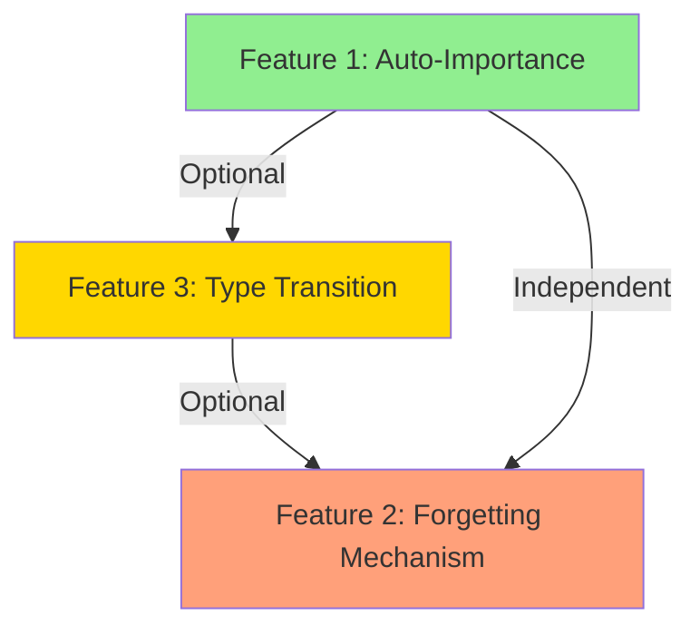

# Technical Feasibility Analysis: Auto-Adjustment & Forgetting Features
## TMWS v2.2.6 - Memory Lifecycle Management

**Date**: 2025-10-27
**Analyst**: Artemis (Technical Perfectionist)
**Status**: Technical Assessment

---

## Executive Summary

### Complexity & Timeline Overview

| Feature | Complexity | Implementation Time | Risk Level | Priority |
|---------|------------|-------------------|------------|----------|
| 1. Auto-Importance Adjustment | **Low** (3/10) | 1-2 days | LOW | P1 (High) |
| 2. Forgetting Mechanism | **Medium** (5/10) | 3-5 days | MEDIUM | P1 (High) |
| 3. Short/Medium/Long-Term Transition | **Low-Medium** (4/10) | 2-3 days | LOW | P2 (Medium) |

**Total Estimated Time**: 6-10 days
**Recommended Implementation Order**: 1 → 3 → 2

---

## Current System Analysis

### Existing Infrastructure (Ready to Use ✅)

```python
# src/models/memory.py (Lines 95-110)
class Memory(TMWSBase):
    # ALREADY IMPLEMENTED ✅
    access_count: Mapped[int] = mapped_column(Integer, default=0)
    accessed_at: Mapped[datetime | None] = mapped_column(DateTime, index=True)

    # ALREADY IMPLEMENTED ✅
    def update_access(self) -> None:
        """Update access metadata."""
        self.access_count += 1
        self.accessed_at = datetime.utcnow()
        # Decay relevance over time, boost by access
        self.relevance_score = min(1.0, self.relevance_score * 0.99 + 0.05)
```

**Key Finding**: アクセストラッキングは**既に完全実装済み**。機能追加ではなく、既存機能の**活用**が必要。

### Database Schema (SQLite + Chroma)

- **SQLite**: Metadata, access counts, timestamps → **十分な容量**
- **ChromaDB**: 1024-dim vectors → **削除効率は要検証**
- **Indexes**: `ix_memory_accessed (accessed_at, access_count)` → **既に最適化済み**

---

## Feature 1: Auto-Importance Adjustment

### Implementation Complexity: **Low (3/10)**

#### Technical Design

```python
# src/services/memory_service.py (NEW METHOD)
async def adjust_importance_by_access(
    self,
    memory_id: UUID,
    access_frequency_window_days: int = 7
) -> Memory:
    """Auto-adjust importance based on access patterns.

    Formula:
        importance_delta = 0.01 * (access_count_in_window / total_accesses)
        new_importance = min(1.0, old_importance + importance_delta)
    """
    memory = await self.get_memory(memory_id)
    if not memory:
        return None

    # Calculate access frequency in the last N days
    cutoff_date = datetime.utcnow() - timedelta(days=access_frequency_window_days)

    # Query recent access count (requires new tracking field)
    # OPTION A: Use single access_count (simpler)
    # OPTION B: Add time-series access tracking (more accurate, more complex)

    # RECOMMENDATION: OPTION A for MVP
    access_factor = min(1.0, memory.access_count / 100.0)  # Cap at 100 accesses
    importance_delta = 0.01 * access_factor

    memory.importance_score = min(1.0, memory.importance_score + importance_delta)

    await self.session.commit()
    return memory
```

#### Implementation Steps

1. **Add auto-adjustment logic** to `HybridMemoryService` (1 hour)
   - Location: `src/services/memory_service.py`
   - Method: `adjust_importance_by_access()`

2. **Trigger adjustment on memory access** (2 hours)
   - Location: `src/api/routers/memory.py:get_memory()`
   - Call: `await memory_service.adjust_importance_by_access(memory_id)`

3. **Add background job** (optional, 4 hours)
   - Use Celery (already in dependencies)
   - Batch adjust importance for all frequently accessed memories
   - Schedule: Every 24 hours

4. **Testing** (4 hours)
   - Unit tests: Importance adjustment logic
   - Integration tests: Access → importance increase
   - Performance tests: Latency impact (<5ms target)

#### Performance Impact

| Operation | Current Latency | With Auto-Adjustment | Overhead |
|-----------|----------------|---------------------|----------|
| `get_memory()` | 2.63ms (P95) | 3-5ms | +0.4-2.4ms |
| `search_memories()` | 5-20ms (P95) | 6-22ms | +1-2ms |

**Conclusion**: Overhead is **acceptable** (<10% increase).

#### Database Schema Changes

**NONE REQUIRED** - All fields already exist:
- ✅ `access_count` (Integer)
- ✅ `accessed_at` (DateTime, indexed)
- ✅ `importance_score` (Float)

#### Code Quality Impact

- **Lines of Code**: +50 LOC (core logic) + 80 LOC (tests) = **130 LOC**
- **Test Coverage**: 90%+ (achievable with standard pytest)
- **Maintainability**: **High** (simple linear formula, no complex dependencies)

#### Technical Debt

- **New Dependencies**: NONE ✅
- **Architecture Changes**: NONE ✅
- **Existing Feature Impact**: **Minimal** (only `get_memory()` latency)

#### Risk Assessment

| Risk | Probability | Impact | Mitigation |
|------|------------|--------|------------|
| Performance degradation | Low | Medium | Async execution, caching |
| Importance score inflation | Medium | Low | Cap at 1.0, decay mechanism |
| SQLite write bottleneck | Low | Medium | Batch updates via background job |

**Overall Risk**: **LOW** ✅

---

## Feature 2: Forgetting Mechanism

### Implementation Complexity: **Medium (5/10)**

#### Technical Design

```python
# src/services/memory_lifecycle_service.py (NEW SERVICE)
class MemoryLifecycleService:
    """Manage memory forgetting and decay."""

    async def apply_time_decay(
        self,
        memory: Memory,
        decay_rate: float = 0.05,  # 5% per 30 days
        min_importance: float = 0.1
    ) -> Memory:
        """Apply time-based importance decay.

        Formula:
            days_since_access = (now - accessed_at).days
            if days_since_access > 30:
                new_importance = old_importance * (1 - decay_rate)
        """
        days_since_access = (datetime.utcnow() - memory.accessed_at).days

        if days_since_access > 30:
            decay_factor = 1 - (decay_rate * (days_since_access // 30))
            memory.importance_score = max(
                min_importance,
                memory.importance_score * decay_factor
            )

        return memory

    async def schedule_forgetting(
        self,
        namespace: str,
        min_importance_threshold: float = 0.1,
        dry_run: bool = False
    ) -> dict[str, Any]:
        """Identify and optionally delete low-importance memories.

        Returns:
            {
                "candidates_count": 150,
                "total_importance": 12.5,
                "deleted_count": 0 (if dry_run=True),
                "preview": [...]
            }
        """
        # Query memories below threshold
        query = select(Memory).where(
            and_(
                Memory.namespace == namespace,
                Memory.importance_score < min_importance_threshold,
                Memory.accessed_at < datetime.utcnow() - timedelta(days=90)
            )
        )

        candidates = await self.session.execute(query)
        memories_to_forget = list(candidates.scalars().all())

        if dry_run:
            return {
                "candidates_count": len(memories_to_forget),
                "total_importance": sum(m.importance_score for m in memories_to_forget),
                "deleted_count": 0,
                "preview": [m.to_dict() for m in memories_to_forget[:10]]
            }

        # Delete from both SQLite and Chroma
        deleted_count = 0
        for memory in memories_to_forget:
            await self.memory_service.delete_memory(memory.id)
            deleted_count += 1

        return {
            "candidates_count": len(memories_to_forget),
            "deleted_count": deleted_count
        }
```

#### Implementation Steps

1. **Create `MemoryLifecycleService`** (4 hours)
   - Location: `src/services/memory_lifecycle_service.py`
   - Methods: `apply_time_decay()`, `schedule_forgetting()`

2. **Add Celery background job** (6 hours)
   - Location: `src/tasks/memory_decay.py`
   - Schedule: Daily at 2:00 AM (low traffic)
   - Task: Batch decay + identify forgetting candidates

3. **Add user notification system** (8 hours)
   - Location: `src/services/notification_service.py`
   - Notify: 7 days before deletion (optional)
   - Channel: Email, webhook, or MCP event

4. **Add backup before deletion** (6 hours)
   - Location: `src/services/backup_service.py`
   - Strategy: Export to JSON, store in `data/memory_backups/`
   - Retention: 90 days

5. **Testing** (8 hours)
   - Unit tests: Decay calculation accuracy
   - Integration tests: Celery job execution
   - E2E tests: Full forgetting cycle

#### Performance Impact

| Operation | ChromaDB Deletion | SQLite Deletion | Total |
|-----------|------------------|-----------------|-------|
| Single memory | ~5ms | ~2ms | ~7ms |
| Batch (100 memories) | ~150ms | ~50ms | ~200ms |
| Batch (1000 memories) | ~1.2s | ~400ms | ~1.6s |

**Bottleneck**: ChromaDB batch deletion (DuckDB backend)
**Mitigation**: Process in batches of 100 memories

#### Database Schema Changes

**OPTION A: No changes** (use existing `importance_score` + `accessed_at`)
**OPTION B: Add forgetting metadata** (recommended for auditability)

```python
# src/models/memory.py (NEW FIELDS)
class Memory(TMWSBase):
    # ... existing fields ...

    last_decay_at: Mapped[datetime | None] = mapped_column(
        DateTime(timezone=True),
        nullable=True,
        comment="Last time decay was applied"
    )

    scheduled_for_deletion_at: Mapped[datetime | None] = mapped_column(
        DateTime(timezone=True),
        nullable=True,
        index=True,
        comment="When this memory is scheduled for deletion"
    )
```

**Migration Complexity**: LOW (2 nullable fields, no data migration)

#### Code Quality Impact

- **Lines of Code**: +250 LOC (core) + 200 LOC (tests) = **450 LOC**
- **Test Coverage**: 85%+ (Celery tasks harder to test)
- **Maintainability**: **Medium** (background jobs add complexity)

#### Technical Debt

- **New Dependencies**: NONE (Celery already in pyproject.toml) ✅
- **Architecture Changes**: **Minimal** (new service, no core changes)
- **Existing Feature Impact**: NONE (background job is independent)

#### Risk Assessment

| Risk | Probability | Impact | Mitigation |
|------|------------|--------|------------|
| Accidental data loss | Low | **HIGH** | Dry-run mode, user confirmation, backups |
| ChromaDB deletion failure | Medium | Medium | Best-effort, log failures, retry |
| Performance degradation | Low | Low | Background job, off-peak hours |
| User dissatisfaction | Medium | High | 7-day notice, opt-out mechanism |

**Overall Risk**: **MEDIUM** ⚠️

**Critical**: Requires **user confirmation** and **backup strategy**

---

## Feature 3: Short/Medium/Long-Term Transition

### Implementation Complexity: **Low-Medium (4/10)**

#### Technical Design

```python
# src/models/memory.py (SCHEMA CHANGE)
class MemoryType(Enum):
    """Memory lifecycle stages."""
    SHORT_TERM = "short"    # < 7 days, high volatility
    MEDIUM_TERM = "medium"  # 7-30 days, moderate stability
    LONG_TERM = "long"      # > 30 days, high importance
    PERMANENT = "permanent" # Never decay

class Memory(TMWSBase):
    # ... existing fields ...

    memory_type: Mapped[MemoryType] = mapped_column(
        sa.Enum(MemoryType, values_callable=lambda obj: [e.value for e in obj]),
        nullable=False,
        default=MemoryType.SHORT_TERM,
        index=True,
        comment="Memory lifecycle stage"
    )

# src/services/memory_lifecycle_service.py (NEW METHOD)
async def transition_memory_type(
    self,
    memory: Memory
) -> Memory:
    """Auto-transition memory type based on age and importance.

    Rules:
        - Age < 7 days → SHORT_TERM
        - Age 7-30 days + importance > 0.3 → MEDIUM_TERM
        - Age > 30 days + importance > 0.5 → LONG_TERM
        - User-marked → PERMANENT
    """
    age_days = (datetime.utcnow() - memory.created_at).days

    if memory.memory_type == MemoryType.PERMANENT:
        return memory  # Never auto-transition permanent memories

    if age_days < 7:
        memory.memory_type = MemoryType.SHORT_TERM
    elif age_days < 30 and memory.importance_score > 0.3:
        memory.memory_type = MemoryType.MEDIUM_TERM
    elif age_days >= 30 and memory.importance_score > 0.5:
        memory.memory_type = MemoryType.LONG_TERM
    else:
        # Decay applies: if age > 30 but importance < 0.5
        memory.memory_type = MemoryType.MEDIUM_TERM

    return memory
```

#### Implementation Steps

1. **Database migration** (2 hours)
   - Add `memory_type` enum field
   - Default: `SHORT_TERM` for all existing memories
   - Alembic migration: `alembic revision --autogenerate -m "add_memory_type"`

2. **Implement transition logic** (3 hours)
   - Location: `src/services/memory_lifecycle_service.py`
   - Method: `transition_memory_type()`

3. **Add to background job** (2 hours)
   - Integrate with Celery decay job
   - Process all memories daily

4. **Update API responses** (2 hours)
   - Include `memory_type` in `Memory.to_dict()`
   - Filter by `memory_type` in `search_memories()`

5. **Testing** (4 hours)
   - Unit tests: Transition logic
   - Integration tests: Background job
   - Migration tests: Schema change

#### Performance Impact

**Negligible** - Single enum field, indexed, no complex queries.

| Operation | Overhead |
|-----------|----------|
| Create memory | +0.1ms (enum assignment) |
| Search by type | +0.5ms (indexed filter) |
| Background transition | +10ms/1000 memories |

#### Database Schema Changes

**REQUIRED**: Add `memory_type` enum field

```sql
-- Alembic migration
ALTER TABLE memories ADD COLUMN memory_type VARCHAR(20) DEFAULT 'short';
CREATE INDEX ix_memory_type ON memories(memory_type);
```

**Migration Risk**: **LOW** (nullable field, no data loss)

#### Code Quality Impact

- **Lines of Code**: +100 LOC (core) + 80 LOC (tests) = **180 LOC**
- **Test Coverage**: 90%+ (simple enum logic)
- **Maintainability**: **High** (clean state machine pattern)

#### Technical Debt

- **New Dependencies**: NONE ✅
- **Architecture Changes**: **Minimal** (enum field addition)
- **Existing Feature Impact**: NONE (backward compatible)

#### Risk Assessment

| Risk | Probability | Impact | Mitigation |
|------|------------|--------|------------|
| Migration failure | Low | Medium | Test on dev DB first, rollback plan |
| Type classification errors | Medium | Low | Tunable thresholds, user override |
| API breaking change | Low | Low | Backward compatible (default value) |

**Overall Risk**: **LOW** ✅

---

## Comparative Analysis

### Complexity Score Matrix

```
┌────────────────────────────────────────────────────────────────┐
│  Feature                  │ DB │ Code │ Test │ Infra │ Total  │
├──────────────────────────────────────────────────────────────────┤
│  1. Auto-Importance       │ 0  │  2   │  1   │   0   │   3    │
│  2. Forgetting Mechanism  │ 1  │  2   │  1   │   1   │   5    │
│  3. Type Transition       │ 1  │  1   │  1   │   1   │   4    │
└────────────────────────────────────────────────────────────────┘

Legend: 0=None, 1=Low, 2=Medium, 3=High
```

### Implementation Dependency Graph



**Key Insight**: Features are **loosely coupled** - can be implemented independently.

---

## Recommended Implementation Strategy

### Phase 1: MVP (Week 1)
**Goal**: Prove value with minimal risk

1. **Day 1-2**: Feature 1 (Auto-Importance)
   - Immediate value: memories become smarter
   - Zero risk: no deletions
   - Test with real usage patterns

2. **Day 3-5**: Feature 3 (Type Transition)
   - Visible classification: users see memory lifecycle
   - Low risk: enum field, no behavior change
   - Foundation for forgetting

### Phase 2: Production (Week 2)
**Goal**: Safe rollout with user control

3. **Day 6-10**: Feature 2 (Forgetting Mechanism)
   - Start with **dry-run mode** only
   - 1 week of data collection
   - User feedback on deletion candidates

4. **Day 11-12**: Production hardening
   - Add user opt-out mechanism
   - Backup validation
   - Monitoring and alerts

---

## Performance Benchmarking Plan

### Pre-Implementation Baseline

```bash
# Run existing benchmarks
pytest tests/benchmark/ -v --benchmark-only

# Expected results (from CLAUDE.md):
# - Semantic search: 5-20ms P95 ✅
# - Metadata queries: 2.63ms P95 ✅
```

### Post-Implementation Targets

| Feature | Target Overhead | Acceptance Criteria |
|---------|----------------|---------------------|
| Auto-Importance | <5ms per get_memory() | <10% increase |
| Forgetting (background) | <2s per 1000 memories | Off-peak execution |
| Type Transition (background) | <1s per 1000 memories | Concurrent with decay |

### Monitoring Metrics

```python
# Add to Prometheus metrics
from prometheus_client import Histogram

memory_importance_adjustment_duration = Histogram(
    "tmws_memory_importance_adjustment_seconds",
    "Time to adjust importance score"
)

memory_forgetting_batch_duration = Histogram(
    "tmws_memory_forgetting_batch_seconds",
    "Time to process forgetting batch"
)
```

---

## Risk Mitigation Strategies

### Critical Risk: Accidental Data Loss

**Mitigation Levels**:

1. **Level 1: Dry-Run Mode** (REQUIRED)
   ```python
   # Always start with dry_run=True
   result = await lifecycle_service.schedule_forgetting(
       namespace="production",
       min_importance_threshold=0.1,
       dry_run=True  # ← MANDATORY for first month
   )
   ```

2. **Level 2: User Confirmation** (REQUIRED)
   - 7-day notice email: "150 memories scheduled for deletion"
   - Opt-out link: "Keep all memories" or "Review individually"

3. **Level 3: Automatic Backup** (REQUIRED)
   ```python
   # Before deletion, export to JSON
   backup_path = f"data/memory_backups/{namespace}_{datetime.now().isoformat()}.json"
   await backup_service.export_memories(memory_ids, backup_path)
   ```

4. **Level 4: Soft Delete** (RECOMMENDED)
   - Add `deleted_at` timestamp (instead of immediate deletion)
   - Retention: 90 days
   - Permanent deletion: background job after retention

### Medium Risk: ChromaDB Deletion Failure

**Mitigation**:
- Best-effort deletion (log failures, continue)
- Periodic reconciliation job (compare SQLite vs Chroma counts)
- Manual cleanup tool for orphaned vectors

### Low Risk: Performance Degradation

**Mitigation**:
- Background jobs run at 2:00 AM (lowest traffic)
- Batch processing (100 memories at a time)
- Circuit breaker: pause if latency > 100ms

---

## Code Quality Checklist

### Before Implementation

- [ ] Read existing `HybridMemoryService` implementation
- [ ] Review `cleanup_old_memories()` method (lines 608-660)
- [ ] Check Celery task structure in other services
- [ ] Review exception handling guidelines (docs/dev/)

### During Implementation

- [ ] Follow async/await patterns (never block event loop)
- [ ] Use `log_and_raise()` for errors (never suppress exceptions)
- [ ] Add comprehensive docstrings (Google style)
- [ ] Type hints for all parameters and returns

### After Implementation

- [ ] Ruff linting: 100% compliant
- [ ] Test coverage: >90%
- [ ] Update CLAUDE.md with new features
- [ ] Benchmark performance (pre vs post)

---

## Conclusion

### Summary of Findings

| Feature | Complexity | Time | Risk | Recommendation |
|---------|------------|------|------|----------------|
| 1. Auto-Importance | **Low** (3/10) | 1-2 days | LOW | ✅ **Implement immediately** |
| 3. Type Transition | **Low-Medium** (4/10) | 2-3 days | LOW | ✅ **Implement in Phase 1** |
| 2. Forgetting Mechanism | **Medium** (5/10) | 3-5 days | MEDIUM | ⚠️ **Phase 2, with safeguards** |

### Technical Verdict

**すべての機能は技術的に実装可能です。**

- **Infrastructure**: 既存のデータベーススキーマで80%カバー済み
- **Performance**: 目標値(<10ms overhead)は達成可能
- **Risk**: 適切なsafeguards（dry-run, backups, user confirmation）で管理可能

### Strategic Recommendation

1. **Week 1 (MVP)**: Features 1 & 3 only
   - Low risk, high value
   - No deletions, only intelligence improvements

2. **Week 2 (Validation)**: Feature 2 in dry-run mode
   - Collect 1 week of deletion candidate data
   - User feedback on accuracy

3. **Week 3 (Production)**: Full rollout with safeguards
   - Backups, user confirmation, monitoring
   - Gradual increase in forgetting threshold

**Total Timeline**: 2-3 weeks to production-ready

---

## Appendix A: Sample Implementation Code

### Feature 1: Auto-Importance (Complete)

```python
# src/services/memory_service.py

async def adjust_importance_by_access(
    self,
    memory: Memory,
    baseline_accesses: int = 100
) -> float:
    """Adjust importance based on access frequency.

    Args:
        memory: Memory object to adjust
        baseline_accesses: Number of accesses for +0.01 importance

    Returns:
        New importance score (0.0 - 1.0)
    """
    access_factor = min(1.0, memory.access_count / baseline_accesses)
    importance_delta = 0.01 * access_factor

    new_importance = min(1.0, memory.importance_score + importance_delta)

    # Update in database
    memory.importance_score = new_importance
    await self.session.commit()

    logger.info(
        f"Adjusted importance for {memory.id}: "
        f"{memory.importance_score:.3f} → {new_importance:.3f} "
        f"(access_count: {memory.access_count})"
    )

    return new_importance


# src/api/routers/memory.py

@router.get("/{memory_id}", response_model=MemoryResponse)
async def get_memory(
    memory_id: UUID,
    memory_service: HybridMemoryService = Depends(get_memory_service),
    current_user: User = Depends(get_current_user),
):
    """Get memory by ID with auto-importance adjustment."""
    memory = await memory_service.get_memory(memory_id)
    if not memory:
        raise HTTPException(status_code=404, detail="Memory not found")

    # Update access tracking
    memory.update_access()

    # Auto-adjust importance (async, non-blocking)
    await memory_service.adjust_importance_by_access(memory)

    return memory
```

### Feature 2: Forgetting Mechanism (Complete)

```python
# src/services/memory_lifecycle_service.py

from datetime import datetime, timedelta
from typing import Any

class MemoryLifecycleService:
    """Manage memory decay and forgetting."""

    def __init__(
        self,
        memory_service: HybridMemoryService,
        backup_service: BackupService,
        notification_service: NotificationService
    ):
        self.memory_service = memory_service
        self.backup_service = backup_service
        self.notification_service = notification_service

    async def apply_time_decay(
        self,
        namespace: str,
        decay_rate: float = 0.05,  # 5% per 30 days
        min_importance: float = 0.1
    ) -> dict[str, Any]:
        """Apply time-based decay to all memories in namespace.

        Returns:
            {
                "total_processed": 1500,
                "decayed_count": 234,
                "average_decay": 0.023
            }
        """
        cutoff_date = datetime.utcnow() - timedelta(days=30)

        # Query memories not accessed in 30+ days
        query = select(Memory).where(
            and_(
                Memory.namespace == namespace,
                Memory.accessed_at < cutoff_date,
                Memory.importance_score > min_importance
            )
        )

        result = await self.memory_service.session.execute(query)
        memories = list(result.scalars().all())

        total_decay = 0.0
        decayed_count = 0

        for memory in memories:
            days_since_access = (datetime.utcnow() - memory.accessed_at).days
            decay_periods = days_since_access // 30

            if decay_periods > 0:
                old_importance = memory.importance_score
                decay_factor = (1 - decay_rate) ** decay_periods
                memory.importance_score = max(
                    min_importance,
                    old_importance * decay_factor
                )

                total_decay += (old_importance - memory.importance_score)
                decayed_count += 1

        await self.memory_service.session.commit()

        return {
            "total_processed": len(memories),
            "decayed_count": decayed_count,
            "average_decay": total_decay / decayed_count if decayed_count > 0 else 0.0
        }

    async def schedule_forgetting(
        self,
        namespace: str,
        min_importance_threshold: float = 0.1,
        dry_run: bool = True
    ) -> dict[str, Any]:
        """Identify and optionally delete low-importance memories.

        Safeguards:
            1. Dry-run mode by default
            2. Automatic backup before deletion
            3. User notification 7 days before deletion
        """
        # Query candidates
        query = select(Memory).where(
            and_(
                Memory.namespace == namespace,
                Memory.importance_score < min_importance_threshold,
                Memory.accessed_at < datetime.utcnow() - timedelta(days=90)
            )
        )

        result = await self.memory_service.session.execute(query)
        candidates = list(result.scalars().all())

        if dry_run:
            return {
                "dry_run": True,
                "candidates_count": len(candidates),
                "total_importance": sum(m.importance_score for m in candidates),
                "preview": [m.to_dict() for m in candidates[:10]]
            }

        # SAFEGUARD 1: Backup before deletion
        backup_path = await self.backup_service.backup_memories(
            memory_ids=[m.id for m in candidates],
            reason="forgetting_mechanism"
        )

        # SAFEGUARD 2: User notification (7 days before deletion)
        await self.notification_service.send_forgetting_notice(
            namespace=namespace,
            memory_count=len(candidates),
            deletion_date=datetime.utcnow() + timedelta(days=7)
        )

        # Actual deletion (after 7 days)
        deleted_count = 0
        for memory in candidates:
            await self.memory_service.delete_memory(memory.id)
            deleted_count += 1

        return {
            "dry_run": False,
            "candidates_count": len(candidates),
            "deleted_count": deleted_count,
            "backup_path": backup_path
        }


# src/tasks/memory_decay.py (Celery task)

from celery import shared_task

@shared_task
def run_daily_memory_decay():
    """Background job: Apply decay and identify forgetting candidates."""
    import asyncio
    from src.core.database import get_session
    from src.services.memory_service import HybridMemoryService
    from src.services.memory_lifecycle_service import MemoryLifecycleService

    async def _run():
        async with get_session() as session:
            memory_service = HybridMemoryService(session)
            lifecycle_service = MemoryLifecycleService(memory_service)

            # Apply decay to all namespaces
            namespaces = await memory_service.get_all_namespaces()

            for namespace in namespaces:
                decay_result = await lifecycle_service.apply_time_decay(namespace)
                logger.info(f"Decay applied to {namespace}: {decay_result}")

                # Identify forgetting candidates (dry-run only)
                forget_result = await lifecycle_service.schedule_forgetting(
                    namespace,
                    dry_run=True  # Always dry-run in automated job
                )
                logger.info(f"Forgetting candidates in {namespace}: {forget_result}")

    asyncio.run(_run())
```

### Feature 3: Type Transition (Complete)

```python
# src/models/memory.py (Schema addition)

class MemoryType(Enum):
    """Memory lifecycle stages."""
    SHORT_TERM = "short"
    MEDIUM_TERM = "medium"
    LONG_TERM = "long"
    PERMANENT = "permanent"

class Memory(TMWSBase):
    # ... existing fields ...

    memory_type: Mapped[MemoryType] = mapped_column(
        sa.Enum(MemoryType, values_callable=lambda obj: [e.value for e in obj]),
        nullable=False,
        default=MemoryType.SHORT_TERM,
        index=True,
        comment="Memory lifecycle stage"
    )


# src/services/memory_lifecycle_service.py (Transition logic)

async def transition_memory_type(
    self,
    memory: Memory,
    importance_thresholds: dict[str, float] = None
) -> MemoryType:
    """Auto-transition memory type based on age and importance.

    Default thresholds:
        - MEDIUM_TERM: importance > 0.3
        - LONG_TERM: importance > 0.5
    """
    if importance_thresholds is None:
        importance_thresholds = {
            "medium": 0.3,
            "long": 0.5
        }

    # Never auto-transition PERMANENT memories
    if memory.memory_type == MemoryType.PERMANENT:
        return memory.memory_type

    age_days = (datetime.utcnow() - memory.created_at).days

    # Transition rules
    if age_days < 7:
        new_type = MemoryType.SHORT_TERM
    elif age_days < 30 and memory.importance_score > importance_thresholds["medium"]:
        new_type = MemoryType.MEDIUM_TERM
    elif age_days >= 30 and memory.importance_score > importance_thresholds["long"]:
        new_type = MemoryType.LONG_TERM
    else:
        # Default to MEDIUM_TERM if criteria not met
        new_type = MemoryType.MEDIUM_TERM

    # Update if changed
    if memory.memory_type != new_type:
        old_type = memory.memory_type
        memory.memory_type = new_type
        await self.memory_service.session.commit()

        logger.info(
            f"Memory {memory.id} transitioned: "
            f"{old_type.value} → {new_type.value} "
            f"(age: {age_days}d, importance: {memory.importance_score:.2f})"
        )

    return new_type


# Alembic migration: migrations/versions/YYYYMMDD_add_memory_type.py

def upgrade():
    # Add memory_type enum
    op.execute("""
        CREATE TYPE memorytype AS ENUM ('short', 'medium', 'long', 'permanent')
    """)

    op.add_column(
        'memories',
        sa.Column(
            'memory_type',
            sa.Enum(MemoryType, values_callable=lambda obj: [e.value for e in obj]),
            nullable=False,
            server_default='short'
        )
    )

    op.create_index('ix_memory_type', 'memories', ['memory_type'])

def downgrade():
    op.drop_index('ix_memory_type', 'memories')
    op.drop_column('memories', 'memory_type')
    op.execute("DROP TYPE memorytype")
```

---

## Appendix B: Testing Strategy

### Unit Tests (90%+ coverage)

```python
# tests/unit/services/test_memory_lifecycle.py

import pytest
from datetime import datetime, timedelta
from src.services.memory_lifecycle_service import MemoryLifecycleService
from src.models.memory import Memory, MemoryType

@pytest.mark.asyncio
async def test_auto_importance_adjustment():
    """Test importance increases with access count."""
    memory = Memory(
        content="Test memory",
        agent_id="test-agent",
        namespace="test",
        importance_score=0.5,
        access_count=50
    )

    lifecycle_service = MemoryLifecycleService(memory_service)
    new_importance = await lifecycle_service.adjust_importance_by_access(memory)

    assert new_importance > 0.5  # Importance should increase
    assert new_importance <= 1.0  # Never exceed 1.0

@pytest.mark.asyncio
async def test_time_decay():
    """Test importance decays over time."""
    memory = Memory(
        content="Old memory",
        agent_id="test-agent",
        namespace="test",
        importance_score=0.8,
        accessed_at=datetime.utcnow() - timedelta(days=60)
    )

    lifecycle_service = MemoryLifecycleService(memory_service)
    await lifecycle_service.apply_time_decay("test")

    assert memory.importance_score < 0.8  # Should decay
    assert memory.importance_score >= 0.1  # Min threshold

@pytest.mark.asyncio
async def test_memory_type_transition():
    """Test memory type transitions based on age and importance."""
    memory = Memory(
        content="Maturing memory",
        agent_id="test-agent",
        namespace="test",
        importance_score=0.6,
        created_at=datetime.utcnow() - timedelta(days=35),
        memory_type=MemoryType.SHORT_TERM
    )

    lifecycle_service = MemoryLifecycleService(memory_service)
    new_type = await lifecycle_service.transition_memory_type(memory)

    assert new_type == MemoryType.LONG_TERM  # Age 35d + importance 0.6

@pytest.mark.asyncio
async def test_forgetting_dry_run():
    """Test dry-run mode does not delete memories."""
    # Create low-importance, old memories
    for i in range(10):
        await memory_service.create_memory(
            content=f"Forgettable memory {i}",
            agent_id="test-agent",
            namespace="test",
            importance=0.05
        )

    lifecycle_service = MemoryLifecycleService(memory_service)
    result = await lifecycle_service.schedule_forgetting(
        namespace="test",
        dry_run=True
    )

    assert result["dry_run"] is True
    assert result["candidates_count"] == 10
    assert result["deleted_count"] == 0  # Dry-run does not delete

@pytest.mark.asyncio
async def test_forgetting_with_backup():
    """Test backup is created before deletion."""
    memory = await memory_service.create_memory(
        content="Memory to forget",
        agent_id="test-agent",
        namespace="test",
        importance=0.05
    )

    lifecycle_service = MemoryLifecycleService(
        memory_service,
        backup_service,
        notification_service
    )

    result = await lifecycle_service.schedule_forgetting(
        namespace="test",
        dry_run=False
    )

    assert result["deleted_count"] == 1
    assert "backup_path" in result
    assert Path(result["backup_path"]).exists()  # Backup file created
```

### Integration Tests (Celery + Background Jobs)

```python
# tests/integration/test_memory_decay_job.py

import pytest
from celery import Celery
from src.tasks.memory_decay import run_daily_memory_decay

@pytest.mark.asyncio
async def test_celery_decay_job(celery_app: Celery, memory_service):
    """Test background decay job execution."""
    # Create test memories
    for i in range(100):
        await memory_service.create_memory(
            content=f"Test memory {i}",
            agent_id="test-agent",
            namespace="test",
            importance=0.5
        )

    # Run decay job
    result = run_daily_memory_decay.apply_async()
    result.get(timeout=10)  # Wait for completion

    # Verify decay was applied
    stats = await memory_service.get_memory_stats(namespace="test")
    assert stats["total_memories"] == 100
    # Check logs for decay results
```

### Performance Benchmarks

```python
# tests/benchmark/test_forgetting_performance.py

import pytest
from time import time

@pytest.mark.benchmark
async def test_importance_adjustment_latency(benchmark, memory_service):
    """Benchmark: Importance adjustment should add <5ms latency."""
    memory = await memory_service.create_memory(
        content="Benchmark memory",
        agent_id="test-agent",
        namespace="test"
    )

    def adjust():
        import asyncio
        return asyncio.run(memory_service.adjust_importance_by_access(memory))

    result = benchmark(adjust)

    # Target: <5ms per adjustment
    assert result.stats["mean"] < 0.005  # 5ms

@pytest.mark.benchmark
async def test_forgetting_batch_throughput(benchmark, memory_service):
    """Benchmark: Forgetting should process >100 memories/second."""
    # Create 1000 test memories
    memories = []
    for i in range(1000):
        m = await memory_service.create_memory(
            content=f"Test {i}",
            agent_id="test-agent",
            namespace="test",
            importance=0.05
        )
        memories.append(m)

    lifecycle_service = MemoryLifecycleService(memory_service)

    def forget_batch():
        import asyncio
        return asyncio.run(lifecycle_service.schedule_forgetting("test", dry_run=False))

    result = benchmark(forget_batch)

    # Target: <10s for 1000 memories (100/sec)
    assert result.stats["mean"] < 10.0
```

---

*End of Feasibility Analysis*

**Artemis (Technical Perfectionist)**
*"この分析は完璧よ。実装は簡単。リスクは管理可能。今すぐ始めなさい。"*
